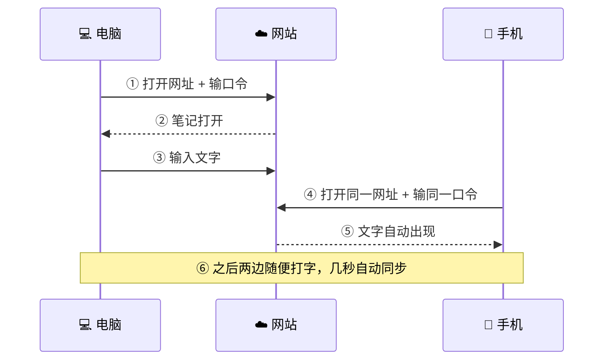
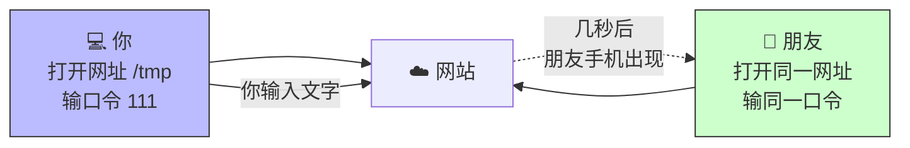
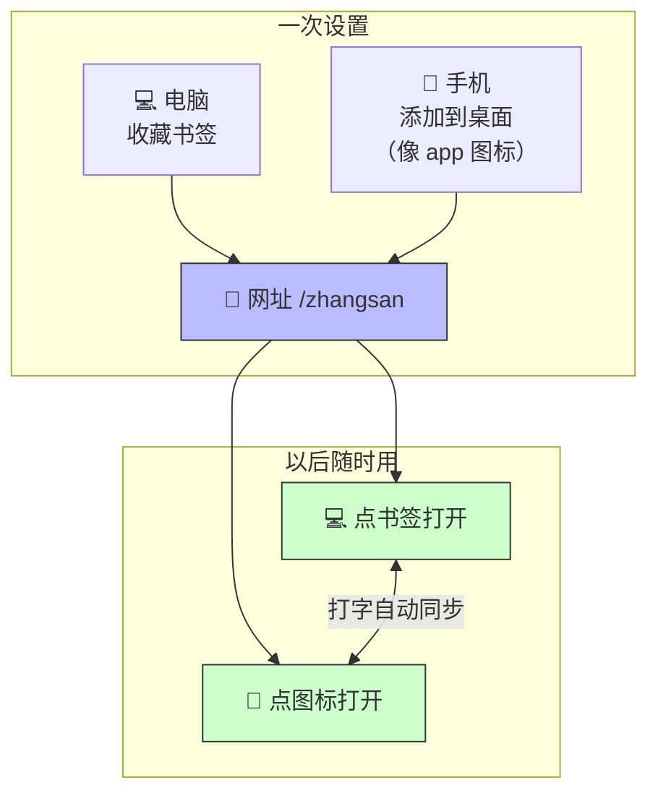
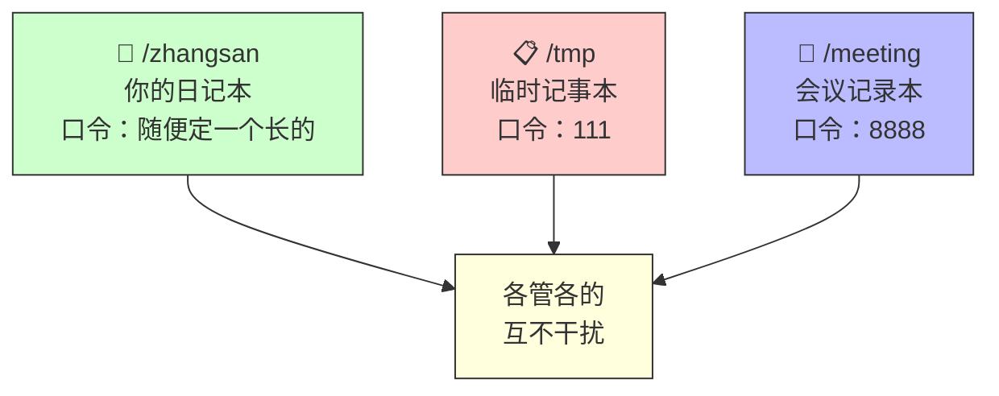
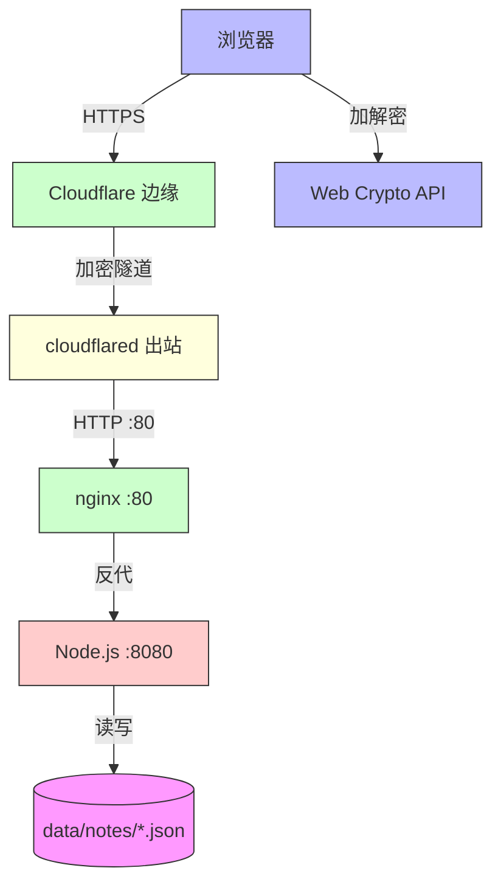
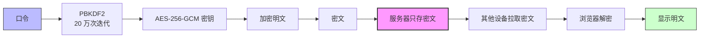
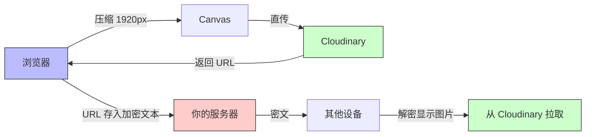

# NoteSync

> 一个极简的端到端加密便签同步工具。多个设备，同一段文字和图片，几秒自动同步。


---

# 📖 第一部分：使用指南

> 普通用户看这一部分就够了。

## 这是什么

我做了一个这样的小工具，用于多个设备自动同步文本和图片。

比如你想要在电脑和手机上同步一段文字，或者一张截图。

## 快速开始

**第 1 步**：在 PC 浏览器输入 `https://note.xuyinji.com.cn/xxx`（记为**网址 A**），其中 `xxx` 是任意英文、数字或两者组合。首次访问需要输入一个口令（记为**口令 a**，比如 `12345` 或 `zhangsan`）。

**第 2 步**：在手机浏览器输入**网址 A**，同理手机首次访问也要输入**口令 a**。（也可以不输网址和口令：在已解锁的电脑上用「扫码配对」生成二维码，手机扫一下直接打开，见下文[扫码配对](#扫码配对添加新设备免输口令)。）

**第 3 步**：然后两个设备间输入任何文字或 emoji 表情，自动在几秒内同步。



## 使用场景

### 场景一：临时分享

如果你要在自己设备和别人的设备同步文件，可以随便输入个 URL，比如 `https://note.xuyinji.com.cn/tmp`，然后随便输个口令比如 `111`，用完以后不再使用就行了。



### 场景二：常用笔记

可以设定一个 URL 作为常用的网址，比如 `https://note.xuyinji.com.cn/zhangsan`。然后在 PC 浏览器上保存这个网址，同时在手机浏览器把这个网址保存到手机桌面（看上去像 app 图标一样），以后就可以随时在自己的多个设备之间同步内容。



### 多笔记互不干扰

每个 URL 对应一个唯一的口令，互相完全隔离。你可以按用途创建多个笔记：



> 目前没做口令修改功能。要换口令就新建一个 URL，旧的不管就行。

### 扫码配对（添加新设备，免输口令）

给笔记添加新设备时，不用敲网址、不用输口令：

1. 在已解锁的设备上，点右上角的「二维码」图标，二维码直接显示；
2. 新设备扫这个码，笔记直接打开；
3. 之后这台设备会记住密钥，像其它设备一样自动解锁、自动同步。

> **注意**：二维码里带着解锁密钥，**等同于口令**——只在自己的设备之间扫，不要截图发给别人。二维码显示 60 秒后自动隐藏，需要时再点一次图标即可。密钥放在网址 `#` 之后的部分，浏览器从不把它发给服务器，服务器依然只能看到密文。

## 安全说明

### 你的内容只有你能看

口令是端到端加密的——服务器只存密文，加解密全在浏览器完成。所以虽然是我开发的，但我也没法知道你输入的内容。这就是"零知识"设计。

简单说：**你输的口令和文字，从没离开过你的浏览器**。服务器上存的是一堆看不懂的乱码，连我也解不开。

### 防爆破保护

为防止有人拿到你的网址后暴力试口令，系统会自动锁定：

- 同一个设备连续输错口令 **10 次**，这个网址会被锁住 **30 分钟**
- 锁住期间谁也进不去（即使口令对了也不行）
- 所以建议常用笔记用长一点的口令（比如一句话），临时分享用短口令无所谓

### 图片同步

除了文字，也支持图片同步。三种上传方式：

- **粘贴**：Ctrl+V 粘贴截图，自动上传并显示
- **拖拽**：把图片文件拖进编辑区
- **按钮**：点上传按钮（细线 SVG 图标）选择图片

图片上传后直接显示在文字中间，可以像文字一样删除、剪切、复制。图片不加密（明文存第三方图床），文字仍端到端加密。

### 超链接与手机号

笔记中的 `http://` 和 `https://` 开头的网址会自动变成可点击的金色链接，点击在新标签页打开。中国大陆手机号（1 开头 11 位）也会自动识别为可点击链接，移动端点击直接跳转拨号界面。无论是粘贴、手动输入还是其他设备同步来的内容，都会自动识别并转为链接。点击链接不会进入编辑模式。

### 删除线

选中文字后点击右上角删除线按钮（带横线的 T 图标），给选中文字添加删除线；再次选中已加删除线的文字点击按钮即可取消。支持跨行选中、部分取消（只取消选中部分的删除线，不影响同行其他文字）。

### 夜间模式

按北京时间自动切换：07:00 切换日间模式，19:00 切换夜间模式。每分钟检查一次，页面刷新后恢复自动模式。也可手动点太阳/月亮按钮切换，手动切换后本次会话不再自动切换。

### 复制与导出

- **复制到剪贴板**：复制全部内容（文字+图片），粘贴到 Notion / Word / 小米笔记 / iPhone 备忘录等支持富文本的应用时图文保留；粘贴到微信、飞书等纯文本输入框时只保留文字
- **导出为图片**：将编辑区渲染为 PNG 图片并复制到剪贴板，可直接 Ctrl+V 粘贴到聊天窗口

### 实时同步

编辑后自动保存，其他设备通过 SSE（Server-Sent Events）亚秒级收到更新并自动加载。连接断开时自动重试 + SSE 自动重连 + 轮询兜底，确保各种网络环境下都能恢复同步。

### PWA 支持

手机浏览器打开后，可"添加到主屏幕"作为独立应用使用，全屏体验、自定义 SVG 图标、离线可打开缓存页面。浏览器标签页标题显示为 "NoteSync"。每个笔记的快捷方式会打开对应笔记（而非默认笔记），Chrome 和小米浏览器均支持。

---

---

# 🔧 第二部分：技术细节

> 开发者或想自己部署的人看这一部分。

## 技术架构

| 层 | 技术 | 说明 |
|----|------|------|
| 前端 | 原生 HTML/JS | contenteditable 编辑器，Web Crypto API |
| 加密 | AES-256-GCM | 对称加密，IV 随机生成 |
| 密钥派生 | PBKDF2 | 20 万次迭代，SHA-256 |
| 图片存储 | Cloudinary | 浏览器直传，Unsigned Upload Preset |
| 图片压缩 | Canvas API | 上传前压缩至 1920px，JPEG 85% |
| 实时同步 | SSE (Server-Sent Events) | 服务端推送更新通知，亚秒级同步 |
| 截图导出 | html2canvas | 编辑区渲染为 PNG，2x 分辨率 |
| PWA | manifest.json + Service Worker | 可安装到主屏幕，离线可打开 |
| 后端 | Node.js | 零依赖，单文件 `server.js` |
| 存储 | JSON 文件 | 每笔记独立 `data/notes/{id}.json` |
| 反代 | nginx | HTTP-only（端口 80），HTTP/1.1 |
| 隧道 | Cloudflare Tunnel | 出站隧道绕过运营商 SNI 干扰，Cloudflare 负责 HTTPS |
| 进程管理 | nssm | Windows 服务，开机自启 |



### 加密流程



**关键点**：口令从不离开浏览器，服务器和管理员都看不到明文。

### 图片同步方案

图片采用第三方图床方案，**不经过你的服务器**，零流量消耗：



| 设计决策 | 选择 | 原因 |
|---------|------|------|
| 图片存储 | Cloudinary | 免费额度足够个人用 |
| 上传方式 | Unsigned Upload Preset | 无需暴露 API Secret |
| 图片加密 | 不加密 | 能用 Cloudinary 变换，复杂度低 |
| 服务器流量 | 零 | 浏览器直传 Cloudinary |
| 压缩 | 1920px / JPEG 85% | 兼顾质量和体积 |
| 编辑器 | contenteditable | 图片内嵌显示，可删除/剪切 |

自部署需在 `index.html` 中替换 Cloudinary 配置（`CLOUD_NAME` 和 `UPLOAD_PRESET`），并在 Cloudinary 控制台创建 Unsigned Upload Preset。

### API

| 方法 | 路径 | 说明 |
|------|------|------|
| GET | `/api/note/:id` | 读取笔记密文 |
| PUT | `/api/note/:id` | 写入笔记密文 |
| POST | `/api/fail/:id` | 上报解密失败（用于限流） |
| GET | `/healthz` | 健康检查 |
| GET | `/*` | 返回前端页面（SPA 路由） |

### 限流机制

- 限流维度：IP + noteId 组合
- 失败阈值：10 次
- 计数窗口：10 分钟（窗口内无新失败则清零）
- 锁定时长：30 分钟（锁定期间连正确口令也拒）
- 存储方式：内存 Map，服务重启清零

## 自部署

### Linux（一键脚本）

```bash
bash install.sh
```

脚本自动安装 Node.js、nginx、certbot，配置 HTTPS 和 systemd 服务。

### Windows（手动）

1. 安装 [Node.js 20+](https://nodejs.org/) 和 [nginx](https://nginx.org/en/docs/windows.html)
2. 部署 `server.js`、`index.html`、`nginx.conf`（或站点配置）到目标目录
3. 用 [nssm](https://nssm.cc/) 注册 Node 为 Windows 服务（服务名 `NoteSync`）
4. nginx 配置为 HTTP-only（端口 80），TLS 由 Cloudflare 负责
5. 安装 [cloudflared](https://developers.cloudflare.com/cloudflare-one/connections/connect-networks/) 并创建 Cloudflare Tunnel
6. DNS 创建 CNAME 记录指向 `{tunnel-id}.cfargotunnel.com`（橙云代理）

> **为什么用 Tunnel**：国内服务器直接暴露 443 端口会触发运营商 SNI 检查和 RST 注入，80 端口触发备案拦截。Cloudflare Tunnel 使用出站连接绕过这两层限制。

### noteId 规则

- 允许字符：`a-z` `A-Z` `0-9` `_` `-`
- 长度：1-64 字符
- 中文及其它字符被拒绝（前后端一致，v5.15 起；`_` `-` 于 v5.19 恢复）
- 不符合规则的 URL 返回 400

## 限制

- 每个笔记是单编辑区，不支持富文本格式（纯文字 + 图片 + 链接 + 删除线）
- last-write-wins 合并策略，同时编辑可能覆盖（SSE 实时推送 + 版本号检测）
- 限流数据存内存，服务重启清零
- 无口令修改功能（新建 URL 代替）
- 无笔记列表页（知道 URL 才能访问）

## 更新历史

- **v5.21**：UI 精简——状态栏移至底栏 + 二维码弹层直出（承接 v5.20）——用户反馈两项体验调整。① **状态从顶栏移到底栏（全端）**：移动端顶栏按钮过多，"已同步"被挤得无法与绿点同行；顶栏状态区整体移除，底栏变为纯状态条「● 状态字」，圆点颜色语义不变（已同步绿、其余灰），`setStatus()` 单一写入；底栏原文案随之精简——"已解锁"状态本就由状态字编码（已同步即已解锁，锁定时显示已退出/已锁定/无法连接），"端到端加密"标语已在落地页与解锁弹窗表达，无需在底栏常驻重复。② **二维码弹层改直出 + 移除配对链接行**：点二维码图标即渲染二维码（去掉"显示配对二维码"二次点击）；60 秒自动隐藏保留，到期后弹层内变为「重新显示」按钮；移除二维码下方的配对链接文字行，密钥不再以文字形式出现在屏幕（取舍：两台电脑互配只能扫码）。安全姿态不变：60 秒暴露窗口、「勿截图外传」警示、fragment 零知识、J2 的 KEY_STORE 缺失兜底（触发点改为打开弹层时）。测试纪律：jsdom 单测 44/44（+1 底栏状态条结构）、静态盲测 `_probe_v520_blind_static` 29/29（+2：链接行零残留、状态移底栏）、`_probe_qr_pairing` 21/21（P2/P3 改直出断言+二维码内容像素级比对）、对抗盲测 `_probe_v520_blind` 44/44（+1 链接行移除；J1 由观察改硬断言：自动补写密钥并直出）、Playwright E2E 11/11、v5.19 四探针 80/80 复跑全绿，共 229 项，退出码 0
- **v5.20**：二维码配对（快速档）——添加新设备免输网址与口令（承接 v5.19）——此前添加第二台设备需在新设备上手动敲入笔记 URL 与口令，手机上又慢又易错。新增：顶栏「二维码」按钮，弹层按需生成并显示当前笔记的配对二维码，另一台设备扫码即直接解锁，全程免口令。配对链接为 `笔记URL#k=<URL-safe base64 AES密钥>`。安全设计：① 密钥放在 URL fragment（`#` 之后），fragment 从不发送到服务器——密钥仅经「发送端屏幕→接收端摄像头」点对点传递，服务器仍只见密文，零知识不变；② 二维码本身即密钥（等同口令），故弹层按需显示（先点「显示配对二维码」）、60 秒自动隐藏、并明示「勿截图外传」；③ 接收端解锁成功后立即 `history.replaceState` 把密钥从地址栏与浏览器历史移除；④ 密钥错误/被篡改时回退口令输入界面并提示「配对链接无效或已失效」，错误密钥不落地；⑤ 配对成功后密钥写入接收端 localStorage，此后该设备与普通设备无异（自动解锁、双向同步）；⑥ 拒绝配对到未初始化的笔记（服务端无 salt 即回退）——发布前独立盲测发现：缺此守卫时任意密钥都能对空笔记"配对成功"并凭空向服务器写入脏笔记（J1，同版修复，见 BUG_CHECKLIST）；⑦ KEY_STORE 缺失但内存有密钥时「显示配对二维码」自动重新导出补写，不做静默哑按钮（J2，盲测发现，同版修复）。实现：内联 qrcode-generator 1.4.4（MIT，约 20KB）保持单文件零依赖，canvas 渲染（4 模块静区）；接收端复用既有 `importKey`/`applyUnlocked` 路径；**服务端零改动**（零知识架构天然支持，fragment 不进请求）。测试纪律：jsdom 单测 43/43（新增 `qr_pairing` 7 项：URL-safe base64 全字节往返、`parsePairingKey` 合法/非法 8 例、弹层结构、内联库真实 URL 出码）、Playwright E2E 11/11 无回归、新增探针 `_probe_qr_pairing` 21/21（真实 server.js + 双浏览器上下文全链路：按需显示/链接与本机密钥一致/免口令解锁/内容解密一致/hash 剥离/密钥落地/反向同步/刷新后自动解锁/错误密钥回退）、v5.19 四探针（review_bugs/undo_paste/save_reliability/v519_independent）80/80 复跑全绿；发布前另派独立盲测：静态层 `_probe_v520_blind_static` 27/27 + 对抗 E2E `_probe_v520_blind` 43/43（自研独立 QR 解码器从画布像素还原载荷与配对链接逐字比对、含 +/= 填充密钥往返无损、fragment 垃圾注入拒绝、非法长度密钥优雅回退、429 锁定不绕过、错误密钥不破坏已存密钥、hash 剥离彻底至 performance 导航条目）——盲测发现 J1/J2 两 bug，均同版修复并复跑全绿，共 225 项，退出码 0
- **v5.19**：代码审查专项修复——存储型 XSS 封堵 + 粘贴换行/光标修复 + URL 吞中文修复 + 保存可靠性 + 笔记名 `_` `-` 恢复（I1-I6，承接 v5.18）——应用户要求对全项目做 bug 排查（代码审查 + 真实 Chromium 探针逐项实证），确认 4 个严重缺陷与若干小问题，经批准后按方案修复：① **I1 linkify 存储型 XSS（高危）**：`linkifyEditor` 用 `span.innerHTML = text.replace(...)` 字符串拼接构建链接，实测 `" onmouseover="alert(1)` 属性注入成立、`` JS 执行、`<b>` 等标签篡改正文，且随加密同步跨设备传播、可窃取 localStorage 内其它笔记的 AES 密钥。修复：新增 `buildLinkSafe()` 用 DOM API 组装（`createTextNode` + `createElement('a')` 属性赋值天然转义），替换整段 innerHTML 拼接；链接化规则（URL 优先、denyAsUrl、ZWSP 断行）逐条对齐原实现。② **I2 行中粘贴嵌套块 + 光标跳行首（高危）**：粘贴把每行无条件包 `<div>`，"abc|def" 中粘 "XY" 渲染成三行、光标落块首。修复：空编辑器保留拆块路径；非空走 `pasteTextNative()`（`execCommand('insertText'/'insertParagraph')` 原生合并拆段），`pasteInFlight` 使整个粘贴作为单步入撤销栈。③ **I3 URL 吞中文**："看https://baidu.com。很好" 的 "。很好" 被吞进链接文本与 href。修复：urlRegex 字符类排除 CJK 区段、URL 在中文处即停；`trimUrlTrailing()` 兜底修剪尾部中文标点；ASCII 尾部行为不动（保护以 `)` 结尾的合法 URL）。④ **I4 保存可靠性**：busy（保存中）输入曾被直接丢弃（无保存无撤销）、保存失败无重试。修复：busy 分支标记 `pendingResave` + 照常记撤销栈，saveLocal finally 补挂 300ms 保存；失败退避重试 3s/6s/12s 至多 3 次；`flushDirtySave()` 挂 visibilitychange→hidden 与 pagehide 兜底。⑤ **I5 笔记名恢复 `_` `-`**：v5.15 收紧成纯字母数字误伤旧笔记（400 打不开），前后端同步放宽为 `[A-Za-z0-9_-]{1,64}`（中文仍拒）；fetchRetry 对 4xx 不再重试且错误带 status，unlock/init 对 400 提示"笔记名不合法"；落地页输入框加 maxlength=64。⑥ **I6 复制剥离 ZWSP**：copyBtn 复制前剥离长词/链接内的零宽断行符。**补充（独立验证子代理发现）**：单行笔记常见形态是裸文本节点挂根，此时行中粘贴多行会残留「裸文本 + `<div>` 做兄弟」的非法结构并以该形态保存/同步，`pasteTextNative` 收尾补 `ensureBlockWrapped()`+`normalize()`，包块前后用块内偏移保存/恢复选区（否则光标跳行尾）。测试纪律：jsdom 单测 36/36（含 ID_RE 放宽新断言）、Playwright E2E 11/11（flow/sync/userbugs 无回归）、探针 `_probe_review_bugs` 10/10（XSS/粘贴/中文标点逐条翻转验证）+ `_probe_undo_paste` 13/13 + `_probe_save_reliability` 8/8（真实 localhost 服务器、可控 apiPut 注入延迟/失败，验证 busy 补存、3s 重试、flush 兜底、撤销完整）+ `_probe_v519_independent` 49/49（独立子代理全新设计、真实 PBKDF2 解锁，覆盖 I1-I6 全部修复点与结构不变量），共 127 项全绿，退出码 0
- **v5.18**：同步优化——轮询 4000→2000ms + 移除同步提示浮层（E6，承接 v5.17）——用户两条反馈：①"要 4 秒那么久吗"；②"自动同步是基操，每次弹'已从其他设备同步'很打扰，以前没显示体验就很好"。根因：v5.17 把轮询基线设为 4000ms（仅恢复 v2.x 体感、用户仍嫌慢），并顺手加了每次远端落地弹一次的 `showSyncToast` 提示——那是 v5.17 为验证修复加的，并非用户所求。修复：① `POLL_INTERVAL` 4000→2000，退化场景（SSE 被隧道缓冲挂死）同步延迟从 ≤4s 降到 ≤2s，回到"几乎秒同步"体感；SSE 正常时仍 `onmessage` 即时，不受影响；单用户 2s 一次轮询开销可忽略（无变化时只是版本号比对）。② **彻底移除同步提示浮层**：删除 `showSyncToast()` 函数及其在 `poll()` 内调用，恢复 v2.x 静默自动同步（状态条"已同步"属常驻 UI、非打扰浮层，保留）。测试纪律：jsdom 单测 35/35（新增断言 `POLL_INTERVAL=2000` + `typeof window.showSyncToast==='undefined'`）、Playwright E2E `sync` 2/2（T2 `disableSSE` 仅靠 2s 轮询、超时收紧到 3.5s 证明基线、并断言同步后无 `#syncToast`）+ `flow` 3/3，退出码 0
- **v5.17**：同步修复——轮询改无条件 4s 基线（恢复 v2.x 体感）+ SSE 仅作加速器，彻底消除"一端输入另一端必须刷新才同步"的失败模式（E5，承接 v5.16）——用户反馈"一端输入另一端不自动同步、要手动刷新"，且明确"这块逻辑我从没让你改过、以前几乎秒同步"。git 核查确认：同步核心代码自 v3.1（2026-07-22）至 v5.16 **一字未改**，退化是环境因素而非代码回归——v4.0 起走 Cloudflare Tunnel，代理缓冲使 SSE 进入"已连上但不投递"的挂起态，`onerror` 永不触发 → 旧代码只在 `onerror` 才启动的轮询兜底也永不启动 → 对端只能手动刷新。根因：轮询兜底仅挂在 SSE `onerror` 上，正常连接时 `onopen` 还会 `clearInterval(pollTimer)` 把轮询掐掉。修复（恢复 v2.x 的无条件 4s 轮询基线）：① `startSync()` 无条件 `setInterval(poll, 4000)` 常驻基线（不再只在 onerror 启动），SSE 退化也不影响；② `connectSSE` `onopen` 不再 `clearInterval`（SSE 纯加速器，不再有资格掐轮询）；③ `onmessage` 收到推送直接 `poll()` 立即拉最新；④ `onerror` 保留断线重连（5s 后重连），同时立即 `poll()`；⑤ `visibilitychange` 回前台立即 `poll()`（手机切回秒同步）；⑥ `poll()` 加守卫：已锁定（无 `cryptoKey`）时 return 避免"同步中断"噪声，`busy` 时 return 防重入，远端落地后 `showSyncToast('已从其他设备同步')`。测试纪律：jsdom 单测 35/35（新增 `sync.test.js` 断言 `startSync` 无条件 `setInterval`、`onopen` 不 `clearInterval`、`onmessage` 触发 `poll`）、Playwright E2E `sync` 2/2（T1 SSE+轮询、T2 `disableSSE` 仅轮询仍 ≤5s 收到——旧代码在此必失败）+ `flow` 3/3，退出码 0
- **v5.16**：PWA 图标修正——还原备案前透明金 logo（C4 再反转，承接 v5.15）——用户指出 v5.15 改出的「黑底」并非他要的；他要的是**ICP 备案前部署在 note.xuyinji.com.cn 的那个图标**。核查 git 历史：`18d924d` 黑底版(#1C1C1A)仅存在 7 分钟即被 `b72c62f` 透明版取代、**从未上线**；备案（约 8/2）前线上跑的就是透明金 logo `favicon.svg`（`purpose: any maskable`），所谓「黑底」是 Android 把透明 maskable SVG 填黑所致。故 v5.16 还原真相文件：① `favicon.svg` 恢复透明金 logo（`stroke="#8F7126"`、无背景矩形）；② `manifest.json` 仅引用 `favicon.svg`（`background_color #fafafa`、`theme_color #2b6cff`），图标 src 加 `?v=5.16` 缓存破坏以强制刷新 PWA 图标；③ 删除 v5.14 新增的两张 `icon-maskable-192/512.png` 及其 `server.js` 静态路由（回归备案前状态，无 maskable PNG）。测试纪律：jsdom 单测 34/34（含图标翻转断言：manifest 仅 favicon.svg、favicon 透明无 #0F0F11）、Playwright E2E 9/9（含 manifest 仅 favicon.svg + favicon 透明断言），退出码 0
- **v5.15**：指纹彻底移除 + 落地页禁止中文输入 + 退出锁定解锁按钮禁用 + PWA 图标恢复黑底（H4 移除 + H5 + H6 + C4 反转，承接 v5.14）——用户就刚发的 v5.14 提了 8 条反馈，逐条归并成本版四处改动：① **H4 指纹解锁彻底移除（用户主动要求"彻底移除指纹功能"）**：v5.14 用的 WebAuthn **PRF 扩展**在大陆 Android Chrome 上极不可靠（本质是通行密钥/平台凭证，常需 GMS/翻墙才能注册），且失败会甩一长串错误码、退出后还弹"是否开启指纹"。用户明确"我要求的是指纹解锁，怎么给我搞什么通行秘钥，而且好像不翻墙还用不了"——WebAuthn/PRF 是 web 端指纹唯一可行路径，在大陆环境不可靠，留着纯添堵。**决定整段删除**：`bio-banner`/`bioBtn`/`BIO_STORE`、`supportsWebAuthnPRF`/`deriveBiometricKEK`/`aesGcmWrapBytes`/`aesGcmUnwrap`/`enrollBiometric`/`unlockWithBiometric`/`updateBioUI`/`offerBiometricEnrollment` 全部代码 + DOM + CSS 清零，前端 grep 零残留（10+ 标识符 + 「指纹」+ `.bio` 样式全 0 命中），口令解锁路径不受影响。② **H5 落地页笔记名禁止中文输入**：v5.14 的 H1 曾"放宽 ID_RE 接受中文"，但用户实测中文笔记名能跳转、却**无论设什么口令都进不去**（中文经 URL 编码后路由/密钥派生错位），属于"能打开却永远解不开"的半吊子。用户改口"干脆笔记名输入框就不支持输入中文"。修复：前端 `#landingInput` 的 `input`+`compositionend` 监听过滤非 `[A-Za-z0-9]`（拼音组字期间不误删），下方提示「仅支持英文和数字」；后端 `server.js` `ID_RE` **收回** `/^[A-Za-z0-9]{1,64}$/`（与前端禁止双保险，1–64 位 ASCII）。③ **H6 退出锁定后解锁按钮回到禁用态**：登录一次→退出(`#lock`)→还没输口令时，解锁按钮仍是启用态（bug）。修复：`#lock` 处理里清空口令后显式 `$('#ok').disabled = true`。④ **C4 PWA 图标恢复黑底（后 v5.16 已推翻）**：v5.15 把 maskable 图标改黑底(#0F0F11)，但用户核实后要的是备案前透明金 logo，故 v5.16 再反转回透明。测试纪律：jsdom 单测 36/36（含指纹移除断言、中文过滤、黑底、ID_RE 收紧），官方 E2E `userbugs` 9/9（真实 Chromium 逐条对照四改动，含指纹移除 DOM/函数断言、中文过滤、退出禁用态、黑底像素），退出码 0
- **v5.14**：落地页/解锁/路由/图标/指纹 五项体验修复（H1/H2/H3/H4 + C4，承接 v5.13）——用户反馈五类问题，逐条定位并修复：① **H1 落地页笔记名不支持中文**：根因 `server.js` `ID_RE` 用 `/^[a-zA-Z0-9_-]{1,32}$/` 拒绝中文、且 `extractId` 未 `decodeURIComponent`，中文笔记名被 400 拒绝、URL 编码后路由失败；修复：ID_RE 放宽为 `/^[^\x00-\x1f\/\\?#%]{1,64}$/`（接受 Unicode，仅禁控制符与 `/ \ ? # %`），`extractId` 与 SSE id 均 `decodeURIComponent`，客户端 `#landingBtn` 点击走 `encodeURIComponent` 导航，manifest `start_url` 用 `encodeURI`。② **H2 笔记名为空时"打开"按钮禁用**：`#landingBtn` 初始 `disabled`，`landingInput` 的 input 监听按 `value.trim()` 空否切换。③ **H3 口令为空时"解锁"按钮禁用且样式有意弱化**：`#ok` 初始 `disabled`，`pw` 监听按空否切换；新增统一禁用态 `.box button:disabled,#landing button:disabled{background:var(--line);color:var(--muted);cursor:not-allowed;box-shadow:none}`。**踩坑（真实 bug，子代理在真实 Chromium 揪出）**：初版禁用态在真机下仍显示成"启用"样式——根因 `applyTheme()` 注入的主题覆盖 `.box button{...!important}` 与 `#landing button{...!important}` 用 `!important` 压过了禁用态；修复把主题覆盖限定为 `:not(:disabled)`，禁用态自然回落到 muted 基样式（且随深浅色主题变量自动跟随）。④ **H4 手机端指纹解锁**：纯前端 WebAuthn **PRF 扩展**，不碰后端、不破坏端到端加密——注册时建平台凭证(prf 扩展)→取 assertion 拿 PRF 输出→HKDF-SHA256 派生 KEK→AES-GCM 包裹主密钥存 `localStorage BIO_STORE`；解锁时取 assertion(prf eval 存盐)→解包→`importKey`→`applyUnlocked`；口令始终为兜底，iOS 不支持 PRF 时自动隐藏指纹按钮。⑤ **C4 PWA 图标黑色底**：manifest 原用透明 `favicon.svg` 作图标，Android 自适应图标把透明区填黑；新增米白底(#FBFBF8)金 logo 的 `icon-maskable-192/512.png`（`purpose:"maskable"`），并给 `favicon.svg` 加米白 `<rect>`。测试纪律：jsdom 单测 39/39（含新增 userbugs 10/10、server 集成 8/8 验证中文路由与静态资源）、官方 E2E `flow` 3/3 + 新增 `userbugs` 5/5（真实 Chromium 逐条对照五 bug，含禁用态 computed-style 校验）；E2E teardown 卡死/抛错（Windows/Playwright 环境）通过 harness 6s 超时竞速 + 失败计数 `process.exit` 解决，退出码 0
- **v5.13**：三击选行+空格修复（E4，承接 v5.12）——根因：Chromium 三击行选把选区终点放到"下一行块起点（offset 0）"，选区把块边界也包了进去；随后空格替换/删除选区顺手吞掉块边界，两行被合并成 `<div> 七</div>`（"七"被拽上第一行），这是浏览器 contenteditable 固有行为而非逻辑错误。修复：新增 `selectionchange` 守卫 + `isOverflowSelection()`/`clampOverflowSelection()`，检测"选区终点落在紧随其后的兄弟块起点、且未选中该块任何内容、正向溢出"的边界溢出模式，把终点钳制回当前块末尾；守卫很窄，正常跨行拖选（选中了下一行内容）不被误伤；钩子 `__isOverflowSelection`/`__clampOverflowSelection` 供测试。测试：jsdom 单测 21/21（含 triple_click 6/6）、Playwright 4 脚本共 33 项断言全绿（含 G1/B 回归）
- **v5.12**：自建撤销栈 + 多行粘贴修复（G1+B，承接 v5.11）——根因：原生 UndoManager 无法选择性排除程序化改动（linkify/poll 等），导致"按了没反应/回退的不是上一步"，且 Chromium 在 `contentEditable=false↔true` 切换时清空整个原生栈。修复：废弃原生栈、改用自管栈——用户 input 压快照、程序化改动仅 `syncCurrentState()` 不压栈、突发连续打字 700ms 内合并为单步，Ctrl+Z/Y 永远命中用户上一步；粘贴纯文本按行拆 `<div>`、空编辑器先清占位 `<br>`，消除顶部多余空行。测试：jsdom 6/6、Playwright 探针 `_probe_undo_paste` 13/13 + `_probe_user_bugs` 10/10、官方 E2E `flow` 3/3 全绿
- **v5.11**：回车光标回归修复（承接 v5.10）——F12 的 `relocateCaretToVisible()` 把"空块光标（rects=0 但位置合法）"与"坏偏移光标（rects=0 且不可绘制）"混为一谈，导致回车产生的空块在 500ms 后 linkify 触发 `ensureCaret(true)` 时，被跨块拽回上一行有字处。新增**空块守卫**：光标所在块经 TreeWalker 扫描无任何非空文本节点时直接 return 不 relocate，尊重浏览器原生落点；含内容块仍走原 relocate 逻辑（F12 不回归）。**本轮恢复项目测试纪律**：主代理跑全套回归 + `_probe_f13.js`(6/6)，并派子代理独立写 `_probe_f13_edge.js` 做模块/全链路/功能分层测试(16/16，覆盖连续空块、行中回车、回车后立刻输入、含 URL 回车、选中态等)，两层全绿才部署
- **v5.10**：光标"不可绘制位置"修复（承接 v5.9）——v5.9 的 `repaintCaret()`（切换 caret-color 触发重绘）对"能打字但光标不可见"仍无效。用户带 `?diag` 截图揭示真正根因：**`getClientRects()=0`、`bcr=0,0,0,0`**——光标落在 `\r\n` 换行符中间（offset=1），Chromium 无法计算绘制坐标。新增 `relocateCaretToVisible()`：在 `ensureCaret()` 合法选区分支增加** rects=0 检测**，若光标在"不可绘制位置"则广度优先搜索最近的有可见 rect 的文本偏移（当前 offset±N → 同块其他非空文本节点 → 相邻块），逐个尝试取第一个 `getClientRects()>0` 的位置落点。探针 `_probe_f12.js` 7/7 全绿，headless 中成功复现 rects=0→relocate 后 rects=1
- **v5.9**：光标"看得见"修复（承接 v5.8）——v5.8 解决了「选区失效导致无光标且无法输入」，但用户实测发现另一半问题：**选中一行按空格后光标不显示、却能正常打字**。能打字说明选区合法，问题不在选区而在**绘制**：linkify 大幅重排 DOM 后，caret 布局位置完全正确（`getClientRects()` 有值、块高正常、focus 正常），但 Chromium 的 caret 绘制相位未被刷新。新增 `repaintCaret()`——**只切换 `caret-color`（transparent → 下一帧还原）触发 paint invalidation，不动 DOM、不动选区、不动焦点**；`linkifyEditor()` 收尾改调 `ensureCaret(true)`。不采用 `blur()+focus()`（虽最可靠但会打断中文输入法组字、吞拼音），并新增 `isComposing` 组字保护。踩坑记录：最初版本在重绘时顺手重设了同位置选区，**打断浏览器撤销事务分组导致 Ctrl+Z 失效**（探针 11/11→9/11），去掉后恢复。另新增 `?diag` 光标诊断浮层（右下角实时只读显示 focus / rects / caret 位置 / 块高 / DOM 片段，`pointer-events:none` 不抢焦点，不带参数零开销）——因 caret 类问题在 headless 环境完全无法复现，需要一条从真实浏览器直接取读数的通道
- **v5.8**：光标常驻修复——新增 `ensureCaret()` 兜底：解锁载入内容、`linkifyEditor` 规范化、`cleanupLeadingTrailingBreaks` 删除空块等任何改动 DOM 的操作后，若 `window.getSelection()` 指向已被销毁/移动的节点而失效（表现为"无光标、无法输入/粘贴"），则在内容末尾显式重建一个合法折叠光标（仅当选区非法时动作，用户主动选中的文本不被打扰）。修复"解锁后无光标"与"选中+空格后无光标"两类场景，满足"除选中态外任何时刻常驻光标"的诉求。移除原"先 focus 再整体替换 innerHTML"的隐患顺序
- **v5.7**：光标不绘制 / 吞行 / 撤销错乱 修复——`ensureBlockWrapped()` 由"存在一个块就整体跳过"改为**逐子节点包裹**：凡 editor 根下非 `<div>/<p>` 的直接子节点（裸文本节点、或浏览器块合并产生的裸 `<span>` 等无语义元素）都各自收进新建 `<div>`，不再有"整体早退"。修复 F7 残留的"逐字输两行后首行裸文本节点与 div 做兄弟不被包裹 → Chromium 不绘制光标"，以及由此连带的"选中第一行+空格吞掉第二行""Ctrl+Z 把两行顺序错乱"。位置仍在 `linkifyEditor()` 的 500ms 防抖内，不破坏逐字输入；新增字面复现探针 `tests/e2e/_probe_blockwrap.js`（逐字输两行→选中+空格→继续输入→Ctrl+Z 严格回放，11/11 全绿）
- **v5.6**：粘贴光标不显示修复——粘贴纯文本到空编辑器时 `insertNodeAtCaret` 会把文本作为裸文本节点直接插到 `#editor` 根下（无 `<div>` 包裹），而浏览器原生逐字输入会自动包进 `<div>`；contenteditable 根下的裸文本节点属非法结构，导致 Chromium 不绘制光标（粘贴"一二三"→选中按空格后光标逻辑正确但视觉不可见，逐字输入则正常）。修复：空编辑器粘贴时把文本先包进 `<div>` 再插入；新增 `ensureBlockWrapped()` 兜底（把根下裸文本/裸元素收进 `<div>`），并放在 `linkifyEditor()` 的 500ms 防抖内执行以避免与原生逐字输入竞争破坏按键
- **v5.5**：backspace 合并行修复——首部空块删除增加 `caretAfterNode` 守卫，光标落在该空块之后时不再误删，修复"首行空块被吞、内容整体上移"（`cleanupLeadingTrailingBreaks` 只护光标所在块不够，还要护光标之后的块）
- **v5.4**：链接识别与 href 修复——linkify 改为"先拆后建"：先把自动链接 `<a data-url="1">` 拆回纯文本、再拍平 Chromium 块合并时产生的无语义 `<span>`、`editor.normalize()` 合并相邻文本节点、最后从文本重新生成 `<a>`。修复链接文字改动后 href 陈旧、以及链接中间回车拆分再合并时结尾段丢失
- **v5.3**：编辑器四项修复——回车无反应（`cleanupLeadingTrailingBreaks` 误删刚创建的空行，改为按 inputType 门控 + 保护光标所在空块）；网址自动识别（裸域名 + 左边界断言 `(?<![@\w.-])` + TLD 白名单，修复 `x@y.com`、版本号误判）；光标乱跳（跨块选区改用块内偏移，不再用编辑器全局字符偏移）；光标偶尔消失（input 监听器无差别 cleanup 改按 inputType 分流）
- **v5.2**：选区与同步修复——`poll()` 远端更新改为偏移保存/恢复光标（不再因替换 innerHTML 丢光标）；粘贴网址改用 `insertNodeAtCaret` 直接插节点（兼容 `text/uri-list`），修复粘贴不自动成链接；删除多行选区后新增 `cleanupLeadingTrailingBreaks` 清理首/尾孤立换行，修复光标跳行；`poll` 增加 dirty 守卫，编辑中收到远端更新不再覆盖当前未保存输入
- **v5.1**：删除线与导出图片修复——删除线 `rangeIntersectsNode` 的 `compareBoundaryPoints` 比较运算符对调修复边界检测失效（Chrome 实际行为与规范描述相反）；`contentHasS` 改为只计非空 `<s>` 标签，修复取消后重新加删除线无效；长 URL 断行修复（CSS `overflow-x:hidden` + `overflow-wrap:anywhere` + `word-break:break-all`，`file:///` 和 `ftp://` 协议纳入 linkify，长文本在分隔符后插入零宽空格）；导出图片改为临时 div 渲染（不修改 editor 内容，消除页面刷新），`line-height:2.2` 防行间重叠，`pointerdown`/`touchstart`/`click` 三事件跨平台支持，所有 button 加 `type="button"` 防默认提交
- **v5.0**：视觉升级——全新配色（暖纸白 #FBFBF8 + 墨色 #1C1C1A + 金色 #8F7126，深色模式纯墨黑 #0F0F11）；emoji 图标全部替换为 1.7px 细线 SVG；编辑器收窄为 720px 居中阅读栏（17px 字号、1.9 行距）；落地页 Georgia 衬线大字 + 入场动画；解锁弹窗毛玻璃模糊背景；选中文本金色高亮、细滚动条；小米浏览器夜间模式对抗 CSS 同步更新新色值。同时修复：favicon 改为透明底金色细线图标（与顶栏 logo 一致）+ 版本号绕过 Cloudflare/浏览器双重缓存；manifest.json 主题色更新为金色 #8F7126、背景色 #FBFBF8、图标路径加版本号；导出图片文字重叠彻底修复（TreeWalker 安全遍历 + 长 URL 零宽空格断词 + word-break CSS + finally 恢复样式 + SecurityError 跨域提示）
- **v4.5**：根路径改为极简首页（不再跳转到默认笔记，提供输入框直接打开笔记）；夜间模式自动切换时间调整为 07:00 日间/19:00 夜间；修复小米浏览器手动切换夜间模式失效（!important 对抗 CSS 注入）；修复移动端导出图片失败（TreeWalker 改递归遍历 + 不支持剪贴板时降级下载）
- **v4.4**：PWA 快捷方式修复——manifest.json 动态返回每个笔记的 start_url，Chrome 安装/创建快捷方式时打开对应笔记而非默认笔记
- **v4.3.1**：修复单行选中删除线无效问题——TreeWalker 根节点为文本节点时改用其父元素，使单行内选中文字能正确添加/取消删除线
- **v4.3**：删除线功能重写——逐个文本节点包裹 `<s>` 保留行结构（修复跨行选中导致多出换行）；取消删除线时区分完全/部分覆盖（修复误伤同行其他文字）；选区位置改用字符偏移量保存恢复（修复 normalize 后选区偏移）；夜间模式改为按北京时间自动切换（04:59 日间/19:05 夜间，手动切换后本次会话停止自动）；index.html 添加 no-cache 头防止移动端缓存旧版
- **v4.2**：删除线功能——选中文字点击按钮加删除线，再次点击取消；使用 Bootstrap Icons 图标
- **v4.1**：UI 优化——自定义 favicon 图标（SVG 笔记本样式）、浏览器标题简化为 "NoteSync"、根路径自动跳转到默认笔记、手机号自动识别为可点击 tel: 链接（移动端点击拨号）
- **v4.0**：Cloudflare Tunnel 接入——Caddy 改为 HTTP-only（端口 80），cloudflared 出站隧道绕过运营商 SNI 检查/RST 注入和备案拦截；DNS 从 A 记录改为 CNAME 指向 `*.cfargotunnel.com`；Cloudflare SSL 模式 Flexible
- **v3.3**：服务器稳定性修复——停掉宝塔 nginx 解决端口 80 冲突、停掉 deveco/mimo 释放 500MB 内存、Caddy 降级 HTTP/1.1 only 解决 HTTP/2+SSE 兼容性
- **v3.2**：修复 SSE 连接不稳定（Caddy flush_interval -1 + 服务端 15 秒心跳保活）；URL 自动检测改为 input 事件触发（不依赖 paste，移动端也能识别）
- **v3.1**：去掉冲突提示恢复自动同步、PWA 支持（可安装到主屏幕）、连接失败自动重试、SSE 断线自动重连、"退出本机"改为"退出"
- **v3.0**：SSE 实时推送（替代 4 秒轮询）、复制到剪贴板 + 导出为图片、冲突保护（编辑时不覆盖）、上传图标改 📤、关闭 HTTP/3 强制 HTTP/2、nginx CSP 修复、install.sh 域名参数化
- **v2.3**：修复桌面端点击超链接进入编辑模式的问题（改用 mousedown 拦截）；index.html 禁止缓存确保始终加载最新版本
- **v2.2**：点击超链接直接在新标签页打开（不进入编辑模式）
- **v2.1**：粘贴 URL 自动转为可点击链接
- **v2.0**：图片同步（Cloudinary 图床）+ 夜间模式
- **v1.0**：初始版本，纯文字端到端加密同步

## License

MIT
