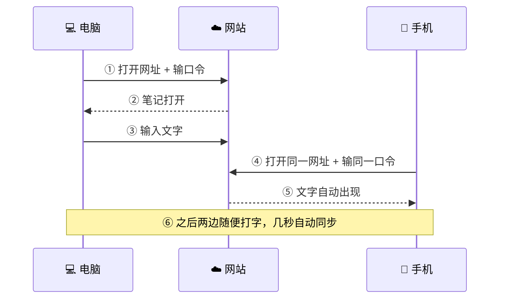
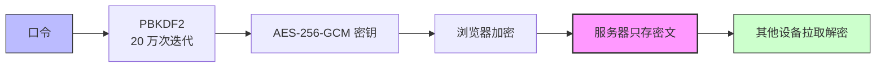

# NoteSync

> 只有你能看的加密便签：多设备几秒自动同步，服务器只存密文，连开发者都看不到内容。


---

## 这是什么

一个极简的端到端加密便签同步工具。电脑、手机打开同一个网址、输同一个口令，之后随便打字、贴图、写提醒，几秒自动同步。

三个特点：

1. **加密**：口令在浏览器里派生密钥，服务器上只有一堆乱码——正文、提醒、草稿、历史版本全是密文
2. **省事**：扫码配对新设备免输口令，可以像 App 一样装到手机桌面，断网也写得下去
3. **能干正事**：正文里写「明天上午10点接孩子」就能设提醒，还有历史版本、AI 助手读写

---

## 快速开始（3 步）

**第 1 步**：电脑浏览器打开 `https://note.xuyinji.com.cn/xxx`，`xxx` 是任意英文/数字（这是你的**笔记名**），首次访问设一个**口令**。

**第 2 步**：手机打开同一个网址，输同一个口令。（也可以不输：在已解锁的设备上点右上角「二维码」图标，新设备扫一下直接打开，见[扫码配对](#扫码配对添加新设备免输口令)。）

**第 3 步**：两边随便输入文字、图片或提醒，几秒自动同步。



---

## 核心功能

### 🔒 端到端加密（零知识）

口令从不离开你的浏览器。服务器只存密文，管理员也解不开。输入的每一句话、每一条提醒、每一份历史版本，都是加密后才上传的。想临时记点私密东西：随便起个网址、随便定个口令，用完即弃。

### 📱 多设备实时同步

编辑后自动保存，其他设备亚秒级收到更新（SSE 推送 + 2 秒轮询兜底 + 断线自动重连）。

- **两端改不同段落 = 自动并集**，不弹提示；只有真的改了同一处才让你二选一（保留本机 / 使用云端），**绝不自动覆盖**
- 版本落后的写入被服务端拒绝（乐观并发），不会出现「谁后保存谁悄悄赢」
- 每个笔记一个网址一个口令，互不干扰；常用笔记电脑存书签、手机加到桌面

### 📷 扫码配对（添加新设备，免输口令）

1. 在已解锁的设备上点右上角「二维码」图标；
2. 新设备扫这个码，笔记直接打开；
3. 新设备记住密钥，以后自动解锁、自动同步。

> **注意**：二维码里带着解锁密钥，**等同于口令**——只在自己的设备之间扫。密钥放在网址 `#` 之后，浏览器从不把它发给服务器。

### ⏰ 便签提醒（写人话时间就能设）

**正文里直接写时间，光标停上去就浮出「添加提醒」小卡**，点一下即设好，时间自动加下划线。支持的说法（★ v7.1.0 起，★ v8.1.5 大扩展）：

| 你写 | 解析成 |
|------|--------|
| `明天上午10点`、`后天晚上8点半`、`大后天下午3点20` | 相对日期 + 时段词自动换算 24 小时 |
| `今天下午4点钟提醒我`、`两点二十五分交表` | 中文数字时刻（一点~二十三点、点半、点M分、点钟） |
| `周五18:30`、`下周五早上9点`、`星期一下午两点` | 裸写 / 这 / 下 + 周X / 星期X / 礼拜X（可带「个」） |
| `本月15号 09:00`、`下个月1号 18:50` | 月内日 / 下月日 |
| `2026-9-10 9:00`、`9-10 09:00`、`9月8日 08:30` | 绝对日期，年份缺省自动补 |

- 「`15:00`」「`下午3点`」这种**只写时刻**也能识别，默认今天，已过点则不弹卡（不打扰）
- 「`上周X`」「`本周五`」这类暂不识别——写具体日期最保险；过去时间（含 30 秒内）一律不给设
- 电脑鼠标**悬停**在时间上也会弹卡，不必非要点中（★ v7.2.0）；卡片显示「时间 + 明天/周X/几天后 + 事项 + 添加提醒」，3 秒自动收起

其他能力：

- **面板批量设**：点工具栏闹钟图标，选日期 + 时分滚轮 + 事项（≤20 字），一次设多条（未来提醒最多 10 条）；添加后自动在正文写一行「时间　事项」并把光标换到下一行
- **取消**：点浮卡上的「删除」、面板里的 `×`，或者**直接把正文里那句时间删掉**——提醒会跟着从列表消失、闹钟同时撤掉，所有设备同步生效（★ v7.4.0 / v8.1.6 / v8.1.7）
- **到点**：系统通知 + 页内卡片 + 双音响铃 + 震动；**已推送的提醒，正文里的「时间+事项」自动整段画删除线**（跨设备一致），一眼看出哪些办完了
- **手机关了 App 也照推**：APK 用系统精确闹钟 + 开机自动重排，提醒列表在设备本地再加密存一份（★ v5.51 / v5.55）。代价是零知识决定的：别的设备新设的提醒，需要这台手机打开一次 App 解锁才能排上闹钟
- 提醒和正文同一把密钥加密，服务器不知道你几点要干什么

### 📸 扫一扫 / 扫码换机

- 顶栏「扫一扫」直接扫笔记二维码打开笔记，首页也能扫码（★ v5.57 / v7.7.0）
- 没装谷歌服务的机型自动回退到网页扫码层，不是一句「不支持」就完事（★ v8.1.3）
- **扫码换机**：旧设备一键生成「收藏 + 密钥」二维码，新设备扫一下批量恢复笔记清单并自动解锁（★ v7.7.0）

### 🕘 历史版本

- 每次保存自动留快照（60 秒节流），也可以在菜单里手动「新增历史版本」打点
- 任意版本可**预览**、可**恢复**（恢复 = 生成新版本，绝不丢数据）
- **修改口令时，所有历史版本自动换新钥重加密**，不会出现改完口令旧版本打不开的情况

### 🔑 修改口令

菜单 →「修改口令」→ 输旧口令验证 + 新口令两遍即可。正文、提醒、历史版本全部自动用新钥重加密。其他设备下次打开时输新口令解锁（会被明确告知口令已在别处变更，不会拿旧内容覆盖你的新内容）。

### 📴 断网也写得下去

- 断网 0 秒页脚变「离线」，恢复联网自动补传（★ v5.50）
- 未同步内容以**密文草稿**存本地，关页、杀进程都不丢；和别的设备版本不一致时弹条让你选，不静默恢复
- 离线仍能读上次同步的正文、甚至输口令解锁（★ v5.49 / v5.54 / v5.56 三级兜底）

### 🖼 图片与导出

- Ctrl+V 粘贴 / 拖拽 / 按钮上传：本地 Canvas 压缩后直传图床，服务器零图片流量，文字仍端到端加密
- **导出为图片**发聊天窗口，或一键复制图文到 Notion / Word / 备忘录（渲染库自托管，离线也能用，★ v7.6.0）

### 🧭 菜单、收藏与夜间

- 页脚 ☰ 抽屉：返回首页、收藏笔记、收藏夹、历史版本、扫一扫、扫码换机、打开链接方式、修改口令、日夜间切换、诊断、退出锁定、关于
- **收藏夹**纯存本机（上限 20，多开一台设备不会带走），点行直达；换机时随「扫码换机」一起过去
- **夜间模式**按北京时间 07:00 / 19:00 自动切，也可手动；小米 / QQ 等国产浏览器的「强制网页夜间」做了专门对抗（含像素级复原的「借壳日间」，★ v5.24~v5.33）

### 📲 装成 App

- 网页版手机「添加到主屏幕」即 PWA，离线可开
- 也有安卓 APK：关 App 推提醒、通知点击直达笔记、点笔记链接直接进 App（App Links，★ v8.1.0）、应用内/系统浏览器打开链接可选（只对本机生效）
- APK 前端直连线上，网页一更新 App 就是新版，无需重装

### 🧰 日常好功能

- **链接识别**：网址、手机号自动变可点击链接（粘贴、逐字输入都识别，中文标点不会吞进链接）
- **删除线**：选中文字点按钮，支持跨行、部分取消
- **撤销/重做**：自建撤销栈，打字合并成一步，程序改动不会污染历史
- **中文输入法**：组字期间绝不动 DOM，回车、空格、退格在国产机型上逐项调稳
- **诊断**：网址加 `?diag` 或菜单「诊断」看同步/密钥/闹钟/缓存状态；「关于」显示网页与 App 双版本号

---

## 🤖 用 AI 管理你的笔记（MCP）

给 WorkBuddy（或任何支持 MCP 的 AI 助手）接上 NoteSync，就能直接说人话让 AI 读写你的笔记。**8 个工具**，本机派生密钥、本机加解密，服务器照旧只见密文：

| 工具 | 能干什么 |
|------|---------|
| `note_locate` / `note_read` | 查笔记状态；读正文纯文本 / 原始 HTML / 渲染成图片 |
| `note_edit` | 末尾追加、按文字定位插入、删除，或整篇替换为 HTML |
| `note_image` | 本机图片直传图床后插图 / 按地址删图 |
| `note_remind` | 设提醒（回写正文行）/ 列出 / 取消 / 清理过期，支持相对时间 |
| `note_search` | 全文检索（本地加密索引 + 解密二次校验，不存明文） |
| `note_export` / `note_import` | 备份 zip（明文可读 / 纯密文可上云）与恢复（默认只出预览计划） |

几句示例：「用 notesync 读一下我的笔记」、「在笔记末尾加一行：明天交周报」、「帮我把 D:\pics\cat.png 加到笔记末尾」、「明天早上9点提醒我晨会」、「笔记里都有哪些提醒」、「取消明天早上 9 点那条提醒」、「把已经触发过的提醒清理掉」。

<details>
<summary><b>能力边界（点开看，哪些做不到如实说）</b></summary>

| ✅ 能 | ❌ 不能 |
|------|--------|
| 加图 / 删图：本机图直传 Cloudinary 后插正文（≤8MB 原图） | 压缩图片（压缩只在网页端粘贴时发生） |
| 提醒全套：设（回写正文行）/ 列出 / 取消 / 清理过期 | 删掉提醒留在正文的那行文字（取消只删提醒本体，文字可让 AI 用 note_edit 删） |
| 逐句改纯文本：追加 / 定位插入 / 删除；整篇替换为 HTML | 逐句写富文本（`**粗体**` 会存成字面星号，要格式就给 HTML） |
| 全文检索、备份/恢复 zip、跨设备版本冲突自动重试 | 检索依赖笔记版本号增量，刚被别的设备改写后下一次检索才更新 |

硬限制与网页端一致：提醒事项**最长 20 字**、未来提醒**最多 10 条**、过去时间拒绝；`plain` 备份是**明文**落盘（含提醒事项），要放网盘请选 `raw` 密文模式；导入默认只出计划、白名单外的 HTML 标签直接报错，绝不静默改写。

</details>

<details>
<summary><b>接入方式一：改一行配置（本机已装 WorkBuddy，点开看 4 步）</b></summary>

1. 拿到 `tools/notesync-mcp-server.js`（clone 仓库，或浏览器另存 `https://biji.xuyinji.com.cn/mcp/notesync-mcp-server.js`）
2. 编辑 `C:\Users\<你的用户名>\.workbuddy\mcp.json`（注意**不是** `.mcp.json`），在 `mcpServers` 里并列加上：

```json
{
  "mcpServers": {
    "notesync": {
      "command": "C:/Users/<你的用户名>/.workbuddy/binaries/node/versions/<版本号>/node.exe",
      "args": ["D:/mcp/notesync-mcp-server.js"],
      "env": { "NOTESYNC_NOTE": "我的笔记名", "NOTESYNC_PASSPHRASE": "这个笔记的口令" }
    }
  }
}
```

`NOTESYNC_NOTE` 可留空（之后每次指定笔记名）；口令**只写在本机这个文件里**，不进聊天、不进 git。多个笔记就照样子多加几条（`notesync-工作`、`notesync-私人`，各填各的口令）。

3. WorkBuddy → 连接管理 → 自定义连接 → 给 `notesync` 点**「信任」**（不点不生效）
4. 验证：说一句「用 notesync 读一下我的笔记」，能复述出内容即通。改了笔记口令记得回来同步改配置并重启会话。

</details>

<details>
<summary><b>接入方式二：换一台电脑，跑一键脚本（点开看 3 步）</b></summary>

```powershell
curl.exe -O https://biji.xuyinji.com.cn/mcp/setup-notesync-mcp.js   # Windows（务必写 curl.exe）
```

```bash
curl -O https://biji.xuyinji.com.cn/mcp/setup-notesync-mcp.js       # macOS / Linux
```

然后 `node setup-notesync-mcp.js`，脚本问你**笔记名**（可空）和**口令**，之后自动下载 MCP 文件、备份你原有的 `mcp.json`、合并进 notesync 条目（不动你其他连接）、填好 node 绝对路径。最后同样去连接管理点一次「信任」。

</details>

> 想删掉 AI 接入？把 `mcp.json` 里的 notesync 条目删掉即可，笔记数据完全不受影响。

---

## 安全说明

- **零知识**：加解密全在浏览器（PBKDF2 20 万次迭代派生密钥 + AES-256-GCM），服务器和管理员只见密文
- **防爆破**：同一设备连续输错口令 10 次，该笔记锁 30 分钟（锁住期间对的口令也进不去）——常用笔记建议用长口令
- **密文到底**：提醒、草稿、历史版本全部随正文同钥加密；离线时也只落密文，不落明文
- **两个等同口令的东西**：解锁二维码、以及存在本机的密钥文件/`mcp.json`——都别截图外传、别提交进仓库

---

## 自部署

### Linux（一键脚本）

```bash
bash install.sh
```

自动安装 Node.js、nginx、certbot，配置 HTTPS 和 systemd 服务。

### Windows（手动）

1. 安装 [Node.js 20+](https://nodejs.org/)
2. 部署 `server.js`、`index.html`、`bridge.html`、`tools/` 到目标目录（如 `C:/Services/NoteSync/`）
3. 用 [nssm](https://nssm.cc/) 注册两个 Windows 服务：`NoteSync`（`node server.js`，端口 8080）、`NoteSyncProxy`（`caddy.exe run --config Caddyfile` 做 HTTPS 反代）
4. `Caddyfile` 按 Host 分流，Caddy 自动 Let's Encrypt 签 HTTPS
5. DNS 加 A 记录指向服务器，放通 80/443

### 笔记名规则

- 允许 `a-z` `A-Z` `0-9` `_` `-`，长度 1-64，中文被拒绝（前后端一致）

---

## 技术细节（给想深究的人）

| 层 | 技术 | 说明 |
|----|------|------|
| 前端 | 原生 HTML/JS 单文件 | contenteditable 编辑器 + Web Crypto API，无框架无构建 |
| 加密 | AES-256-GCM + PBKDF2(20 万次) | IV 随机，密文不可比；等价判定先解密再比 |
| 实时同步 | SSE + 2 秒轮询兜底 | 块级三方合并、乐观并发 `baseV`、409 冲突人工拍板 |
| 图片 | Cloudinary 直传 | Canvas 压缩 1920px，服务器零流量；渲染库自托管去 CDN |
| 提醒 | 页内调度 + 原生闹钟 | 网页 setTimeout；APK 走 `setAlarmClock` + 开机重排 + 本地加密镜像 |
| APK | Capacitor 7 + 自写 Kotlin 插件 | `server.url` 直连线上（热更新天然），通知/扫码/剪贴板各有原生桥 |
| MCP | 零依赖 Node stdio | `tools/notesync-mcp-server.js`，JSON-RPC 2.0 |
| 后端 | Node.js 零依赖单文件 | `server.js`，每笔记一个 JSON 文件；Caddy 反代 + nssm 服务 |



### API

| 方法 | 路径 | 说明 |
|------|------|------|
| GET / PUT | `/api/note/:id` | 读写笔记密文（PUT 支持 `baseV` 乐观并发，冲突返回 409；`rem` 显式传参才更新） |
| GET / PUT | `/api/note/:id/history` | 历史快照列表 / 追加快照 |
| PUT | `/api/note/:id/history/:ts` | 按 ts 覆写快照密文（改口令迁移用） |
| GET | `/api/note/:id/stream` | SSE 实时更新推送 |
| POST | `/api/fail/:id` | 上报解密失败（用于限流） |
| GET | `/mcp/*.js` | MCP 服务器与一键接入脚本公开下载 |
| GET | `/.well-known/assetlinks.json` | 安卓 App Links 域名归属校验 |
| GET | `/healthz` | 健康检查 |
| GET | `/*` | SPA 路由（返回前端页面） |

---

## 限制

- 纯文字 + 图片 + 链接 + 删除线，不支持标题/列表等富文本格式
- 提醒：未来最多 10 条、事项最长 20 字；「上周X」「本周五」这类暂不识别（写具体日期最稳）
- 正文里删掉那句时间才会联动取消提醒；已推送过的提醒会留下删除线（要彻底清可让 AI 或面板里删）
- 多端同时编辑冲突时绝不自动覆盖：无实质差异自动接受，真冲突弹条二选一
- 别的设备新设的提醒，手机要打开一次 App 才能排上系统闹钟（零知识的必然代价）
- APK 冷启动自动进上次打开的笔记；主动返回首页后 120 秒内重开会停在首页
- 限流数据存内存，服务重启清零；无笔记列表页（知道网址才能访问——这也是隐私特性）

---

## 更新历史

| 版本 | 日期 | 摘要 |
|------|------|------|
| v9.4.1 | 2026-09-17 | PC 彩蛋弹窗去「悬停即弹」：鼠标扫过 /pet /dragon 等词不再弹，只有光标落到词上（点选/方向键）或打字才弹，仍锚在词旁、光标移开即收；触屏点词弹/点空白收不变。纯网页层热更、无 Kotlin 改动 |
| v9.4.0 | 2026-09-17 | 桌宠×彩蛋改「融入各蛋本体」（否掉上一版一行纯文字客串）：打砖块桌宠顶一块砖、那块被击中就抱砖滚落；断网恐龙撞停后桌宠爬上结算卡；贪吃蛇吃颗粒→桌宠叼走那个 +N 鼓腮；垂直着陆桌宠站落点旁、稳落欢呼摔了掀跟头；坦克桌宠躲一块可碎砖后、砖被打掉就现形窜到下一块。共用剪影零新色、全程不碰正文。纯网页层热更、无 Kotlin 改动 |
| v9.3.9 | 2026-09-17 | 彩蛋词弹窗重做成与「添加提醒」同一模型：移到/光标落到 /pet /dragon 等词上就弹在词旁、移开自动收、触屏点词弹点空白收，修「常不弹/不消失/折叠命中不到」；dragon/brick 音量提档并加限幅器防爆音；桌宠改为「一局结束后才客串」一句；进笔记随机递一句「老友随口」问候（每天首篇+切不同笔记各一次）；修进游戏打字会改坏正文的 P0。纯网页层热更、无 Kotlin 改动 |
| v9.3.8 | 2026-09-17 | 图片查看器底栏按钮彻底修：网页层改纯白字/纯白底纯黑字 + 原生层关闭 WebView 强制深色（根治国产 ROM 把浅色按钮单独翻色，须 OTA 到本版 APK 吃到）；彩蛋提示词改成每次把光标移上去都重弹（点✕关闭后移开再移回仍弹，网页层即时生效） |
| v9.3.7 | 2026-09-17 | 上传图片开弹框/传完两处不再弹软键盘；折叠列表收起态末尾回车不再打乱隐藏正文；光标移到正文 /dragon 等彩蛋词也弹进入提示；图片查看器底栏按钮改不透明实底、亮图压底/日夜都清晰；发版流程新增 APK 自动拷腾讯服务器+OTA 核验，手机可在线覆盖升级 |
| v9.3.6 | 2026-09-16 | 查看器按钮三态(日/夜/借壳)都清晰(改三板豁免反色)；放大图单击关窗不再闪回重开；PC 端彩蛋提示统一成移动端金胶囊 pill、每次移入都弹；App 冷启动仅 Wi-Fi 后台静默预下载新版、点检查更新秒装 |
| v9.3.5 | 2026-09-16 | 上传改扫码配对同款居中弹窗（拍照/相册）；查看器按钮补进强制深色反色名单修夜间白字、单击图片即关、放大不弹键盘；文字中间插图后退格可整删图片；折叠三角后光标不再消失；dragon/brick 音效再调响（8×）|
| v9.3.4 | 2026-09-16 | 移动端上传图片可直调相机拍照；恐龙/砖块音效调响；更新弹窗去「发现新版本」小标题、说明文字加粗更实；查看器「保存到相册」改亮金实底+深字；修「立即更新」下载启动失败(Invalid visibility:2，Kotlin)；App 放大图片按物理返回键关窗回正文 |
| v9.3.3 | 2026-09-16 | 修图片丢失、恐龙玩着退回笔记、保存无提示、彩蛋词有时不弹、折叠三角两态不等大；查看器保存按钮改金边金字、移动端彩蛋弹层改金胶囊、点图不再弹键盘；README 完整更新详情补全 |
| v9.3.2 | 2026-09-16 | APK 国内直下（免翻墙）、发现新版本弹窗精简（分行·、去 meta、按钮齐平）、彩蛋词移到即问可重复、恐龙点跳/按住低头、桌宠天数多端一致 |
| v9.3.1 | 2026-09-16 | 真机四修：检查更新走服务器代理、护照零宽字符、门牌可重复进入、图片底栏按钮可点+换序 |
| v9.3.0 | 2026-09-16 | 十件：App 桌宠可见与护照换养、brick/dragon 吃正文、图片保存直连相册、在线升级、折叠复制丢字 |
| v9.2.1 | 2026-09-16 | 测试闸编排基建（gate.mjs/manifest/version_pins） |
| v9.2.0 | 2026-09-15 | 九件：图片放大与长按右键保存、修夜间游戏看不清根因、刷新开奖卡、折叠光标透明 |
| v9.1.1 | 2026-09-15 | 折叠体验微调：折叠正文往里缩进 1.5em 并加一条与三角对齐的左引导线，层级更清晰；移动端点折叠三角不再自动弹起软键盘（不聚焦编辑器），不再干扰阅读 |
| v9.1.0 | 2026-09-15 | 新增正文折叠：行首写 [折叠] 变行首三角（▶收/▼开），下方正文折到第一个空行、开合状态存本机不跨设备，纯显示层导出/同步仍全文；修彩蛋 /mirror 与 /pet 按 Esc 收不掉（dom 型蛋没接键盘退出），退出语义十只一致 |
| v9.0.0 | 2026-09-13 | 彩蛋十门牌：/snake /dragon 等 URL 直达小游戏，统一画风与音效层，桌宠与成绩可跨设备认档 |
| v8.3.2 | 2026-09-13 | 打字机音改逐字母：每敲一下键都响（拼音组字期也算），桌面不再只回回车有声 |
| v8.3.1 | 2026-09-13 | 去掉禅模式；修打字机音只有回车有声：每次敲字上屏都响 |
| v8.3.0 | 2026-09-13 | 加彩蛋四件：?eggs 图鉴可集卡、notesync 烟花、空白页禅模式、复古皮肤打字机音 |
| v8.2.3 | 2026-09-13 | 移动端标题后 emoji 去掉外圈胶囊皮，只留裸表情随行；桌面胶囊不变 |
| v8.2.2 | 2026-09-13 | 移动端徽章定稿：顶栏只挂 emoji 小图标，全文改打开时 5 秒问候气泡；桌面常驻胶囊不变 |
| v8.2.1 | 2026-09-13 | 修数字彩蛋不触发：改按光标前成串冒泡；手机端徽章显示文案；去掉 logo 盯鼠标 |
| v8.2.0 | 2026-09-12 | 加彩蛋五件：复古皮肤三态环、节日与深夜徽章、节日雨、数字粒子、logo 盯鼠标；纯网页零重建 |
| v8.1.8 | 2026-09-12 | 正文删提醒联动三修：整句删干净当场删提醒不再等几秒、带出处指纹的相对时间提醒不再跨天残留、加提醒后日期下不再叠两条下划线；纯网页零重建 |
| v8.1.7 | 2026-09-12 | 堵住「时间那句改到一半，正好自动保存 → 提醒被误删」：还在打字时不当场删，停手后自动补上联动；纯网页零重建 |
| v8.1.6 | 2026-09-12 | 修「正文里那句时间删掉了，提醒还留在列表里、到点照推」：相对时间提醒记住原文出处，删正文即删提醒（旧数据行为不变）；纯网页零重建 |
| v8.1.5 | 2026-09-12 | 笔记相对时间识别大扩展：裸写「周日/星期一/下个礼拜五」（含可选「个」、周首日=周一，`上/本` 周仍不收）+ 中文数字时刻「三点钟/三点三十/三点三十分/两点半」；此前「周日下午4点钟提醒我…」整句解析不出→不弹添加提醒浮卡，现修复。网页与 MCP `note_remind` 同表；纯网页零重建 |
| v8.1.4 | 2026-09-11 | 扫一扫/扫码打开笔记：出帧前不再闪系统默认播放三角——video 初始隐藏，改深色圆角舞台 + 金色取景框四角 + 扫描线 +「正在开启相机…」占位，出帧无缝显形；纯网页零重建 |
| v8.1.3 | 2026-09-11 | 无谷歌服务机型「扫一扫/扫码打开笔记」点了没反应修复：先探谷歌扫码模块可用性，不可用/原生异常回退自写网页扫码层（不静默失败），用户取消仍静默；纯网页零重建 |
| v8.1.2 | 2026-09-11 | 二级页提示文案精简（旧句误提手机号，拨号不走本设置） |
| v8.1.1 | 2026-09-11 | 菜单去尖角（全菜单无箭头语言）；「打开链接」与「扫码换机」换位（高频在前） |
| v8.1.0 | 2026-09-11 | 修 §K1/K2 服务端两红（HEAD 探活+assetlinks）；新增菜单「打开链接」二级页单选；App Links 直达 APK；「备份换机码」改名「扫码换机」 |
| v8.0.8 | 2026-09-11 | 右下角刷新钮改为字面 location.reload()，与 F5 同路径；自演转圈/✓ 状态机全退役 |
| v8.0.7 | 2026-09-11 | 二级页返回钮左起笔与列表同竖线；刷新改页脚唯一反馈、结果 toast 退役 |
| v8.0.6 | 2026-09-10 | 修回前台键盘复弹：切后台收编辑器焦点+stateHidden 兜底 |
| v8.0.5 | 2026-09-10 | 历史版本二级页同族重设计：时钟胶囊行+mono 时间+展开金框 |
| v8.0.4 | 2026-09-10 | 收藏夹二级页重设计：金星胶囊行+mono 笔记名+眉标计数 |
| v8.0.3 | 2026-09-10 | 收藏笔记行动态注入补 mi-l 定宽列，解锁态对齐守护 M2 上线 |
| v8.0.2 | 2026-09-10 | 菜单定宽标签列+整组居中，图标仍齐、两侧留白对称 |
| v8.0.1 | 2026-09-10 | 抽屉菜单九行改图标列左对齐，长短字不再锯齿 |
| v8.0.0 | 2026-09-10 | 图标体系「描边×一点金」全套重绘；☰/×收编 SVG；修复键盘收起不淡回三图标消失 |
| v7.9.1 | 2026-09-10 | 首页信任图标行贴底显示，键盘弹起时自动淡出；「无需账号」图标换品牌环钥匙孔款 |
| v7.9.0 | 2026-09-10 | 刷新按钮金色转圈+结果提示；首页实时网址预览+信任图标；品牌3A环N全触点统一 |
| v7.8.0 | 2026-09-09 | 时间悬浮卡改三行小卡：移动端长文本不再挤掉「添加提醒」，新增相对日标签与实底主按钮 |
| v7.7.0 | 2026-09-09 | 扫一扫迁顶栏+首页可扫码；换机一码恢复；行首编辑冲突根治；图片导出移动回退；提醒识别修复 |
| v7.6.0 | 2026-09-09 | 新笔记首存409与冲突根治；触屏点工具栏收键盘；导出图片去CDN自托管；配对码放大；诊断提示自动消失 |
| v7.5.0 | 2026-09-08 | 自冲突幻影根治：等价草稿静默清理；键盘守卫收紧；冲突误报多路堵截 |
| v7.4.0 | 2026-09-08 | 移动端免自动弹键盘并显笔记名；回车占位冲突根治；删正文提醒联动；文案更新 |
| v7.3.4 | 2026-09-08 | 块级三方合并：两端改不同块自动并集零冲突，真同行冲突才弹条；合并提醒补推防丢 |
| v7.3.3 | 2026-09-08 | 干净设备自动采纳他端变更；恢复强制落库+保护窗；提醒草稿防丢；App 显示笔记名 |
| v7.3.2 | 2026-09-08 | 四连修：提醒浮卡自动关闭、行首回车不跳行、光标不再消失、新提醒自动换行 |
| v7.3.1 | 2026-09-08 | 返回首页失灵双根修：冷启动误跳回笔记、浮卡挡菜单点击 |
| v7.3.0 | 2026-09-08 | 保存冲突五根因修复：解密比较自动接受、二次409收口、提醒解耦、保存互斥 |
| v7.2.1 | 2026-09-08 | 提醒面板事项框暗文标注20字上限 |
| v7.2.0 | 2026-09-07 | MCP删图/整篇替换/检索/备份四工具；修丢数据、冲突误报、打字跳行 |
| v7.1.1 | 2026-09-07 | MCP图片直传与提醒管理，冲突归一化保留图片src |
| v7.1.0 | 2026-09-07 | 相对时间设提醒，MCP同表；修冲突误报；提醒弹窗四项优化 |
| v7.0.1 | 2026-09-07 | 菜单图标加大，按钮瘦身间距减小，列表一屏放下 |
| v7.0.0 | 2026-09-07 | MCP服务接入大版本，关于弹窗重排 |
| v6.3 | 2026-09-07 | 修PC扫码CSP、提醒上限与过期拦截、通知跳错笔记、历史迁移、MCP服务 |
| v6.2 | 2026-09-07 | 口令弹窗X融入标题行，菜单可滚动并瘦身，菜单X退役 |
| v6.1 | 2026-09-07 | 图标加粗重绘、关于弹窗+诊断彩蛋、历史版本单行可滚、菜单图标加大 |
| v6.0 | 2026-09-06 | 十连修：误报冲突根治、改口令、历史版本、跨笔记提醒、jsQR扫码兜底 |
| v5.58 | 2026-09-06 | 五连修：冲突卡加宽、离线并入状态栏、菜单统一、盐根治 |
| v5.57 | 2026-09-06 | 真机九连修：通知直进正文、冲突浮卡、冷启回笔记、扫一扫 |
| v5.56 | 2026-09-06 | 真机六连修：冲突二选一、提醒恢复、诊断入口、离线三级兜底 |
| v5.55 | 2026-09-06 | 推送通知修通、APK离线看正文、时分滚轮、菜单精简 |
| v5.54 | 2026-09-06 | 页脚菜单替代双击返回、过期提醒静默、离线解锁 |
| v5.53 | 2026-09-06 | APK四连修：汉字上屏、IME兜底、退出edge-to-edge、返回键 |
| v5.52 | 2026-09-06 | APK直连线上、砍热更新、修多提醒、断网兜底、服务端安全三修 |
| v5.51 | 2026-09-05 | APK装小米：Capacitor7壳+Kotlin提醒+开机重排，关App也推送 |
| v5.50 | 2026-09-05 | 断网实时感知：1秒变离线、恢复自动回已同步 |
| v5.49 | 2026-09-05 | 新增离线阅读：断网看正文、旧草稿弹冲突条 |
| v5.48 | 2026-09-05 | 修小米Chrome弹键盘顶出菜单栏、提醒面板被遮 |
| v5.47 | 2026-09-05 | 时分分隔改全角空格、提醒卡加删除、临近30秒必弹 |
| v5.46 | 2026-09-05 | 提醒下划线只包时间、过期回归正文、悬停展示卡 |
| v5.45 | 2026-09-05 | 提醒四连改：时分框选中分钟、添加写正文带下划线 |
| v5.44 | 2026-09-05 | 到点卡居中、面板聚焦时间、恢复声音 |
| v5.43 | 2026-09-05 | 去自动弹键盘、面板居中、时分居中 |
| v5.42 | 2026-09-05 | 列表改文本节点防吃字、面板居中、时间默认+5分 |
| v5.41 | 2026-09-05 | 提醒纳入夜间保护、去重复闹钟图标 |
| v5.40 | 2026-09-05 | 提醒面板对齐弹窗风格、按钮更名添加提醒 |
| v5.39 | 2026-09-05 | 提醒面板极简+设事项、过期明示、按钮防夜黑块 |
| v5.38 | 2026-09-05 | 提醒/草稿/安装/版本条改实底，不透笔记文字 |
| v5.37 | 2026-09-05 | 多条提醒+点按设提醒+响铃卡；移除待办 |
| v5.36 | 2026-09-05 | 便签提醒：一键设时间、到点通知、关页补弹 |
| v5.35 | 2026-09-04 | 离线草稿不丢、冲突弹条自选、安装引导 |
| v5.34 | 2026-09-04 | 新增待办：行内点勾变待办、点框切换完成 |
| v5.33 | 2026-09-04 | 借壳日间上线：反色环境自动启用，像素级复原 |
| v5.32 | 2026-09-04 | 借壳日间：伪装夜间+滤镜，像素级复原日间 |
| v5.31 | 2026-09-04 | 深色模式收尾：确认浅色反色、新增提示条 |
| v5.30 | 2026-09-04 | 深色模式二阶段：升级?themedi实验台 |
| v5.29 | 2026-09-04 | 修国产浏览器深色下切日间被强制反色 |
| v5.28 | 2026-08-28 | 扫码配对弹层换行优化、红字警示保留 |
| v5.27 | 2026-08-27 | 新增biji可信域、落地页文案动态适配 |
| v5.26 | 2026-08-27 | 配对二维码走主站短链，规避小米相机拦截 |
| v5.25 | 2026-08-18 | 夜间兼容二：日间only light豁免强制反色 |
| v5.24 | 2026-08-18 | 夜间兼容：color-scheme声明对抗强制反色 |
| v5.23 | 2026-08-18 | 配对中转迁自有域名bridge.html、去github.io依赖 |
| v5.21 | 2026-08-06 | UI精简：状态栏移底栏、二维码弹层直出 |
| v5.20 | 2026-08-05 | 二维码配对，加设备免输网址与口令 |
| v5.19 | 2026-08-05 | 安全审查：封XSS、修粘贴光标、URL吞中文、存可靠 |
| v5.18 | 2026-08-04 | 同步优化：轮询4s→2s、移除同步浮层 |
| v5.17 | 2026-08-04 | 同步修复：轮询无条件4s基线、SSE仅加速 |
| v5.16 | 2026-08-04 | PWA图标修正：还原透明金logo |
| v5.15 | 2026-08-03 | 移除指纹、禁中文输入、解锁禁用、图标黑底 |
| v5.14 | 2026-08-03 | 落地页/解锁/路由/图标/指纹五项修复 |
| v5.13 | 2026-08-03 | 三击选行+空格修复：选区钳制防吞行 |
| v5.12 | 2026-08-03 | 自建撤销栈、多行粘贴修复 |
| v5.11 | 2026-08-03 | 回车光标回归修复：空块守卫 |
| v5.10 | 2026-08-03 | 光标不可绘制位修复：relocateCaretToVisible |
| v5.9 | 2026-08-03 | 光标看得见修复：caret-color触发重绘 |
| v5.8 | 2026-08-03 | 光标常驻修复：ensureCaret兜底重建 |
| v5.7 | 2026-08-03 | 光标不绘/吞行/撤销乱修复：ensureBlockWrapped |
| v5.6 | 2026-08-03 | 粘贴光标不显修复：空编辑器先包div |
| v5.5 | 2026-08-03 | backspace合并行修复：首部空块守卫 |
| v5.4 | 2026-08-03 | 链接识别与href修复：先拆后建 |
| v5.3 | 2026-08-03 | 编辑器四项修复：回车/网址/光标乱跳/消失 |
| v5.2 | 2026-08-02 | 选区与同步修复：偏移恢复光标、粘贴网址 |
| v5.1 | 2026-08-01 | 删除线与导出图修复：rangeIntersectsNode等 |
| v5.0 | 2026-08-01 | 视觉升级：暖纸白金配色、细线SVG、阅读栏 |
| v4.5 | 2026-08-01 | 极简首页+夜间时间调整+小米夜模/导出修复 |
| v4.4 | 2026-08-01 | PWA快捷方式修复：manifest动态start_url |
| v4.3.1 | 2026-07-28 | 单行删除线无效修复：TreeWalker改用父元素 |
| v4.3 | 2026-07-27 | 删除线重写：逐节点包裹、取消覆盖区分 |
| v4.2 | 2026-07-26 | 删除线功能：选中加线、再取消；Bootstrap图标 |
| v4.1 | 2026-07-23 | UI优化：favicon、标题简化、根跳默认笔记、tel识别 |
| v4.0 | 2026-07-23 | Cloudflare Tunnel接入：Caddy改HTTP、隧道绕过拦截 |
| v3.3 | 2026-07-22 | 服务器稳定性修复（停宝塔 nginx、停 deveco/mimo、Caddy 降级 HTTP/1.1） |
| v3.2 | 2026-07-22 | 修复 SSE 不稳定（Caddy flush + 15s 心跳）+ URL 自动检测改 input 事件 |
| v3.1 | 2026-07-22 | 恢复自动同步 + PWA 支持 + 连接失败重试 + SSE 重连 + 「退出本机」改「退出」 |
| v3.0 | 2026-07-22 | SSE 实时推送（替代轮询）+ 复制/导出图片 + 冲突保护 + 关 HTTP/3 |
| v2.3 | 2026-07-21 | 修复桌面端点超链接进入编辑模式（mousedown 拦截）+ 禁缓存 |
| v2.2 | 2026-07-21 | 点超链接新标签页打开（不进编辑模式） |
| v2.1 | 2026-07-21 | 粘贴 URL 自动转可点击链接 |
| v2.0 | 2026-07-21 | 图片同步（Cloudinary 图床）+ 夜间模式 |
| v1.0 | 2026-07-21 | 初始版本，纯文字端到端加密同步 |

<details>
<summary>完整更新详情（共 136 个版本）</summary>

- **v9.3.8**：用户两修（查看器按钮彻底修 + 彩蛋每次重弹）。① **图片查看器底栏「复制链接/保存到相册」真机仍看不清**——派四路独立子代理彻底定位，根因**不是色值不够纯，而是国产 ROM 的「强制深色·浅色检测型反色」按元素把浅色块（主按钮浅底）单独翻色**：同一版本两张截图里两按钮坏法正好相反（一张翻次按钮、一张翻主按钮）就是这种按元素启发式翻色的铁证；且 Capacitor WebView 的 UA 不含 MiuiBrowser/QQBrowser，App 自带的「借壳」反色防御在这类机上根本没触发。修法两层：**网页层**——次按钮文字改纯白 `#FFFFFF`、主按钮改纯白底 `#FFFFFF` + 纯黑字 `#000000`（用户拍板保留浅色底）；**原生层（根治）**——`MainActivity.onCreate` 拿到 WebView 后用 `androidx.webkit` 的 `WebSettingsCompat` 关闭算法/强制深色（API33+ `setAlgorithmicDarkeningAllowed(false)`、API29-32 `setForceDark(FORCE_DARK_OFF)`，整段 `try/catch(Throwable)` 静默降级不崩启动），令系统强制深色不再作用于本 App，WebView 按作者 CSS 原样渲染（App 自带日夜仍由 JS 的 `body.dark` 管）。② **彩蛋提示词改成每次把光标重新移到 `/dragon` 等保留字上都弹**（用户拍板：点 ✕ 关闭后把光标移开再移回来仍要弹）——去掉该通道的 `asked[]` 一次性抑制，改用 `_eggCaretTok` 边缘触发（同一词内光标微动不重复弹、离开词置空、再进来才弹），组字期 / 有选区 / 确认层已在 / 焦点不在编辑器仍一律跳过。守护：新增 `tests/unit/v938.test.js`（按钮纯白/纯黑静态锚 + 彩蛋「弹→点✕→移开→再移回仍弹」jsdom 行为测）、翻转 `v933` K9（次按钮 `color:#FFFFFF`、主按钮 `background:#FFFFFF;color:#000000`，旧 `--zoom-ink`/`--zoom-solid` 中间态禁回潮）。三 bump 9.3.8/938 + 版本 pin 全量随动 + www/android 壳字节一致。**① 按钮根治含原生改动（`MainActivity` + 新增 `androidx.webkit` 依赖），须重装/OTA 到本版 APK 才吃到；② 彩蛋重弹为纯网页层热更、即时生效。**
- **v9.3.7**：用户五修（上传键盘×2 / 折叠回车 / 彩蛋光标 / 查看器按钮）：① **上传图片两处弹软键盘**——开「拍照/从相册」二选一居中模态前（`nsUpMenuOpen`）与上传成功插图片后（`handleImageUpload` 于 `insertImageAtCursor` 之后），各补一次 `dismissKeyboardForTouch()`（自带仅触屏 / 非组字期 / 焦点在编辑器三重守卫，桌面与组字期 no-op，禁裸 `blur`），修「弹框时键盘压在框底下」与「传完图键盘又弹起」。② **折叠列表收起态、光标停在折叠标题末尾按回车会打乱折叠内正文**——旧走 `insertParagraph` 把新空段插进标题与其 `display:none` 隐藏正文之间、搅乱折叠边界；改为识别「收起态折叠标题 + 光标在可见文字末尾」时跳过整组 `ns-fold-body`、在折叠组之后另起空块并落光标，隐藏正文与折叠结构一律不动（展开态、光标在标题中间仍走原逻辑）。③ **光标移到正文已有 `/dragon` 等彩蛋词上不弹进入提示**——旧触发只覆盖「正在敲字」(`beforeinput`/`compositionend`) 与「鼠标悬停/触屏点」(按坐标 `nsEggAtPoint`)，键盘方向键/点选纯落光标两头都不沾；补一条 `selectionchange` 防抖（260ms）通道，从光标所在文本节点按词边界取整词命中保留字才弹，`asked[]` 与敲字通道同表去重（一次会话每词最多问一次、绝不挪一次光标骚扰一次），组字期/有选区/确认层已在/焦点不在编辑器一律跳过。④ **图片查看器底栏「复制链接/保存到相册」在亮图铺到按钮背后时（PC/手机同）看不清**——根因是底栏渐变、次按钮 `--zoom-chip`、主按钮文字 `--zoom-bg` 都是半透明色，被背后亮图冲淡成灰；新增不透明近黑实底令牌 `--zoom-solid`（同 `--zoom-bg` 去 alpha、非新色相，日 `#141412`/夜 `#000000`），底栏由半透明渐变换成不透明实底、主按钮文字由半透明 `--zoom-bg` 换成 `--zoom-solid`、次按钮 chip 恒坐落深底（候选A，用户挑版放行）。守护：新增 `tests/unit/v937.test.js`（问题2/3 走 jsdom 行为测、问题1/5 静态锚定补丁行）、翻转 `v933` K9（主按钮文字 `--zoom-bg→--zoom-solid` + 底栏不透明实底 + `--zoom-solid` 日夜双声明 + 旧半透明渐变/旧 `--zoom-bg` 文字禁回潮）；顺修一处既有红 `v936` V4（测试串 `getBoolean("wifiOnly", false)` 对齐实码 `getBoolean("wifiOnly") ?: false`）。三 bump 9.3.7/937 + 版本 pin 全量随动 + www/android 壳字节一致；**纯网页层热更、无 Kotlin 改动**（APK 仅需带新壳号）。**发版流程新增**：`push_latest_apk.py` 固化为发版闸强制步 + OTA 线上核验（`/api/latest` tag==本版 且 `/dl/latest.apk` sha256==本版 APK），APK 每次自动拷腾讯服务器、手机检查更新即可在线覆盖升级。
- **v9.3.6**：用户四条（查看器/彩蛋/更新体验）：① 查看器底栏按钮在**夜间/借壳（国产强制深色）下文字反白看不见**——v9.3.5 逐元素预反色三板把 overlay 反成近白、浅字压浅底；改用**三板豁免法**：`SHELL_CSS` 里让 `#nsZoom{filter:invert(1)}` 与整页 `invert(1)` 叠加抵消，查看器连同底栏按钮、照片一律回到自身暗底设计，日/夜/借壳三态一致清晰（主按钮浅实底深字、次按钮 chip 描边浅字）。② **App 放大图片后单击关窗，回正文又立刻被同一次手势的 click 重新放大（闪回）**——真关掉查看器时打 `NS_IMG.closedAt` 戳，编辑器图片 click 在 500ms 内吞掉这次幽灵重开。③ **PC 端 hover 彩蛋词 `/pet` `/dragon` 等**：确认提示由桌面「方案1 细条」统一改成**与移动端一致的金胶囊 pill**（`nsAskConfirm` 恒挂 `.ns-ask-m`），每次鼠标移入都弹、点 ✕ 本次会话不再打扰。④ **App 冷启动仅 Wi-Fi 后台静默预下载新版**：`nsPrefetchUpdate` 延时查 `/api/latest`，确有新版且本会话未预下过则 `downloadApk({wifiOnly:true})` 静默预下（不弹界面、失败不扰）；`UpdatePlugin.kt` 加 `wifiOnly` 参数 + `isOnWifi()`（非 Wi-Fi 直接跳过、不偷跑蜂窝也不留排队通知，网络类型收窄 NETWORK_WIFI）；用户点「检查更新→立即更新」命中 downloadApk 的 reused 分支秒进安装器。守护新增 v936 V1-V4、翻转 v933 K8/K9、把既有脆弱点 v930 G4b 收敛为确定性（浮宠 #nsPet 挂载受 petBadgeOn 门禁、jsdom 不可靠，不再断言）；三 bump 9.3.6/936 + pin 随动 + 双壳一致。④ 含 Kotlin 改动（`wifiOnly`/`isOnWifi`），须重装 APK 生效——但联网重开即可吃到 ①②③ 网页层。

- **v9.3.5**：用户七项（App 使用/编辑体验）：① 上传「拍照/从相册选择」从左下角裸列表条改为**扫码配对同款居中模态**（复用 `.mask`+`.box`，衬线标题「插入图片」+ 主按钮「拍 照」+ ghost「从相册选择」，点遮罩取消；桌面仍直开文件框；退役 `#nsUpMenu` 及其镜像补偿）。② **dragon/brick 音效仍偏轻** → 音色 `gain` 由 2 抬到 **8**（约 +18dB；主增益 0.12 下单声峰值≈0.38、fail 叠加≈0.48 不削波），仅这两条、其余零变化。③ 查看器夜间/借壳下「复制链接/保存到相册」**文字被强制深色反成白压白底看不清**——根因是 `#nsZoom`/`.nz-bar` 未进 `SHELL_CSS` 预反色三板（`.box`/提醒卡都进了）；补进三板并把主按钮改**浅实底深字**、次按钮**描边浅字**。④ **文字中间插图后光标停在图片边删不动**——退格护栏此前只管 `[折叠]` 原子；新增 `imgBeforeCaret`，光标紧贴内联图左侧按退格即原子整删该图再继续删字。⑤ **App 放大图片后单击图片即关窗回正文**——`pointerup` 里触屏单指、无位移、非双指即 `nsImgCloseZoom()`（拖拽平移/双指缩放/桌面双击 1:1 不误触）。⑥ **放大时软键盘弹出遮图**——触屏打开大图主动 `editor.blur()`+`dismissKeyboardForTouch()`。⑦ **折叠三角后光标消失**——`[折叠]` 同行无可见标题字时光标会停在零宽标记边看不见，归一化改为把光标跳到上一可见行尾（非破坏、不自动展开）。守护新增 v935 U1-U5、翻转 v934 T1/T2、v933 K9；三 bump 9.3.5/935 + pin 随动 + 双壳一致。**纯网页层，无 Kotlin 改动**（`#6` 更新器修复已在 v9.3.4，本版起 in-app 更新正常）。

- **v9.3.4**：用户七项反馈：① 移动端「上传」纯触屏先弹**「拍照 / 从相册选择」**二选一（按 `CHIP_HOVER_OK` 分支，桌面仍直开系统文件框）；选拍照给隐藏 `file input` 设 `capture=environment` 调相机，拍完走既有 `change→handleImageUpload` 压缩上传，非模态弹层不加遮罩（避免挡住原生选择器）。② **dragon/brick 音效太轻**——新增音色级音量乘子 `(v.gain||1)`（tone/nz 输出增益各乘一次），仅给 dragon、brick 两音色 `gain:2`（约 +6dB），其余游戏与提醒音零变化。③ 更新弹窗删顶部**「发现新版本」小标题**（与下方「新版本：vX」重复），`#updNotes` 保持 `--fg` 仅加**字重 500**（方案B，零新色）。④ 图片丢失已由 v9.3.3 修，本版补一条**按用户复现路径的行为回归**（首行清空后 `cleanup` 不得吞掉含 `` 的块）。⑤ 查看器主按钮「保存到相册」由 v9.3.3 金边金字改为**方案A 亮金实底 + 深字**（底 `--foil-gold-hi`、字 `--zoom-bg` 近黑），主操作最突出、日夜都清晰。⑥ **修「立即更新」下载启动失败 `Invalid value for visibility: 2`**——`UpdatePlugin.kt` 误用废弃常量 `VISIBILITY_HIDDEN(=2)` 传 `setNotificationVisibility`（仅接受 0/1/3）在 `enqueue` 前抛异常；改合法的 `VISIBILITY_VISIBLE`（下载期间显示一条通知，进度仍 JS 轮询、下完插件自拉安装器）。**本版唯一一处 Kotlin 改动，须 CI 编译验证**。⑦ **App 端放大图片后按物理返回键/手势关窗回正文**——打开查看器 `history.pushState` 压一条同 URL 历史，`popstate` 仅消费本查看器的压入（否则完全不干预游戏/路由的 `onPop`）；关闭拆成不碰历史的 `nsImgRemoveZoom`、用户/Esc 关闭经 `history.back()` 抵消，返回键计数不错乱。守护新增 v934 T1-T8、翻转 v933 K9、V11e 随重构改钉 `nsImgRemoveZoom`；三 bump 9.3.4/934 + pin 随动 + 双壳一致。

- **v9.3.3**：用户八项反馈：① 修**图片莫名丢失**——`isBlankBlock` 把「块内只有 `` 无文字」判为空块，删除/粘贴触发的首尾空块清理连图删；改为含 img/媒体/嵌入的块不判空。② 修**恐龙跳着跳着退回笔记页**——死亡卡半透明罩盖住画布、误点空白→`closeShell()`→`history.back()`；改为点空白=再来一局、退出只留 X/回到笔记；并修 `reset` 漏清上一版新加的 `introTap/heldDuck/holdT`（致「再来一局」首点被吞）。③ 修**保存到相册成功无提示**——成功 toast `z-index` 被全屏查看器压住，抬到其上（成功仅走 toast，不改按钮态）。④ 修 **/pet /brick /dragon 有时不弹**——hover 命中改用不锚行尾的正则，容忍尾随标点、仍防 `/peter`。⑤ 修**折叠三角收起大展开小**——`▶`(U+25B6) 走 emoji 呈现偏大，加 VS15 强制文本、与 `▼` 等大。⑥ 查看器主按钮「金底近黑字像禁用」→ **V3 金边金字**（`--foil-gold-hi`，日夜清晰）。⑦ 移动端彩蛋确认弹层「桌面细条直搬丑」→ 按 `CHIP_HOVER_OK` 分支，移动端 **M2 金胶囊 pill**，桌面方案1 不动，按钮全吃令牌零新色。⑧ 修**偶尔单击正文图片弹键盘**——`pointerdown` 触屏对 IMG `preventDefault`，click 仍达、放大不受影响。另 README「完整更新详情」补齐 v8.0.6→v9.3.2 缺失的 27 条、校正误标计数。守护 v933 K1-K9 + A6 随版更新；三 bump 9.3.3/933 + pin 随动 + 双壳一致；纯网页层热更、无 Kotlin 改动。

- **v9.3.2**：用户反馈七项落其中五：①APK 国内直下——GitHub releases CDN 国内慢/需翻墙，改服务器固定名覆盖式直出（server.js 新 /dl/latest.apk 路由+Range 续传，latest_app.json browser_download_url 指 biji，原生 downloadApk 仅校验 https 不锁域→已装旧壳免重编即吃到），push_latest_apk.py 并入发版；②发现新版本弹窗精简——顶部「新版本：vX」+大小弱成灰等宽、正文按 summary 分行金色· ≤40 字人工浓缩（不再自动掐 3×34、删 GitHub meta 行）、修「稍后再说」margin-top 权重错位使两键齐平；③彩蛋入口——正文已有 /pet /dragon … 用只读 caretRangeFromPoint 命中即弹（不注入 span 污染存档）、桌面 hover 边沿触发可重复、触屏点中即弹、确认层改方案1 无衬线+金色小圆点；④断网恐龙触摸改「点屏幕=跳、按住=低头」（退役旧 y 分上下半屏，手机多点偏下只低头）；⑤桌宠「醒着 X 天」每次按同步好的 born 现算，修多端显示不一致（旧值只在 petTick 冻住）。守护 v930 G9 更新+新增 G9e（三交互锚补丁行）+G9d（国内直下），三 bump 9.3.2/932+pin 随动+双壳一致；server.js 已随上一版部署含 /dl，本版 index.html 网页层热更吃到、无 Kotlin 改动（APK 仅需带新壳号）。
- **v9.3.1**：用户真机复测四条热修：①「检查失败，稍后再试」——手机直连 api.github.com 在国内容器基本必挂，改走同源 /api/latest；二修定稿：服务器读发布五件套随部署落地的 latest_app.json（本机 gh api 生成，字段与 GitHub API 同形）——因实测服务器→GitHub 同样不可靠（api 域匿名配额 60/时被云主机共享出口耗尽 403、网页域 TLS 间歇 socket hang up），任何「代拉」都不成立，升级查询最终零外网依赖，GitHub 仅作 APK 下载源出现在元数据里；发新版须重新生成并部署该文件（已入发布五件套⑤与 deploy spec）；②护照换养「格式不对」——护照存进笔记后 linkify 长词断行往串里插零宽空格 U+200B，从笔记复制来换养永远解析失败，认领入口（正文扫描与手动输入两条通道共用）解析前统一剥 零宽/BOM；③/门牌 第一次能进第二次进不去——asked 一次会话只弹一回且进过不复位，点「进入」后 delete asked[id] re-arm（点「不了」仍保持不再打扰）；④图片查看器底栏「保存到相册」灰的点不动且要换序——父 .nz-bar pointer-events:none + 子按钮 auto 在国产老内核不回升，容器整条改 auto（关闭判定本就只认 z/stage/x），按钮顺序换「复制链接左、保存到相册右」（用户指定）。守护 v930 G9/H1-H3 随版翻转+新增（零宽护照可解析、re-arm、底栏可点+顺序、代理在位）。三 bump 9.3.1/931+pin 随动+双壳一致；本版含 server.js 改动，**需重启 NoteSync 服务**；网页层 App 靠热更即吃到、无需重装 APK（saveImageUrl 主路径需 9.3.0+ 壳，旧壳自动回退 base64 桥）。
- **v9.3.0**：用户十件（一次报九条+补报折叠复制丢字），逐条落码：①App 里桌宠根本不可见——三根因：adopted 默认关而领养唯一链「正文敲 /pet→确认浮层」在 App 里被安卓键盘推出可视区（原生窗口 ADJUST_UNSPECIFIED 落 pan 时 viewport resizes-content 完全空转）＋节日深夜徽章拒挂＋无菜单入口；修＝主菜单加「桌宠」行直开 /pet 面板（即领养/唤醒，位置保持顶栏下沿左右爬——用户明确「不要挪正文」）＋AndroidManifest windowSoftInputMode 补 adjustResize（底部浮层全家一律贴键盘上沿）。②桌宠档案页护照换养：面板加输入框+「换养这只」，认领复用同一条 nsTryClaimFromBody（新增 scanText/cb 形参，默认路径零变化，ARC_PASS_RE 保持单一解析点——v9.0.0「两套格式必漂移」教训）；格式错当场红字不发请求。③/brick 砖面与 /dragon 障碍牌优先取当前正文词（bodyWords 按标点切、长中文 3 字一块、词<8 回退旧池；只读快照零写入红线不动；tank 的 obs 种子不搭车）。④桌宠×彩蛋互动：游戏层独立脚本经 window.nsPetGame 桥（on=已领养且醒着）——brick 小宠蹲球拍、碎砖点头 18% 冒泡「好消化」借桌宠打嗝音；dragon 小宠骑恐龙头同跳、低头时它跃起；节日雨 body:has 让顶栏宠物抬头张望（旋转挂内层 svg，不抢爬行 translateX）。⑤图片：PC 右键交还系统原生菜单（v9.2.0 自建菜单拍板按用户令推翻，自建只留触屏长按）；「删除图片」两处入口+函数+样式整体退役（放大查看器传克隆节点导致点了没反应的那颗死按钮一并消失）；底栏 12px mono 半透明胶囊→44px 高大按钮+渐变衬底+safe-area 避手势条；保存阶梯重排：App 内 https 直链走新增的 ImgSavePlugin.saveImageUrl（原生 HttpURLConnection 下载+64MB 上限，不吃页面 CORS；旧壳回退 base64 桥），两桥皆败明确报错——壳内 window.open 冒充保存的静默兜底拆除（用户报「点保存变打开链接」根因）。⑥折叠三角窄屏感应区 ≈18×23→44×44（定宽定高+负 margin 回补，行盒与桌面零变化），可见三角 12→16px，触屏 pointerdown 源头拦截聚焦（旧「先弹键盘再 blur」保留为兜底）+touch-action:manipulation。⑦折叠列表选择复制/剪切丢正文——display:none 块不进剪贴板序列化；copy/cut 事件把与选区相交的隐藏块先显形、默认序列化完成后 setTimeout(0) 还原，cut 按退格护栏同款顺序 applyFolds→persistFoldStates 重建防把手错位（顶栏复制钮 v9.1.1 补丁的选区对等面）。⑧GitHub release 完整更新详情：tools/gen_release_notes.py 从 VERSION_LOG 拆条成 bullet，CI build-apk 随版自动生成 body_path（失败回退占位不阻塞），v8.3.0~v9.2.1 历史 release 已回填。⑨App 在线升级：关于页「检查更新」行（仅壳内）实时拉 releases/latest（no-store，仓库公开免鉴权）→居中确认弹窗=版本号+≤3 行 34 字摘要+包大小→新增 UpdatePlugin（downloadApk 走 DownloadManager 进 external-files/update、downloadState 轮询进度且成功须文件>1MB 防截断哑弹、install 经 FileProvider content:// 拉系统安装器、缺权限引导 ACTION_MANAGE_UNKNOWN_APP_SOURCES）+REQUEST_INSTALL_PACKAGES；旧壳无桥则明说并打开官方下载页。⑩satoshi：数字字号三档 .34/.26/.20→.27/.21/.16；移动/合并加动画——slide 对象化携带来源格与合并旗（A25 防二连合字面量原样保留、行为逐值等价），draw 按 120ms ease-out 滑入+170ms pop，棋盘数据仍同步落定（probe/守卫零感知），幻影换格清动画防跳格，GOAL 分支补 restore 防变换泄漏。守护：新增 tests/unit/v930.test.js G1-G9（含 jsdom 行为：复制显形-还原、菜单领养挂出、词源空回退、换养乱文不发 fetch、nsVerCmp 段比）+ tests/e2e/v930.test.js H1-H4（真视口 44 几何+桌面反证、领养-退出-骑线爬行位移、satoshi 30 步零异常、真剪贴板读回含被折正文）；v920 V8/V8c/V8d/F4 随版翻转（右键交还/删除退役/share 退役/mono 引用 19→18）；v900 A25 窗口 420→560。原生：ImgSavePlugin+saveImageUrl、UpdatePlugin 新增注册、manifest adjustResize+REQUEST_INSTALL_PACKAGES+file_paths update——需云重建 APK；网页层三 bump 9.3.0/930＋版本 pin 全量随动＋www/android 壳 md5 一致；server.js 未动无需重启服务。教训：①一段正则少个右括号＝整个主脚本 parser 阵亡，炸的是全量功能而非一个按钮——大段编辑后必须先把每段内联脚本 node --check 一遍（jsdom 冒烟也已固化进闸）；②jsdom 跨 realm 数组禁 deepStrictEqual（原型不同恒红），量 length 或逐元素；③给编辑器加同名事件监听器要先 grep 既有同族（pointerdown 已有一枚三击钳位，守护锚点必须带独特上下文否则假绿/假红双向翻车）；④剪贴板序列化跳过 display:none 是所有内核的通病，「复制前显形」要覆盖按钮通道与选区通道两条路。
- **v9.2.1**：测试闸编排基建：新增 tests/gate.mjs 发版闸编排（T1 unit×2 / T2 e2e×2 / 探针，漂移归因=红则自动重跑 1 次、仍红中止）、tests/gate.manifest.json 改动域→测试映射、tests/unit/version_pins.test.js 三源版本 pin 一致性自检；CLAUDE.md 同步新命令与新流程。无产品功能改动，纯测试基建升级
- **v9.2.0**：九件（用户一次报九条，逐条落码）：**①图片放大与保存**——正文图片是 Cloudinary https 直链，旧版无放大层、壳内 `<a download>` 是哑弹；新增 #nsZoom 查看器（单击放大、滚轮/双指缩放、双击 1:1、Esc/点空白关）+ PC 右键与移动长按共用一份 #nsImgMenu（放大/保存/复制链接/删除），保存走四层阶梯：安卓 ImgSavePlugin 原生存 Pictures/NoteSync（API29 走 MediaStore RELATIVE_PATH、预 Q 走 getExternalFilesDir+MediaScanner，零新权限）→ blob 下载 → 系统分享 → 开原图提示长按；删除走 recordIfChanged+saveLocal 并补 br 防真空块（红线5/6）。**②夜间看不清的根因**——不是没做夜间，是 `css()` 从 documentElement 读自定义属性而夜间色板声明在 body.dark 上，自定义属性只向下继承不上浮，八个 canvas 蛋无论日夜一律拿日间色板（夜间把近黑前景画在近黑底上）；改读 body 并把 13 次 getComputedStyle 合成一次 live 对象；另加画布专用 --g-line/--g-fill/--g-mute（日间与基础令牌逐字节同值、夜间抬一档）+ gA() 装饰 alpha 下限，修掉「令牌已暗再乘 globalAlpha」的双层压暗。**③刷新开奖卡**——刷新钮语义零改动仍是 location.reload()，点击前把 {档位,序号} 落 sessionStorage、重建后在 applyUnlocked 尾部兑现，白送「按下→转圈→开奖」节奏；R70/SR20/SSR8/UR2 四档，方案A 角标式（SR 冷银内描边、SSR 金双线+衬线、UR 金渐变边+斜向高光），金属色四个新令牌只作用卡面；350 条池按档去重轮换，只存下标不存文案，无收藏册（用户判为负担）、UR 阅后即焚；让位守卫必须按各浮层真实开关判（#nsGreet 看 .show、#nsRain 看 .hidden——一律按 .hidden 或按存在判会把常驻空壳误判在场，开奖一次都不兑现，e2e F2 实锤）。**④折叠光标透明**——font-size:0 的 [折叠] 不再是光标停靠点：selectionchange 归一化把落进标记内的光标推到「三角右、标题首字前」，最左位再按 ← 直接跳上一行末尾（跳过 display:none 正文块），退格原子整删护栏原样保留（一个删一个走）。**⑤首页彩蛋入口**——旧版命中门牌即清空输入并报「换一个」，在用户眼里就是输入了没反应；改为保留输入、主按钮变金色描边「打开彩蛋」+ 专属说明行，点击走 nsRouteEgg 唯一入口；名单复用 NS_RESERVED_ROUTES 不抄第二份。**⑥正文 /门牌 放宽**——旧判据扫 textContent 末 40 字（`(^|\s)` 里的 `^` 是窗口开头不是行首，中文后紧跟斜杠永不匹配）且整条排除组字通道（Chromium 拼音 commit 不派 insertText）；改成以光标为锚 + 补 compositionend，并要求光标后不得是字母数字（防 /petshop 误触）。**⑦游戏文字**——dragon/tesla 障碍名旧版 `slice(0,6)` 按字数截，6 个汉字 60px 压出 52px 的框；新增 clipTo 按 measureText 逐字回退加省略号；satoshi 千分位逗号是会下伸的字符、与下一行「聪」必撞，格内改窄空格且数字与单位行距改按格宽定死（旧版按字号缩放，字越大两行反而越近）。**⑧FOUND 不换行**——.about-v 基础板 width:110px + word-break:break-all 为版本号短串设计，长计数串被拦腰折断尾字母掉行；彩蛋行自己解掉定宽与断字并钉 nowrap。**⑨桌宠档案页**——旧版与镜像共用 margin:auto + 父级 overflow:hidden，面板比视口高时上下两端一起被裁（「让它去睡」以下永不露出）；拆成 .ns-pet-scroll 可滚 + .ns-pet-dock 常驻底栏（带 safe-area），镜像面板零牵连。守护：新增 tests/unit/v920.test.js V1-V10（28 用例，含「日间三令牌与基础令牌逐字节同值」这种硬约束与逐条旧形态禁现钉）+ tests/e2e/v920.test.js F1-F7（10 用例，真 reload 开奖、真键盘 ←、真像素对比度、真视口滚动量测）。教训：①**自定义属性不上浮**——读 CSS 变量必须从声明它的那个元素（或其 descendants）取，从 documentElement 取 body 上的覆盖恒为初值，且这类 bug 在日间完全看不出来；②**浮层在场判定必须按各自真实开关**——项目里 .show / .hidden / 按需建元素三种机制并存，统一按一种判会把常驻空壳当成永远在场；③**顶层读后段 const 撞 TDZ 会掐掉整个脚本**，typeof 也救不了 TDZ，一个未捕获异常让后段所有 var 赋值全灭（实测 14 红）；④**布局与像素断言只能写在真浏览器里**，jsdom 里画布高与滚动高度恒 0，写了也是伪绿。三 bump 9.2.0/920（index/gradle/MCP serverInfo）+ BUILD_DATE 随版 2026-09-15 + 版本 pin 全量随动（qr_pairing/v556/v61/v61_behavior/v62/v71/v711/v72/v830/v900）+ www/android assets 壳字节一致 + README/VERSION_LOG 随版；本版含 Android 原生插件新增（MainActivity 注册 ImgSavePlugin），**闸一轮收口（六子代理：R1 根因/R2 对抗/R3 逐条 + T1/T2/T3 独立重跑）：评审命中 **P0×2**——① `--mono` 被 19 处 `font` 简写引用却全仓从未定义，var() 解析失败让整条简写在计算值阶段作废，等宽小字全废成继承的 16px 无衬线（正是「10 / 10 FOUND」撑破 110px 掉行与桌宠小字翻倍的放大器，第 2/3/8/9 条的共同前提），:root 补一行定义；② 开奖卡复用通用 `rise` 入场，其 `to{transform:none}` 帧在 fill-mode:both 下永久接管 transform，把基座 `translateX(-50%)` 抹掉＝卡片右偏 170px 溢出屏外（v5.44 remCard 同款事故重犯），改自带居中帧的 `drawRise`。**P1×5**：桌宠面板 `margin:0` 在宽屏左贴边→`margin:0 auto`；镜像态 `#nsImgMenu`/查看器文字条/卡面文字未进反向抵消名单→补；首页彩蛋态被两板 `#landing button:not(:disabled){…!important}` 广规则碾平→动态板与国产壳板各补一条排在广规则之后（壳板预反色 255−#8F7126=#708ED9）；借壳模式下 `body.dark` 是伪装的而画布像素被单独反回，按 body.dark 取夜盘会「页面看着白天、精灵却是夜间色」→`PAL.dark` 摘出 `darkShellActive()`；图片查看器/菜单关闭未归还焦点（红线10）→补 `nsImgGiveFocusBack()`。**自引入回归一条，值得记**：补焦点归还时把 `nsImgGiveFocusBack()` 放在了 `nsImgCloseZoom/nsImgMenuClose` 的无条件路径上，而这两个函数挂在 capture 的 `scroll` 与全局 `mousedown` 上、没有浮层时也会被调用——结果打开提醒面板时焦点从事项输入框被抢回编辑器，`V544-2`/`V71-3` 由绿转红；用「给 editor.focus 打栈钩子」定位到调用方后，改为「真的关掉了浮层才归还」。另修 `#nsAsk` 未进开奖让位名单（同一条底部泳道）、`nsImgEsc` 监听器只在 Esc 路径摘除导致每开一次叠一份、两处夜间装饰 alpha 未走 `gA()`、真人框选时会走 jsdom 兜底路径可能误弹。教训：① **评审的 P0 必须自己复算再改**——两路各自独立命中 `--mono` 与居中帧，复算确认「19 处引用 / 0 处定义」与 rise 的 to 帧后才动手；② **补纪律性守卫（红线10）时先问「这条路径真的关掉了东西吗」**，挂在 capture scroll/mousedown 上的清理函数是无条件被调用的，把"归还焦点"写进它们的公共路径等于给全页加了一个焦点窃贼；③ **回归必须用 git stash 单文件对照定性**（HEAD 绿、本版红才算回归），猜是猜不出来的。守护随版新增 V11/V11b–f 六条回归钉（含「关闭必须真关掉了浮层才归还焦点」的禁现钉）+ e2e F2 卡片居中几何钉 + F2c 改量 background-image 渐变环（原量 border-color 恒为 transparent，语法坏了也绿）+ F3 拆掉一条恒真断言。APK 需重新打包**，网页层零依赖 server.js 未动、无需重启服务
- **v9.1.1**：折叠体验微调（用户 v9.1.0 上线后两条反馈）：**①折叠正文缩进**——applyFolds 给每处折叠正文块始终打 `ns-fold-body`（展开/收起都打），CSS `#editor .ns-fold-body{margin-left:.5em;padding-left:1em;border-left:2px solid var(--line)}` 把正文往里缩进约 1.5em、并画一条内缩到三角正下方的左引导线（纯布局、--line 令牌非新色、div class 归一化不看→不误触同步；线到空行自然断开）。**②移动端点三角不再弹键盘**——根因是点 contenteditable 里的三角＝编辑器聚焦＝软键盘弹；把 `preventDefault()` 从 click 提到 **mousedown**（点 `.ns-fold-mark` 时不聚焦），并在开合处理器补 `dismissKeyboardForTouch()` 兜个别 touchstart 早聚焦的内核（桌面/组字期 no-op）。守护 tests/unit/fold.test.js F11（ns-fold-body 收起/展开都在、把手与空行不打）+ F12（缩进引导线 CSS、mousedown preventDefault、dismissKeyboardForTouch 源码锚定）。三 bump 9.1.1/911 + 版本 pin 全量随动 + www/android 壳字节一致 + README/VERSION_LOG 随版；BUILD_DATE 保持 2026-09-13；纯网页零重建，server.js 未动。键盘那条无头测不到，需真机复验
- **v9.1.0**：新功能**折叠列表**：行首写 `[折叠]` 变行首三角（▶收/▼开），其下正文折到第一个空行、末尾以空行收束、支持多处；纯显示层——`[折叠]` 文本与正文始终留 DOM，导出/同步/打印/复制仍全文；开合状态存本机 localStorage（按 noteId + 折叠序号，不跨设备，默认收起）；护栏退格在标记边界整删 `[折叠]`（原子，不啃半截）。挂点 linkifyEditor finally + applyState + 历史恢复 + 远端应用各补 applyFolds、复制前临时展开；normDecorHtml 与 normPlaceholderHtml 双豁免 ns-fold-mark；自定义 span 从 linkify straySpans 排除（防一处折叠逼每键全量拆建）；折叠身份按把手序号不按文字（防改标题重置展开态）。守护 tests/unit/fold.test.js F1-F10。另修：真 Chromium 逐门牌自检发现：/mirror 与 /pet 是 dom 型蛋，launch 在 g.dom 处早退、不走 shell()/bindInput，整个浮层期间没有任何 keydown 监听——按 Esc 收不掉，只能去点 ×（其余八只 canvas 型正常）。修法：新增只管 Esc 的 domKeyHandler，在 launch 的 dom 分支挂、closeShell 统一摘（与 keyHandler 对称，防进出叠层）。刻意不复用 keyHandler——它带 p 暂停与「已暂停」标签，对没有帧循环的浮层是无关副作用。守护：A53 行为钉（mirror/pet 按 Esc 真收壳 + 解掉锁滚动类）、A54 按函数名 domKeyHandler 计挂摘配平（十二次进出逐轮净 1→0）、A55 行首锚定语句钉（注释里的同形串不算，探针把原句塞进 /* */ 也判红）、e2e E11 真机 375px 冷启动直达两只并按 Esc（含「退出桌宠面板不得把跨笔记常驻宠物摘掉」与零未捕获报错）。教训：①A54 首版按事件名 keydown 计数是假红——收壳里有两句无条件 removeEventListener(keyHandler/keyup)，dom 型蛋根本没挂过却被计入，净数跑成负数；监听配平必须按函数身份数。②A55 首版用 includes 短串被自己的反证探针骗过：探针把原句塞进注释里它照样命中＝伪绿；静态钉要行首锚定整句或干脆判行为。③「都能玩了吗」这种问题必须真起浏览器逐只跑，读码看不見「没有键盘监听」这一类整块缺失。三 bump 9.1.0/910 + 版本 pin 全量随动（qr_pairing/v556/v61/v61_behavior/v62/v71/v711/v72/v830/v900）+ www/android 壳字节一致 + README/VERSION_LOG 随版；纯网页零重建，server.js 未动
- **v9.0.0**：用户要「访问 /mirror 出镜像、/snake 出贪吃蛇」这类 URL 彩蛋并补齐 PC 与移动端；十门牌（mirror/snake/dragon/brick/satoshi/bitcoin/tank/spacex/tesla/pet）定为专属保留字——命中即不解析为笔记（noteId 置空走首页态），首页净化与提交双挡同名笔记创建。一套 nsGame 引擎（rAF 缺失退化为 16ms 定时器）+ 十游共用外壳（HUD 44px／退出四路径 Esc·×·点空白·popstate／结束卡／z70 画面·z76 HUD·z78 结束卡·图鉴 z90 最高且打开即暂停）；画风统一在令牌与音阶基因、性格各自放飞（禁 emoji 当精灵、禁新色字面量、1.7px 圆头描边、26px 纸面网格底）；音效层默认静音、复用单一 remAudioCtx、未解锁静默丢弃不排队、连射 60ms 节流、持续音可被暂停/切后台/退出打断。App 内入口两条：关于页第四行「彩蛋 N/M FOUND」→ 图鉴 replay，或正文敲 `/门牌`（必须带斜杠、粘贴与组字期不算、先弹「要开始吗」不打断打字、同词一次会话只问一次）。新增 /api/arcade 街机档案（id 寻址 + writeKey 走请求头 + 服务端只存哈希 + 钥匙错与不存在同形 404 + 计数器取 max/集合并集 + 每分钟 10 次限流 + tmp→rename 原子写），桌宠与十游成绩共用一份，故 server.js 只改这一次。守护 v900.test.js A1-A52 + e2e E1-E10（含真起 server.js 验归属、限流、门牌挡新建不毁存量、形态跨设备不互冲、深度加成在真视口成立）。闸（六子代理四层·两轮）收口 P0×2＋P1×7：①护照生成用 '/' 分隔而认领正则要 '[;,]'，两套格式各写一半＝自产护照永不被自认领、跨设备再领养整链死（合并为同源 ';'，正则同时容忍旧斜杠，A37 真跑「生成→粘进正文→认领→形态与柜子一次落全」往返钉）；②server.js 门牌防遮蔽写成 extractId(url,'/api/note/')，拼出 ^/api/note//… 双斜杠正则恒 null＝防呆是死代码而字符串钉照样绿（改同前缀 + E8 真发 PUT 验 400，并验存量同名笔记仍可读可写、不毁数据）；③e2e E1 白页——冷启动直达门牌时 launch 没压历史，closeShell 却无条件 history.back() 把标签页退出站点（新增 NSG.pushed 分流：压过才 back，没压就地 replace；A29 打桩 back 计数 + A30 补丁行钉 + 删护栏必红反证）；④换游戏 back+pushState 同 tick 交错会多出一发 popstate 把新局关掉（改原地 replaceState 并把 prevPath/pushed 交给新局，A31）；⑤visibilitychange 在无游戏时也置 paused、launch 不复位＝切一次后台冻死之后每只游戏（launch 复位，A32）；⑥三处 ×/返回把 closeShell 直接当 click 监听器，Event 混进第一参当 fromPop，UI 退出静默改走「不动历史」分支堆历史（显式包一层传 false，A33）；⑦桌宠三件（偷字贴片/嘴里叼的字/气泡）只有 JS 写 inline 坐标、CSS 零定义，且 header 非包含块 → absolute 落到文档首屏底缘外（补三条 position:fixed 令牌样式 + 气泡自报坐标并夹进视口 + header position:relative，A34/A35；放归不清 60ms interval 一并补 clearInterval，A36）；⑧PUT 从不带 stage/ate/shelf，桌宠成长只活在本机（补形态随档上行、petSave 挂 30s 节流通道、pagehide 尽力补发、撞 429 退避 20s 不静默丢，A38/E9）。另：学舌链休眠（petRememberEcho 全仓零调用，改由复制事件喂 petEcho）；存量同名笔记被门牌遮蔽从「静默蒸发」改为游戏壳内一行提示（判据保守，疑似不提示）。二轮闸（R1b 复诊 + 用户三项拍板）再收九处：⑨ARC.claimed 持久化会把第二次换档永久堵死（连会话内标志都不行，防重复扫描交给「本机已是这只」）；⑩先换档再 fetch＝用户手抄错一位护照就把本机切进不可达档且成绩清零，改「先拉后换、拉不到一字不动」；⑪放归/睡眠必须双向随行（无条件 asleep=false 会让 A 机放归、B 机一认领就复活；retiredAt 不上行则「档案保留 30 天原样认领」是空话），且 asleep 的档不得当场挂出宠物；⑫pagehide 不带 keepalive 大概率被掐死、30s 节流「窗口内即丢」正好吞掉睡眠/放归这种低频关键写（改 leading+trailing）；⑬服务端存在性只查小写文件，会把 ID_RE 允许的存量大写笔记（如 Snake）判成新建→从此保存永久 400 写不进数据，必须原样名+小写名两处查；⑭restart 与 launch 同口径清 paused（结束卡期间切一次后台，回来点再来一局仍定格且看不到暂停标签）；⑮satoshi GOAL=1e8 聪但以 2/4 聪出生、4×4 上限只有 2^17=131,072（达标率 0.13%）→ won、「1 ₿」显示与解锁 /bitcoin 全是死内容；按用户口径保留「1 亿聪=1₿」这句真话，出生值抬到 65,536 聪（合 11 档到 1.34 亿，难度精确等于经典 2048 合出 2048），配色与合并音高阈值随出生值重标定（否则每块都是金底、音高恒同一档）；⑯bitcoin「越深越值钱」从提示语变成真机制（同档按深度 0.6→2.2 倍加成、价值与重量同比，系数夹住防矮视口下 span 退化算出负价值）；⑰tank 提示语「四向摇杆」改准为「划屏改向 + 右半屏开火」（实装本已如此，文案不许吹过）。教训：⑤上一轮评审报告里的行号与结论属于它当时读到的状态，照抄去改就会改错——本轮据此否掉「关于页无入口、图鉴 9/10 行不可点、十游音效全哑、dragon 障碍不生成、tank 只吃一个键、brick 回写收藏」六枚不实 P0，全部自己读码复验后才动手；⑥布局相关的断言不能写进 jsdom（画布高恒 0 时 span 退化，写进去要么恒真要么恒红），单调性与跨度只能放 e2e 真视口判；⑦探针里重算生产公式＝自证（生产端改回常量它也绿），必须回传「生成时真用过的那个值」；⑧生成侧与解析侧各写一份格式必漂移，必须同源并补「自产自用」往返钉；②死代码型防呆（前缀拼错致正则永不匹配）用字符串钉永远测不出，必须真发一次请求看状态码；③把函数直接当事件监听器＝第三个参数起全凭 Event 形状猜，带语义参数的处理器一律显式包一层；④CSS 与 JS 分两处新增的定位元素要两头都钉（有规则、且真写坐标），只钉一边等于没测。另收 V2 复核三处：nsEggGot 数位图全部真值键而图鉴只数在册条目——v8.3.1 拍板「退役残键不清」使老用户位图里真有 zen，两处口径不一就会「关于页 8/17、图鉴 7/17」（改成共用同一 filter 并加 A51 残键钉）；arcadePush 与 arcadeId 双发建档 POST（白吃按 IP 计的限流配额，收成单发并加 A24「恰发一次」钉）；mountAboutRow 补 try/catch（本版彩蛋一律静默，入口行挂不出来不该把主脚本点击链拖红）。顺手拆掉一个自 v8.3.0 潜伏的时间依赖守护：B1/B3 拿真实时钟断言「全新用户 0/17」，而 22:00-06:00 开机徽章状态机当场把 badge 记入图鉴（B14 正是钉这个行为的）→ 夜里跑套件必红，按 B14 同法冻到无节日的白天天时。三 bump 9.0.0/900 + 版本 pin 全量随动 + www/android 壳字节一致 + README/VERSION_LOG 随版；闸三再收两枚真 P1 与四枚 P2：/dragon 根本跳不起来（y 的语义是离地高度、碰撞与绘制都按 GY - y 写，但重力写成 vy += g 且起跳 vy = -330 两头同号，起跳首帧就被落地分支夹回 0——要翻正需单帧 dt≥0.367s 而循环把 dt 钳在 0.05s，于是恐龙永远贴地、地面障必撞死），补 dragon probe 并把符号约定写进注释；建档 POST 只挂在「第一次写成绩」分支，而 arcadeId() 会被渲染/复制护照提前调用——id 一旦先落进 localStorage 那次 POST 就永不发出，之后每次 PUT 打在云端不存在的档上并被 catch 静默吞，本版主打的跨设备找回对这批用户整链失效（建档抽成 arcadeCreate 在 id 诞生即发，PUT 撞 404 补建一次并重推，且必须限死一次：抄错的护照也回 404，不设限就是补建死循环）；关于页入口行计数挂载时一次算死，本会话新解锁的蛋重开关于仍挂旧数（改成已存在就刷新并复用同一取数函数）；retiredAt 客户端上行而服务端 arcMerge 不搬，「放归后保留 30 天可原样认领」是空话（服务端补搬 + E9 往返钉）；brick 提示语「打掉一块砖 = 划掉一条」与 tank「四向摇杆」都与实装相刺（改成只计分/划屏改向）；FX 表 legs/chew/sep 三条从未接线（实测调用各 0）删除。教训：①评审报告的行号与结论属于它当时读到的状态，照抄必改错——本轮据此否掉「关于页无入口、图鉴 9/10 行不可读、十游音效全哑、dragon 障碍不生成、tank 只吃一键、brick 回写收藏」六枚不实 P0，全部自己读码复验；②物理符号约定（谁为正）必须注释钉死并被 probe 观测，静态钉与「元素存在」断言都抓不出跳不起来；③断言别拿定值帧数等异步，外壳自身 rAF 也在推进时间，只判「曾经多高、最终落地或撞死」这类真条件；④测接口少写一个斜杠会命中 SPA 兜底拿到一坨 HTML，报的是 JSON parse 而非断言，看都看不出来；⑤探针与一次性脚本用完即出树，守护留 tests/、工具不留仓库根。含 server.js 改动，需重启 NoteSync 服务
- **v8.3.2**：用户追问「现在不是每次敲一下键盘就响一下？」坐实 v8.3.1 词级节奏未达原话——改逐字母发声：keydown 恢复字符分支并在 IME 组字期放行（Blink 拼音期发真实 key→每字母一声；撤销 v8.3.1「组字期一律静默」，那正是中文只剩回回车响的另一半成因），iOS WebKit 软键盘以 keyCode=229 精准静默（其逐字母声由 compositionend/insertText 通道承担），桌面同键 keydown↔beforeinput 加 10ms 同字符双通道去重防每键两响（人手/33ms 连发链越不过 10ms）；长按 auto-repeat 仍由 e.repeat（keydown）+50ms 链式护栏（beforeinput）压制。**发版前对抗评审再收口一 P1**：拆掉 v8.3.1 给 beforeinput 挂的 e.isComposing 早退——白名单已挡真组字过程（insertCompositionText），而部分安卓/国产内核 commit 的 insertText 一律带 isComposing=true，那腿等于把移动上屏声全数挡哑（宁缺毋响反了）；桌面同键双响已由 10ms 双通道去重独立防住，B15 翻禁现钉、B17 末断言由吞声变出声。已知挂账（非阻断，桌面达标）：安卓中文逐字母受限于内核 keydown 恒 229=词级上屏响（compositionend/insertText），iOS 英文软键盘依赖真机复验。B9 冻时钟重写逐字母/去重/229 三态钉、B13 换字符挂 keydown 正向钉（v8.3.1 禁挂钉按用户拍板撤销）、B15 换 10ms 去重+229 两钉。教训：同形串禁现钉必误伤（烟花监听同款 isComposing 守卫让 v8.3.1 式禁现钉恒红），护行为改正向锚补丁行。三 bump 8.3.2/832（BUILD_DATE 保持 2026-09-13）+ 版本 pin 全量随动（qr_pairing/v556/v61/v61_behavior/v62/v71/v711/v72）+ www/android 壳字节一致 + README/VERSION_LOG 随版，纯网页零重建
- **v8.3.1**：用户令两件：**①禅模式整体退役**——CSS（含为其独加的 header/footer opacity 过渡）、#zenTip DOM、nsZen* 函数段与 visibilitychange 发呆计时、解锁/输入两处挂钩、图鉴条目全删，图鉴 8→7（已发现位图里的 zen 残留无害不清）；B13 翻退役禁现钉（nsZen/zenTip/id:'zen' 三串禁回潮）。**②打字机音只有回车有声**（用户实测打字机纸皮肤）根因=发声判据挂 keydown：触屏软键盘敲字符基本不发 keydown（仅 Enter/Backspace 等功能键发），桌面 IME 组字期字母又被静默防误响——两路合起来字符音永远到不了。修=发声判据迁输入层 beforeinput：insertText（实体键/软键盘/IME 整词上屏共用）各响一声、换行类兜底（软键盘 Enter 无 keydown 也响）、删除/粘贴/替换/补全不响、口令框不响；keydown 只留物理回车（换行+铃）与物理空格，加 tyEnterAt 300ms 双通道防重（一声回车=一次铃），软键盘空格双通道由既有 24ms 节流天然去重，e.repeat/isComposing/皮肤/静音门全保留。守护 B7/B8 重写为输入层行为钉（jsdom InputEvent 手派 beforeinput）、B9/B10 通道随迁、B15 补补丁行钉。守护 B7/B8 重写为输入层行为钉（jsdom 手派 beforeinput）、B9/B10 通道随迁、B15 补补丁行钉。**闸 R2 收口两 P1**：①IME 整词上屏部分内核 commit 不派 insertText（只 compositionend 后直接落 DOM）→ 中文打字仍整段哑火=本版主旨落空，补 compositionend 兜底通道+tyCompAt 120ms 双通道去重窗（B17 钉）；②软键盘连快按两次回车（无 keydown）兜底出声不占防重窗→铃叠响，兜底换行响后回写 tyEnterAt（B18 钉）；beforeinput 叠 e.isComposing 双保险（B15 钉）。**闸二复审再收口（R2 CDP 真机探针实锤：长按 auto-repeat 逐重复仍派 insertText、e.repeat 只守已成死通道的 keydown；Chromium 真机 compositionend 的 isComposing=undefined 不误杀）**：字符通道补同字符 50ms 连发抑制（人手连打 >90ms 不误伤，B19 冻时钟分辨钉——虚拟 33ms 节奏刻意越过 24ms 节流逼出护栏本体，免疫 OS 定时器粒度漂移）；compositionend 去重窗 120→60ms（防吞中英混打后第一记英文击键，B15/B17 钉随迁）。B19 冻时钟当场抓出首版护栏真缺陷——抑制分支只记「上一声」不记「上一事件」，真机 33ms×2=66ms 越窗漏响；改抑制时链式刷新占窗后连发全程零漏（教训：连发/去重类窗口的占位时间戳必须以「上一事件」为锚，非「上一声」）。三 bump 8.3.1/831（BUILD_DATE 保持 2026-09-13）+ 版本 pin 全量随动 + README/VERSION_LOG 随版 + www/android 壳字节再同步，纯网页零重建
- **v8.3.0**：新功能版（无 bug 修复，用户从四个候选里挑定四件）：**彩蛋图鉴**=`?eggs` 打开一页 8 条清单，未发现显示 ??? 且不可点、已发现显名显触发提示并可点行「再玩一次」（replay 调用原函数，不新起第二条触发路径，badge 属自动出现故无 replay）；发现进度写 `localStorage['notesync_eggs']` 位图（只有 id→1，不含任何笔记内容），埋点散落在既有彩蛋本体（`nsSetSkin` 进环 / `nsRainStart` 真起雨 / `nsBurst` / `updateNsBadge` 挂出 / `openDiagModal`）。**notesync 烟花**=编辑器里敲出成串 notesync（大小写不敏感）即从光标处爆开 20 粒金色点阵（吃 `--accent`，1.5s 自清），与数字梗共用同一 `nsCaretPrefix` 尾判定（取尾长度 12 以满足词长，各自独立 armed 跳变互不干扰）。**禅模式**=空白笔记静置 30 秒→顶栏页脚淡到 .2 + 一行提示浮层；任意真实输入即退并重新计时，非空笔记永不进、未解锁（无 cryptoKey）不上膛、切后台只暂停（`visibilitychange` 清 timer、回前台重新 arm）。**打字机音**=仅复古皮肤环内击键发声（50ms 白噪声过 bandpass + 回车额外叠 1560Hz 回车铃），24ms 节流且**回车是节奏点不受节流约束**（若同受节流，实测 `nsSetSkin(1)` 后 key→Enter 连击的回车铃会被 24ms 窗吞掉，故回车一律豁免——B9 oscs 钉为证），出环或 `localStorage['notesync_tymute']='1'` 即停，复用既有 `unlockRemAudio` 的全局 ctx 不新建。四件一律浮层/body class，不触正文 DOM、不引新色字面量、全部 try/catch 静默。守护 `tests/unit/v830.test.js` B1-B13（含假 AudioContext 计数只统计 bandpass/oscillator 以避开解锁静音 buffer、禅模式走间接 eval 赋 cryptoKey、顶层 const 不挂 window 故断言取 NS_EGG_LIST 一律走 eval）；v820 A13 两处字面量钉随版更新（`nsCaretPrefix` 加 n 参数、捕获监听后紧跟彩蛋段二正则放宽换行）。闸修（三路评审 P1/P2 收口）：图鉴键与 `nsEggMap/Has/Unlock` 上移至徽章状态机之前（顶层 `updateNsBadge()` 埋点早于键声明，TDZ 被 try/catch 吞→深夜开机当次会话徽章永不入图鉴，冻时探针实锤）；`nsEggClose` 补红线10 焦点归还（X/关闭钮/遮罩/Esc 四路径一处收口）；`#eggMask` 提 z90 对齐 menuMask 先例（修复 landing z30 压制 ?eggs 直开面板）；图鉴打字机音 replay 由 `nsTyToggle`（点一下反静音，语义反向）改为 `nsTypeSound('enter',true)` 点播示例音；击键监听滤 `e.repeat`（长按不再 24ms 顶格连响）；`tyNoise` 缓存绑定 ctx（重建即重生成，防跨 ctx buffer 抛错被吞成永久消音）；`nsCaretPrefix` 头注释「≤8」随 n 参数改准。挂账不修（记档）：禅模式 replay 在非空笔记为 no-op（hint 已写明「空白笔记」）；节日雨 replay 非节日兜底放 🎆 雨=「演示一次」刻意设计；timechip TC13 定值 sleep 并发偶红定性见发布记录。三 bump 8.3.0/830（index/gradle/MCP serverInfo，BUILD_DATE 保持 2026-09-13）+ 版本 pin 全量同步 + www 与 android assets 壳同步，纯网页零重建
- **v8.2.3**：移动端标题后 emoji 去掉外圈胶囊皮（用户反馈 v8.2.2 的 emoji 外那圈底色+描边胶囊「显脏」不好看）：≤560 视口 #nsBadge 的 padding/border/background/gap 全归零，只留裸 emoji 与笔记名同字级随行；桌面带文案胶囊保留（无容器会像正文误入）。纯 CSS 一行改，状态机/气泡/时长零动。A13 媒体查询字面量钉翻转+反向禁 v8.2.2 胶囊形态（padding:4px 8px 退役）、E6 兼容不改、L12 措辞更新。三 bump 8.2.3/823（BUILD_DATE 保持 2026-09-13）+ 版本 pin 全量随动 + www 字节一致 + README/VERSION_LOG 随版，纯网页零重建
- **v8.2.2**：移动端徽章定稿（用户对 v8.2.1 省略号方案回批「不如之前」，终拍=换载体而非原位置调字号）：≤560 header 徽章回到 emoji-only 小胶囊（.ns-bt display:none，文案留 DOM），全文改「打开时 5 秒问候气泡」——新增顶层 nsShowGreet；nsFestWelcome 扩为「节日→雨+卡（卡文案层与雨解耦统一 5 秒，雨仍 6 秒）；移动端无雨且处深夜/节日态→按 nsBadgeAt 同状态机出气泡」，桌面有常驻胶囊不出气泡；气泡门=与 CSS 同源的 nsNarrowViewport 视口谓词（闸 R1 纠偏：设备判据会漏窄窗桌面两头空），雨卡文案亦与徽章同源深夜优先。A13 媒体查询两断言翻转、新增 A15 气泡出现/自收行为钉、E6 重写（390px emoji-only+computed display none+气泡 5 秒自收真条件轮询+header 零溢出）；L12 移动端行翻转。三 bump 8.2.2/822（BUILD_DATE 保持 2026-09-13）+ 版本 pin 全量随动 + www 字节一致 + README/VERSION_LOG/BUG_CHECKLIST 随版，纯网页零重建
- **v8.2.1**：彩蛋上线后用户三条反馈收口：**①数字梗粒子「打字不触发」**=v8.2.0 三处叠加致哑——editor 冒泡监听晚于主监听重建（实时前缀取不到，退化成全文 textContent 尾判，文中打字永不命中）、e.target 实为块内 div 被 `!==editor` 挡（探针实锤）、克隆 Range 的 textContent 在 Chromium 对 in-editor 节点返回空串（探针实锤，弃用）；修=document 捕获阶段监听（重建前读鲜活 selection）+ 自写 TreeWalker `nsCaretPrefix` 取光标前缀 + target 放宽到编辑器子树 + 删「前一位非数字」规则（正是「3点666」误杀源头，防连爆职责全交 nsDigitArmed 跳变），E5 钉两场景（数字紧邻/文中打字）。**②移动端深夜徽章无文案**=≤560px 原设计只显 emoji（怕挤爆顶栏），用户要文案：改限宽 min(44vw,190px) 省略号 + flex-shrink 进 v7.3.3 让位链，E6 真机 390px 钉文案可见且 header 零横向溢出。**③logo 盯鼠标**用户令整件移除：删 setupLogoGaze+transition，A9 翻禁现钉。守护 v820 单测 13（A4 新语义/A13 结构钉）+e2e 6 全绿。三bump 8.2.1/821 + pin 随动 + www 字节一致 + README/VERSION_LOG/BUG_CHECKLIST(L12 追加) 随版，纯网页零重建
- **v8.2.0**：彩蛋五件（新功能版，无 bug 修复）：**复古皮肤三态环**=连点 logo 7 次沿「默认→终端绿→打字机纸→默认」前进，切换弹 1.5s 小标签（复用退役的 #versionToast 位与样式，旧「7 次弹版本号/?about」彩蛋退役、版本号关于页可查），皮肤走 themeOverrideCss 同一锁色通道（themeCssCore 模板抽薄，主主题输出逐字节等价由 A10 钉），日夜双配色跟随底层语义、环内不借壳（强制反色环境自动切皮肤夜版自保）、会话级不持久化刷新即退；**节日/深夜徽章**=标题栏同槽位状态机 nsBadgeAt(深夜 22-06 优先>节日)，节日表为双库交叉验证的 2024-2060 公历直出表（2.2KB，零运行时换算，过期静默），用户拍板：春节档初四~十四不弹、清明不做、无 × 关闭、菜单无总开关；**节日雨**=解锁进编辑器每次打开放一轮 6s emoji 雨+问候卡（浮层 pointer-events:none 不触正文，挂 applyUnlocked 主路径+离线解锁恰 2 处，nsFestWelcome 硬计数钉）；**数字梗粒子**=敲出 666/520/1314/233 整串且前一位非数字时从光标处冒 emoji 粒子（真机闸前自测实锤：主 input 监听同步重建 DOM 致实时 selection 的 startContainer 脱文档，tail 判定改取重建后仍可靠的 editor.textContent 末尾）；**logo 盯鼠标**=17px 徽标加眼睛会糊品牌标，做成向光标微平移注视感（±1.6px rAF 节流，CHIP_HOVER_OK 桌面门控、触屏零启用）。守护 tests/unit/v820.test.js A1-A10（含借壳×皮肤环 A7、不持久化 A8、钩子恰 2 处 A9、主主题字节级回归 A10）+ tests/e2e/v820.test.js E1-E4（真连点整圈+刷新退环/雨自清/打字零污染/徽章随钟点）。三bump 8.2.0/820（index/gradle/MCP serverInfo，BUILD_DATE 保持 2026-09-12）+ 版本 pin 全量同步（qr_pairing/v556/v61/v61_behavior/v62/v71/v711/v72）+ www 壳字节一致 + README/VERSION_LOG/BUG_CHECKLIST 随版，纯网页零重建
- **v8.1.8**：正文→提醒删除联动 + 下划线三修（用户报障①②③，BUG_CHECKLIST L10/L11）：**②「删了要好几秒才消失」**=v8.1.7 打字热态守卫一刀切「热态内一律跳删除+挂 2.5s 重试」的代价；本版收窄为 `srcPrefixLingers(srcOld, bodyText)` 只挡「疑似半截改写」（原文指纹的 ≥2 字真前缀仍在正文里才跳），整句干净删除（连同前缀一并消失）在热态内也当场联动删除、无延迟。**①「删了正文列表却还在」**=本机删 chip 主路径（挂点①）上 `lastHtml` 已被 `saveLocal` 推进成删除后正文，`reconcile` 现算的 `prevSrcs` 与当前同源失去「上一版」证据力，唯余 `remSeenSrc`——相对漂移且未登记的条目被判删③永久挡住；修=`saveLocal` 成功路径 stash `remPrevSrcs = srcLiteralSet(htmlToRemText(prevHtml))`，`reconcile` 并入 `prevSrcs` 兜底后单发即清。**③「加提醒后日期下两条下划线」**=contenteditable 打字延续把紧邻已有下划线后新敲的字塞进浏览器克隆的裸 `<u>`（先「自带下划线」），旧重建只拆 `u.rem-mark` 不拆裸 `<u>`→新 rem-mark 套进它成双层；用户拍板本 App 无手动下划线，`linkifyEditor` 与 `u.rem-mark` 同轮 `querySelectorAll('u:not(.rem-mark)')` 拆回、`normDecorHtml`/`normPlaceholderHtml` 把任意 `<u>` 视作非语义噪声（同步放开 `v71 V71-B3` 手打 `<u>` 断言为等价）。守护 `tests/unit/v818.test.js` C1（整句干净删除热态内当场删且不挂重试）/C2（`remPrevSrcs` 兜底放行 + 反证无证据不删 + 用后即清）/C3（源码静态钉），`tests/e2e/v818.test.js` 真机验 ③（裸 `<u>` 拆净、无 `u u` 嵌套、文字零丢）；`v817 B1/B2/B3` 与 `v72 W1`（`baseV→409` 窗口 {0,1200}→{0,1600} 随 saveLocal 新增兜底行）随版。三bump 8.1.8/818（index/gradle/MCP serverInfo，BUILD_DATE 保持 2026-09-12）+ 版本 pin 全量同步（qr_pairing/v556/v61/v61_behavior/v62/v71/v711/v72）+ www 壳字节一致 + README/VERSION_LOG/BUG_CHECKLIST 随版，纯网页零重建。**发版闸（六子代理四层）收口三 P1**：① 守卫收窄过头——只判时间前缀会把「删旧时间留事项、准备敲新时间」的改时间中间态误判为整句删除当场删（v8.1.7 会跳+重试走改时间分支），修=守卫叠一条 `itemStillInBody`（事项文本仍在正文也跳+挂重试），守护 C4；② 拆克隆裸 `<u>` 从有损 `unwrapMark`（元素子节点压 `textContent`）改【保节点】的 `unwrapStrayU`，防裸 u 内 ``/用户 `<s>`/手动 `<a>` 被毁（`parentNode` 判空兜 `<u><u>` 嵌套），V818-3 注入 `` 断言 `imgs===1` 且 `remMarks===1`；③ `loadReminder` 与 `remSeenSrc.clear()` 同位补 `remPrevSrcs = null`，堵 A 笔记陈旧指纹漏进 B 首轮对账误删合法提醒
- **v8.1.7**：收口 v8.1.6 挂账残余①（BUG_CHECKLIST L10）：用户把时间句「改到一半」（「明天下午3点」删到只剩「明天下午3」）时恰好撞上 800ms 自动保存 → 半截串不再是独立时间匹配，被 `reconcileRemindersFromBody` 判成「原文已从正文消失」，且 `remSeenSrc` 里早有「见过」证据 → 联动误删提醒。修=删除判定之前加打字热态守卫：距末次真实击键（复用 v7.2.0 `lastTypeAt`，只认真实 InputEvent，程序化 input 不刷）< `REM_EDIT_GRACE_MS=2200` 时本轮 `continue` **只跳过删除这一支**，判活与「改时间」分支照常即时生效（两者非破坏性，守卫若挪到删除之后等于没挡）；同时挂单发延迟重试（`remReconcileRetryTimer` 先 clearTimeout 再挂 grace+300ms，用编辑器当前正文补一轮对账），用户停手即自动完成联动删除、无需再敲一次键。守护 `tests/unit/v817.test.js` B1（热态内不删 + 句柄在位 + 停手后重试轮删除且 rem 置 null）/B2（热态不挡改时间，at 与指纹当场更新）/B3（守卫行必须位于删除三条件之前、判据与句柄各恰一处、重试单发），反证=在 v8.1.6 源码下 B1 红在「热态内不得删除」、B3 红在缺守卫行。三bump 8.1.7/817（index/gradle/MCP serverInfo）+ 版本 pin 全量同步（qr_pairing/v556/v61/v61_behavior/v62/v71/v711/v72）+ www 壳字节一致 + README/VERSION_LOG/BUG_CHECKLIST L10 随版，纯网页零重建
- **v8.1.6**：用户报「笔记正文里那句时间和事项都删了，提醒还在列表里、到点还推」。根因=v7.4.0 正文→提醒删除联动的三条判据全建立在「按当天重算出的时间戳」上，而相对说法（明天/后天/周X/裸时刻/中文数字时刻）解析值随今天是哪天漂移：跨一天或重启一次，存量 `at` 就再也算不出来 → 判删①②形同虚设、判删③「曾被见过」恒不成立，只能停在「从未见过→绝不删」的保护分支，幽灵条目留在列表里到点照推（v8.1.5 模糊时间形态大扩展后命中面显著放大）。附带同源第二症状：正文那句原样留着时，每天打开都会被「改时间」分支滚到次日并误弹「提醒时间已更新」。修法=条目带出处指纹 `src`（创建时命中的原始时间串；面板/MCP 侧取即将写回正文的那个绝对时间串，逐字同串），判活加原文通道（`src` 仍在正文→续命且不再进改时间分支），判删③加原文通道（`src` 曾在本会话正文/上一版基线正文出现即认定见过），`remSeenSrc` 在 loadReminder/mergeRemoteReminders/restoreReminderDraft 三处按当前正文核验登记（`lastHtml` 在 saveLocal 里先于对账被推进，只靠它当基线必漏「重开即删」主路径）；无 `src` 的旧数据与旧调用一律 `srcSeen=false` 退回 v7.4.0 时间戳比对，判删面只收紧不放宽。守护 `tests/unit/v816.test.js` A1-A8（A1 不滚/A2 同会话删/A3 重开即删/A4 旧数据不新增误删/A5 面板绝对串回归/A6 改时间随动更新指纹/A7 归一化透传/A8 源码静态钉），反证=旧 index.html 下 6 红且 A3 红在主症状断言。三bump 8.1.6/816（index/gradle/MCP serverInfo）+ 版本 pin 全量同步 + www 壳字节一致，纯网页零重建
- **v8.1.5**：用户报「笔记里写『周日下午4点钟提醒我…』不弹添加提醒浮卡」+ 要求支持 上/下个礼拜、上/下星期、三点三十/三点钟/三点三十分。根因两处独立：①日期段只认 `这周X/下周X`，裸 `周X/星期X/礼拜X` 无解析路径，且分支B「时刻左邻为周X」负向断言把裸时刻一并误杀 → 整句 0 命中不弹卡；②时刻段 `H`/`M` 均 `\d{1,2}`（仅阿拉伯数字）、无 `点钟` 后缀 → 中文数字「三点」根本不命中。修法=web `collectRelTimeMatches` + MCP `parseAt` 同一张表：日期段加裸/这/下 + 周/星期/礼拜（+可选「个」，周首日=周一、`下`+7）；时刻段加 `cnNum` 中文数字（一~十二含两、分十~五十九）与 `点钟`；本/上 + 周X 刻意不解析（WD_UP 占位跳过 + 分支B 负向断言仅拦 `上/本`），保留 legacy「本周五 18:00」null 守护。守护 v71 fixtures（改 星期五/礼拜五 裸写用例 + 新增 周日下午4点钟/中文数字/下礼拜X 等）+ C2 周矩阵 98 例 + C3 MCP↔web 对齐。三bump 8.1.5/815（index/gradle/MCP serverInfo）+ 版本 pin 全量同步 + www 壳字节一致，纯网页零重建
- **v8.1.4**：扫一扫/扫码打开笔记出帧前闪系统默认播放三角（国产 WebView 在 `scanWithWebCamera` 先摆空 `<video>` 再 `await getUserMedia` 的空窗期画占位海报）。修=video 初始 `visibility:hidden` 包进深色圆角 stage，叠金色取景框四角 + `scanSweep` 金扫描线 +「正在开启相机…」占位；`loadedmetadata`/`playing` 出帧后显形并移除占位。守护 qr_pairing Q5d（stage/隐藏 video/占位/出帧显形，锚补丁行）+ 版本 pin 全量 sed 同步 + www 壳字节一致。三bump 8.1.4/814，纯网页零重建
- **v8.1.3**：无 GMS 机型（如未装谷歌服务的小米 Note11 Pro+）点「扫一扫/扫码打开笔记」静默无反应：根因=原生 `bs.scan()` 走谷歌 play-services-code-scanner，无 GMS 拉不起取景框，`doScanAndOpen` 在 `catch(e){return}` 里静默吞异常。修=先 `bs.isGoogleBarcodeScannerModuleAvailable()` 探可用性，不可用/原生异常统一回退自写网页扫码层 `scanWithWebCamera`（getUserMedia+jsQR，免 GMS 零重建）；仅 `scan canceled.` 保持静默、权限拒单独提示。守护 qr_pairing（扫码回退链）+ 三bump 8.1.3/813，纯网页零重建
- **v8.1.2**：用户改文案：link-hint 改「笔记里的网址默认打开方式，仅对本机生效。」（旧句误提手机号=tel: 拨号不走本设置）；三bump 8.1.2/812，纯网页零重建
- **v8.1.1**：用户点名同族不一致（仅打开链接行有箭头）拍板方案二：主菜单行尖角退役（正向钉翻禁现钉、死码不留）、「打开链接」⇄「扫码换机」换位（行序钉）。纯网页改动 APK 直连线上零重建
- **v8.1.0**：K1/K2（HEAD→GET 归一化吞 body + /.well-known 先于 SPA 兜底：assetlinks 真指纹 statement + Manifest autoVerify + App Links 冷/热启 URL 转发）+ 链接打开方式（挑版A：菜单「打开链接」二级页单选，默认系统浏览器走原生 ACTION_VIEW 绕 Capacitor 确认弹窗、应用内=子 WebView Activity 不碰主 WebView；localStorage 本机键；MainActivity 主文档拦截器加 note/biji 双域白名单堵外站污染离线缓存）+ 菜单「备份换机码」改名「扫码换机」+ 主菜单新增行 M2 九行→十行。守护 v809 路由 9 条 + v810 单测 14 条 + e2e L1-L4（几何零漂移/真点分流）。闸修随版：HEAD 排除 SSE 流路由、App Links/本站门双端 origin 归一（跨源锁屏）、mailto 同窗回退、协议门、裸 socket 吞 body 硬证。
- **v8.0.8**：用户拍板「不要等同，要一模一样」：右下角刷新钮从「自演加载状态机」升格为字面 `location.reload()`——与浏览器 F5 走同一实现路径（标签页转圈、整页重建、boot→poll 原生落位页脚）。v7.8.1~v8.0.7 的按钮自演状态机（spinning/working/done 类、ico-check ✓、@keyframes spin、800ms 保底、2.5s 封顶、rfbRun 连点令牌、setStatus 强写页脚、点刷新手动 hideUploadStatus 清道）全退役。前置守卫保留：未解锁→「请先解锁」轻提示（重载只会回锁屏页属自伤）、busy/在途写入→「正在保存中」轻提示（reload 会掐断在途 PUT）。脏内容/在途保存卸载兜底走既有 pagehide→flushDirtySave 链，密钥/草稿/缓存在 localStorage→重载 loadStoredKey 自动解锁，与手按 F5 逐字节相同。守护 v807 H2-H3（reload 本体 CRLF 安全正则锚补丁行+自演令牌全禁现）+v781 Z1-Z6（jsdom location.reload 非可配置无法打桩→改测真导航 jsdomError 计数硬证「按下=reload」）+v60 T3+toast_autodismiss T2+e2e sync T3（跨文档 __preReload 哨兵证真整页重建+重载后自动解锁重落「已同步」+零 toast）。教训：①「等同/等效」措辞先问「要仿真还是真做」，用户驳回仿真观感、要同一实现路径；②退役类名/串禁以字面量遗留在源码注释（撞 deploy forbidden 与守护反断言）
- **v8.0.7**：用户两报随版修：①「收藏列表太靠左没和返回对齐」根因=二级页返回钮沿用主菜单 v8.0.2「整组居中」（起笔悬空且随屏宽浮动）而列表行左起笔——改视图级 `#menuFavView .menu-item,#menuHistView .menu-item{justify-content:flex-start}`（闸R1-P1：枚 id 会漏同页「新增历史版本」钮=再造左-左-中参差，升视图级一次收编全部同族行；基规则与 M1/M2 九行居中不动），图标列与金星/时钟列同竖线（左 padding 同 12px）。②「点刷新页脚谎报已同步+完成 toast 与页脚重复」用户拍板=等同刷浏览器——页脚成唯一结果反馈通道：按下即灰点「同步中…」，结果由 poll 原生落位（已同步/待处理/同步中断），「已是最新/已同步更新/刷新失败」结果 toast 与 rfbState 晚到翻牌状态机全退役（2s 常驻轮询接管晚到纠正），2.5s 封顶仅在页脚仍「同步中…」时代报「刷新失败」；按钮留金转圈→成功✓一闪→回灰+800ms 保底；未解锁/保存中前置轻提示不动（红线15 守卫保留）。守护 v807 H1-H4 + menu_align M5（真浏览器几何：flex-start+竖线 x±1px+主菜单 center 反证）+ sync T3（MutationObserver 全程：同步中…→已同步 顺序+零 toast）。教训：applyUnlocked 尾 poll 竞态踩「同步中…」，失败路径单测先等页脚落定再换 reject fetch
- **v8.0.6**：安卓「Home 再点开 app 键盘自己弹回」根因链三跳：收键盘不触发 blur(editor 留焦, v8.0.0 已实锤)→visibilitychange 切后台只 flushDirtySave 不收焦→manifest 无 windowSoftInputMode(stateUnspecified) 系统把键盘弹回仍持焦的 WebView 编辑器。修=hidden 分支追加 dismissKeyboardForTouch()(复用现成三重守卫：仅触屏/组字中不 blur 不吞拼音/焦点确在 editor 才动，桌面零变化)+activity 声明 windowSoftInputMode=stateHidden 兜底国产内核不发 visibilitychange；只加 state 位禁动 adjust 位(布局让位归 viewport interactive-widget=resizes-content，v5.48/v7.9.1 链不动)。守护 v806 A-G(补丁行正反锚+manifest 禁 adjust+www 字节同步+jsdom 触屏收焦/桌面反证/组字豁免/口令框零打扰)。**随版修(红线18，登记见 BUG_CHECKLIST 顶部注记)**：_verify_v72 V72-2 当晚 20:04 起 HEAD 亦红=fixture 硬编码当日时刻过期非漂移，改动态「明日此刻+5min」全角化+前提自诊断，全角归一测试意图不变

- **v8.0.5**：**历史版本二级页同族重设计（v8.0.4 挂账兑现）**。① 病根同收藏页：`.hist-item` 裸文本 13px+hairline，与刚升级的两级菜单语言脱节。② 新形态=同族胶囊（radius10/minH42）+行首 16px 时钟列（金指针一点金，与主菜单 26px 同款形制）+ui-mono 12.5px 时间列+预览/恢复钮右置；行级 `hist-open` 展开态金框，预览内联换行成「左金线摘要卡」；失效态从「压暗 45%」升格虚线胶囊+「· 不可用」后缀（不确定语义可视化）；顶部复用 `.list-kicker` 眉标「版本 · N 个」、空态升格时钟轮廓+居中构图与收藏页同构。③ v6.1 拍板语义全保留（单行「时间·手动|预览/恢复」、删 KB/v/自动标注——原 pin 未动继续守护）；恢复链零触碰（快照环/3s 保护窗/force 落库）。④ 守护：v805 G1-G4+e2e M4 全链（打点→列表→预览展开实证）。三 bump 8.0.5/805。
- **v8.0.4**：**收藏夹二级页重设计（用户评「裸文本左对齐很 low」）**。① 病根=`.fav-row` 还是古时代的「13px 裸文本+hairline 下划线」列表，与主菜单 12 行「图标+胶囊」语言完全脱节，且 space-between 在单元素行上失效=纯左对齐右侧全空。② 新形态=主菜单同族胶囊（border+radius10+min-height42+hover 金边）行内三段：`fav-star` 18px 金星列（gf 金，收藏语义自证）→ `fav-name` ui-mono 13.5px 笔记名（标识符感，长名省略号）→ `fav-go` 14px 灰右箭头补位行尾；非空时列表头挂 `.list-kicker` 眉标「收藏 · N 篇」（mono 大字距+金点，金点三板锁色联动 var/${accent}/壳蓝补偿）；空态升格为空心星+短句居中构图。③ v5.55 拍板不动：行内无 ✕，删除唯一入口仍是笔记内「取消收藏」（E6 禁现护栏不回潮）。④ 守护：unit v804 F1-F4（胶囊终形/三段注入结构/金点三板/旧形态禁现）+ e2e M3 全链实证（解锁→收藏→进二级→结构/圆角/mono 名/眉标计数）；动态重写携带被守护结构=红线17 v8.0.3 教训闭环。三 bump 8.0.4/804。
- **v8.0.3**：**收藏笔记行对齐回归修复（注入路径漏网）**。v8.0.2 只修了静态 markup，`renderMenu()` 里 `favBtn.innerHTML = STAR + 裸文本` 把该行标签重写成匿名 flex 子项，脱离 112px 定宽列——解锁笔记打开菜单即错位。修复=拼接串包 `<span class="mi-l">`；守护双补：unit v801-A3 钉注入行结构（旧裸拼接禁现）+ e2e menu_align 新增 M2「解锁笔记→真点 ☰→九行含收藏行 svg.x/文字 x/行高三维全等」（旧守护只在 landing 量、收藏行 display:none 被过滤=盲区，教训入红线17）。三 bump 8.0.3/803。
- **v8.0.2**：**抽屉菜单定宽标签列+整组居中（v8.0.1 续报的均衡终形）**。① 用户续报「齐了但整列贴左、右侧大片空白不好看」——终形=`.mi-l` 定宽 112px 左对齐标签列 + `justify-content:center`：组宽恒定（26+12+112=150px），图标列/文字起线两列仍各自严格对齐，居中后留白两侧对称（真浏览器实测左右各约 58px）；最长标签「关于 NoteSync」实测约 100px，列宽有富余且 scrollWidth 溢出断言钉死。② 守护三维：unit v801（center+定宽列终形、11 行 mi-l 计数、theme 行同构）+ e2e menu_align（双视口 svg.x/文字 x/行高三维全等 ≤1px——行高维堵「超长标签换行撑高不溢出 scrollWidth」盲区）；v8.0.1 的 flex-start 中间形演进注释保留成链。③ 随版 flake 修两处（T2 闸抓出）：V547-2 墙钟秒区间裸等改 :30–:42 窄带落位 + 前提自诊断（饥饿漂移根因）；V72-1 的 1500ms 定值 sleep 条件化（已同步回位 + localVer 4 采样稳定）；CLAUDE.md 新红线18「墙钟测试窄带+自诊断+禁定值落定」。**仓库纪律重申：文档/状态声明必须逐条对/git grep 实证**——本版准备期间曾出现「已发版」提前宣告（commit/tag/deploy 实际未执行），全部以本条为准补正。unit 477 + e2e 77 全绿后三 bump 8.0.2/802。
- **v8.0.1**：**抽屉菜单「列表乱」修复——图标列左起线**。① **菜单行视觉锯齿根治**：`.menu-item` 由整组居中改左对齐起线（`flex-start` + `gap:12px`）。根因=历史 `text-align:center` 血统（v7.0.1 改 flex 时以 `justify-content:center` 等价搬运，纯文字时代无碍），v8.0.0 图标升到 26px 后九行长短字把锯齿放大——真浏览器量测旧形图标列 x 参差 26.1px → 新形 0.0px。② **守护**：unit v801 A1/A2（静态钉形制 + center 回潮禁令）+ 新增 e2e `menu_align`（桌面/移动双视口、可见行 `svg.x` 全等 ±1px，走 computed 层补「静态断言无真浏览器层」的 jsdom 伪绿盲区；隐藏行按 `offsetParent` 过滤，`#menuFav` 未开笔记时 `display:none` 属既有设计）。③ **随版**：index 注释 gap 现值更正、v556 断言消息版本标签补齐；pin sed 8.0.0→8.0.1/801 负向护注释（800ms 连击计时常量遭 sed 误伤当场回正并入注释——教训：数字 pin 正则须限定断言上下文，`800(?!\d)` 不防 `ms` 后缀）。unit 477 + e2e 77 全绿，六子代理四层闸全过。三 bump 8.0.1/801。

- **v8.0.0**：**图标体系「描边×一点金」全套重绘 + 修安卓键盘收起不 blur 致信任行三图标永久消失**。① **28 枚功能图标重绘**（Canvas 规范页三轮拍板落码，逐枚映射表见规范页 09 节）：内层 path 按 24 网格/圆头描边/至多一组金重绘，金件走 `.g`（描边金）/`.gf`（填充金）钩子=`var(--accent)`，`body.dark` 自动 `#D4B068`；基础板/夜间覆盖板/国产壳板三板同步锁色（壳 `#708ED9`=255−`#8F7126` 逐通道恰等）；信任行结构降 muted、金件浮出；页脚 ☰、安装条 × 两枚 Unicode 字形收编为 SVG（19/13px 档入 CSS）；月牙两版合一、双锁同体成对、点亮星=整面金。② **品牌几何零漂移**：环 N hero/header 双弧 + N 路径零 diff，`favicon.svg` 字节未动（`?v=7.9.0` 保留正当），`gen_icons.py` 仅加金色分工注释 → 19 件 PNG 位不变未重生成，manifest/sw 维持现状。③ **用户报修根因**：v7.9.1 的 focus 淡出只靠 blur 淡回，安卓「返回/收起键」收键盘常不触发 blur → `.trust-away` 永久卡住（v7.9.1 备忘已预言该形态）；修=`onResizeTrust` 视口回弹第三通道（基线 max 记录 + 120 阈值 + `activeElement` 守卫：回弹淡回、仍聚焦再压缩再淡出；iOS 不缩布局视口走 blur 通道零扰动），e2e K2 全程不 blur 守 computed 层。④ **测试**：新增 unit/v800 D1-D5（金件钩子/旧形清零/Unicode 收编/品牌字节锁/www 逐字节），v790 Z2/Z4 重锚新形态，v558 H2 窗口 300→400；unit 475 + e2e 76 全绿。六子代理四层闸：R2 P1=gradle 注释 + v556 消息未随 bump（已修，v7.9.0 教训同族复发再记）。三 bump 8.0.0/800。

- **v7.9.1**：**首页信任行贴底 + 键盘期淡出 +「无需账号」换品牌环款**。① **贴底**=`absolute bottom:44px` 兜底 + `calc(env(safe-area-inset))` 渐进（老内核丢 calc 落回 44px）。② **让位**=focus 淡出/blur 淡回（实锤 iOS 键盘必盖贴底元素；安卓 Chrome 因 `interactive-widget=resizes-content` 会抬升但国产内核参差 → 淡出保全内核一致，纯装饰行零交互损失；visualViewport 上移判过度设计）。③ **「无需账号」图标**换套 A 双弧环 + 环心钥匙孔（弧段与 3A logo 同族），旧圆圈斜线禁止标记退役（Z4 断言防回潮），盾牌/双设备按拍板保持现状。④ **发版闸（六子代理）随版修 P0**：R2/R3 双路独立命中同一根因——`#landing>*` 的 rise 动画 `fill-mode:both` 把 to 帧 `opacity:1` 以动画级联永久压过 `.trust-away` 的 `opacity:0`，focus 淡出整条失效（v5.44 remRise transform 锁死教训的 opacity 镜像；jsdom 无动画级联、470 全绿伪绿，R3 Playwright 实测 computed=1 实锤）→ 修=`.trust` 改 `animation-fill-mode:backwards`（延迟期保 from 帧、结束交还样式让 transition 接管）+ 新增 e2e `trust_keyboard` K1 用真浏览器读 computed opacity 守门。⑤ **闸内新坑**：`harness.teardown` 签名是 `(browser,server)` 双参，传对象→TypeError + 浏览器泄漏挂死 runner 26 分钟，e2e 新文件须对照现有模板。三 bump 7.9.1/791 + 8 测试 pin sed（带 assert 命中数）；favicon `?v=7.9.0` 刻意保留（内容未变不刷缓存位，index/manifest/brand.test 三处一致）。unit 470 + e2e 75 全绿。

- **v7.9.0**：**三合一——刷新按钮反馈 + 首页定制案 + 品牌 3A 环 N 全触点统一**。① **刷新按钮（用户报「点了无感知」）= 方案 A**：`working` 金色转圈保底 800ms → `done` 切同族 1.7px 细线 ✓（失败不装完成）→ 结果胶囊「已是最新/已同步更新/刷新失败」（复用 upload-status，红线 15 守卫），冲突挂起态让位不叠。挖出断网真坑=poll 走 fetchRetry（1s+3s）退避死等转 4 秒圈 → UI 层 2.5s 封顶先报失败、晚到成功翻牌纠正，`rfbRun` 令牌连点去抖，poll 零侵入（lastHtml/页脚文案比对）。测试 v781 Y1-Y6。② **首页（用户五条拍板）**：placeholder 变短「笔记名（英文/数字）」（校验与红字口径不动）；旧 URL hint 退役 → 实时网址预览行（`syncUrlHint` 挂 sanitizeName 三入口，空值隐身不闪光杆域名，金色名字段跟输入变）；扫码行下三枚 1.7px 细线信任图标（服务器只见密文/无需账号/扫码跨设备）；夜间随正文 07/19 规则零新逻辑 + 两套强制深色对抗清单同步锁色。测试 v790 Z1-Z3。③ **品牌 3A（用户拍板 A1 衬线 N + F2 16px 保环弃尖）**：网页双弧箭头标与 App 衬线 N 双头标并存，manifest 遗留蓝 `#2b6cff` + iOS 无 apple-touch 一次清；favicon=纸白底 `#F7F2E9` F2 档描边 4.6，hero=全细节（双弧 + 直角肘尖 + 环心 N），顶栏=F2；`gen_icons.py` 新增 `render_ring`（0.92/0.66 安全区 4x 超采样）重渲染 launcher/round/foreground/playstore，新增 icon-192/512（maskable）+ apple-touch-icon 180；manifest theme/background→`#FBFBF8`，sw ASSETS+5 件，server.js `BRAND_PNG` 精确白名单路由（防 SPA 兜底把 HTML 当 PNG 缓存七天），www 壳逐字节同步。测试 brand W1-W3 + server 路由集成。发版闸六子代理 R2 审出刷新金色态只落静态板 → 两板补 `#refreshBtn` 锁色 + Y6 五断言防回归。unit 469 + e2e 74 全绿，三 bump 7.9.0/790。（随版 acd3ba7：syncUrlHint 注释内嵌旧版精确串命中 deploy forbidden 字节守卫 → 注释改写语义不变、全仓旧特征清零。）

- **v7.8.0**：**时间悬浮卡移动端适配——单行胶囊改三行小卡**。用户实测：长事项（「2026-09-15 18:00 明天体检…」）光标落时间上时「添加提醒」整颗被裁出屏幕（功能未坏，整卡仍可点、只是入口不可见）——根因=`#timeChip` 旧为 `white-space:nowrap`+`max-width:92vw` 单行胶囊，时间＋20 字事项已占满 390px 窄屏约 323px。① **方案 C（用户拍板）**=三行小卡 `min(86vw,340px)`：`.chip-when` 时间 + `.chip-day` 相对日（新 `chipDayLabel`：同日返空防与「今天」重复/明天/后天/周 X/N天后）+ `.chip-what` 事项（省略号只落这一行，20 字口径不变）+ `.chip-cta` 实底主按钮（fg 底/bg 字，与 `remCardAck` 同语言，span 伪按钮 + 动态板/SHELL 三板锁色）。② **入场**=新增 `@keyframes chipRise`（两帧都保 `translateX(-50%)`；通用 rise 的 to 帧 `transform:none` 会毁居中——同 v5.44 remRise 教训）。③ **发版闸六子代理随版修**：P1=卡片长高（40→~145px）后与 `#draftBar` 同占 `top:54px`、z56>z55 会盖住「保留本机/使用云端」并吃进整卡 `chipActivate`（误加提醒）→ 修=`showDraftBar()` 即 `hideTimeChip()` + caret/hover 两路 `!isDraftBarHidden()` 守卫（红线 13 多处消费点同步）；P2=确认卡第二行次要灰被动态板/SHELL 与 ok1 捆成前景 → 两板拆开锁 ok1=fg/ok2=muted，老内核丢 `min()` 补 `max-width:92vw` 兜底。测试 unit v780 X1-X5 + e2e `chip_mobile_fit` M1-M3（390/320/桌面几何闸）。教训：e2e 等浮卡用定值 sleep 在并发套件增到 4 个 Chromium 文件后被 CPU 饿死漂移红，一律改 `waitForFunction`。unit 456 + e2e 74 全绿，三 bump 7.8.0/780。

- **v7.7.0**：**七项合一**。① **扫一扫迁顶栏** `scanBtn` + 首页 `landingScan` 扫码入口（菜单扫一扫退役，流程抽 `doScanAndOpen` + `scanFeedback` + 层 z40）。② **换机备份码**：菜单一键出「收藏 + 密钥」二维码，首页扫码批量恢复并跳第一篇自动解锁。③ **行首回车同步冲突复发根治**：`isCloneNoiseSpan` 堵 Blink 克隆样式假脏/假变更（等价集三点同步）+ linkify 术后补存守卫堵终态漏存，e2e 五步复现 `rem_line_move` 固化。④ **导出图片移动端**：`renderNotePng` Promise 化 + 手势内 `ClipboardItem` + APP 原生 ImgClip 桥（ClipboardManager+FileProvider）/系统分享/长按预览三级回退，WebView 哑弹下载兜底退役。⑤ **原生扫码修复**：ML Kit 插件 cap sync 真正进 gradle + CAMERA 权限（插件 manifest 为空=从未生效根因）。⑥ **提醒悬浮卡不弹 + 退化裸文本同根**：长词 ZWSP 断行限域 + TIME_GUARD 时间豁免 + remSanitize 对账统一净化（历史毒化一轮手术自愈）。⑦ **对抗审随版修**：改时间比对两侧同净化 / 备份覆盖与截断透明化 / 补存携 force。三 bump 7.7.0/770，unit 451 + e2e 71 全绿（`_probe_backspace_merge` 为 HEAD 既有红，Blink 克隆样式环境漂移、与本版无关）。

- **v7.6.0**：**五修 + 发布前三路独立评审**。① **新笔记首存永久 409 根治**：落盐/盐自愈 PUT 后同步 `note.v=rr.v`，防 applyUnlocked 用旧快照把 localVer 覆盖回 0 → baseV 恒 0 永久 409、正文永不落库；补 `new_note_version.test.js` 真起 server 覆盖「空笔记从零建」盲区（seedNote 预建=测试盲区）。② **触屏点工具栏弹软键盘**（☰/二维码/复制/闹钟）：统一 `dismissKeyboardForTouch()` 仅 `!CHIP_HOVER_OK && !isComposing` 时 blur。③ **导出图片「组件未加载」**（html2canvas 挂公共 CDN jsdelivr 大陆不可达）：自托管 `/html2canvas.min.js` + `loadHtml2Canvas` 同源懒加载（仿 jsQR）+ server 路由 immutable + sw 同源 cache-first，全站零外部脚本。④ **复制诊断 toast 常驻**（漏排 hideUploadStatus）：补带守卫的自动隐藏 + 开/关诊断清提示；`#refreshBtn` 点击清 toast 且 busy/在途给轻提示不再纯静默。⑤ **配对码点按全屏放大**（`#qrLarge` 纯白压遮罩 z300 / `drawQrTo` wantPx 高清重载 / 点任意处收回）+ 静默 wakeLock + 去 60s 自动隐藏。发布前修子代理揪出的 V529 e2e 桩非确定红（HTML-as-JS pageerror → e2e server 对懒加载库返回合法 JS）。CLAUDE.md 红线 14（版本写回同步 note.v）/15（toast 必配 hide + e2e 桩库 MIME）。三 bump 7.6.0/760，unit 437 + e2e 70 全绿。

- **v7.5.0**：**双 bug 根治**。① **移动端菜单弹键盘**：键盘守卫移除 `POINTER_FINE` 误判（触屏笔/蓝牙鼠标被误判为鼠标导致漏弹），接受点击光标代价换零漏弹。② **行首回车冲突**：主因=linkify 延迟手术把壳拆成真实空行、豁免集对真实空行失效导致时序分裂；五副因全堵——F1' lite 旧草稿与云端等价时静默清理、A1' 早退补 clearDraft、handleReminderConflict 等价集补 isPlaceholderEqual、合并器 cachedNormPlaceholderHtml 缓存 + blocksEqual 并入占位等价、isEmptyShell 剥 ZWSP + 拍平无属性 span、autoMergeSave 并发窗口 busy 互斥。修 9 远端更新延条 1600ms 不延状态文案；修 10 ?diag 新增 conflict 探针行（`__a1PrimeSkips`/`__f1DraftCleared` 等 5 项）。四层闸 A/B/C/D P0=0，三 bump 7.5.0/750，unit 426 + e2e 66 全绿。

- **v7.4.0**：**五问题修复**。① **移动端不自动弹键盘**（ensureCaret 守卫 + POINTER_FINE）+ 移动网页端顶栏显笔记名。② **行首回车格式克隆占位等价四路堵截**（A1' 草稿先行 / A2' 挂起守卫 / A3 双豁免 / B 两处 409 等价集），根治高概率冲突。③ **正文删提醒时间联动删提醒**：`reconcileRemindersFromBody` 判删三条件 + 改时间更新 at + tombstone 10min + 5 挂点 + `parseTimeMatchesLong` 长文分段。④ **冲突弹窗文案**定稿「检测到同步冲突 / 保留本机 / 使用云端」。B/D 层对抗审查 P0=0，unit 417 + e2e 66 全绿。

- **v7.3.4**：**保存冲突再收敛——块级三方合并**。打掉「本机脏 + 远端真变」最后一类真冲突弹条：`blockize`/`lcsPairs`/`threeWayMergeBlocks` 以两端都保留块为锚切 gap，`mergeGap` 用 `hunksFor` 按两侧 keep 映射导出变更 hunk——base 区间只被一侧改（可多块/删除/纯插入）采纳该侧并集零冲突，同一 base 块两侧都改仅当一致才合并否则回落弹条；hunk 显式建模两侧独立插入，绝无「本机插入 + 远端改同 gap 另一块」静默吞本机输入的数据丢失；单块文档本机编辑远端未动自动采纳；`normDecorHtml` 缓存（≤2w）防大文档合并冻结。poll 级 2 脏路径与 handleWriteConflict 409 双入口接 `autoMergeSave`，打字活跃期静默推迟，组字/恢复保护窗严禁自动合并，合并先落草稿防关页丢、以远端权威 v 重发、落地按偏移重建光标。对抗审 3 参谋：A 数据正确性 12+15 探针零静默丢失、B 接入链路安全、C 发布关口强制修 poll 路径 pendingRemPush 关页丢提醒 → autoMergeSave 成功分支对称补推。unit 405 + e2e 66 全绿，三 bump 7.3.4/734。

- **v7.3.3**：**保存冲突再收敛——干净设备自动采纳 + 恢复 force 落库 + 提醒草稿兜底**。P0-1 提醒保存正文未装饰变化时 `body=null` 只传 rem、去陈旧底版 v+1 广播；P0-4 干净设备 409/级 2 自动采纳他端真实变更不弹条（cleanBody 全守卫 + applyRemoteBody 光标重建）；P0-5 历史恢复 force 强制落库 + lastRestoreAt 3s 保护窗 + poll 级 2 恢复守卫不静默撤恢复，force 忙时保留（pendingForceResave）；系统通道挂起与预算耗尽 409 一律 stashReminderDraft 防丢提醒。对抗审裁决：三子代理模块定向 + 功能核对 6 场景 + 参谋 A/B 挑刺（未落地记 v7.3.4 遗留）+ 裁判 8/10。红线 12 收敛采纳纪律。unit 380 + harness teardown 挂死根修，三 bump 7.3.3/733。

- **v7.3.2**：**四连修**。① **PC 新建提醒「弹窗不关」**实为已添加展示卡常驻——`showChipForMatch` 已添加分支挂 `chipAutoHideTimer` 3 秒自动关闭（`autoHideTimeChip` 冷却包装防闪烁），`hideTimeChip` 清定时器防泄漏。② **行首回车提醒行回跳**——`unwrapMark` 拆包保占位标记内 `<br>`（空占位拆子节点/块级补 br/行内空标记直接移除/非空保 BR），linkifyEditor 三路（autoLinks/remMarks/remDones）统一走 unwrapMark。③ **光标消失**——blur 复位 isComposing + linkifyEditor 组字守卫 + compositionend 兜底重排 + 全部 11 处模态/浮层关闭路径 PC 端焦点归还 + 工具栏按钮防焦点抢夺。④ **新建提醒后光标自动换行**——`placeCaretAfterReminderLine` 插空行并落光标（下一块已空则复用不堆积）。两轮子代理独立定位 + 两轮对抗审核（定时器泄漏/行内空标记/混合占位/空行堆积/冷启动误杀/焦点归还覆盖缺口/死断言 七类补丁），unit 377 + e2e 66 全绿。

- **v7.3.1**：**返回首页点了没反应双根因修复**。① **根因 X**：APK init 冷启动自动跳转误伤主动返回首页——跳转标记 `notesync_jumped` 升级时间戳（markJumped/jumpedRecently +120s 窗口），menuHome/maskClose 先打标再 assign，笔记页 pagehide 兜底返回键出口，时钟回拨/旧格式/缺失一律放行保 v5.52 免输名特性。② **根因 Y**：冲突浮卡 z55/提醒卡 z80 物理挡掉 menuHome 点击——`#menuMask` 提到 z90（通用 `.mask` 不动）。三子代理独立定位 + 三轮对抗审核：参谋 A 补手动输名现场 E2E + remCard 命中；参谋 B 收窄窗口 120s 防误杀免输名特性 + unload 踢 bfcache；参谋 C 封三大假绿通道（点击前清 init 自设标记 / E2 双场景分流稻草人替换 / bfcache 屏蔽）+ 正则锚定 handler 闭合。unit 360 + e2e 7 + 回归 19 全绿，裁判终审 9/10，三 bump 7.3.1/731。

- **v7.3.0**：**保存冲突频繁五根因修复 + 三轮对抗审核**。P0-5 提醒系统解耦（persistReminders 409 走系统通道 handleReminderConflict 只合并列表绝不弹用户条）；P0-1 解密比较自动接受（409 后解密远端正文与 lastHtml/编辑器严格或装饰等价 → 静默采纳不弹条；AES-GCM 随机 IV 绝不比 ct/iv）；P0-2 二次 409 收口（keepMineArmed + retryKeepMineSave 限 1 次自动以最新 v 重试，收口前解密比较真实差异挂起弹条）；P2-4 保存互斥（saveLocal/persistReminders 共享 busy 防单设备并发 PUT 互 409）。HB1-6：remoteKeep 拍板前合并远端提醒 + 补推 rem / 用户通道等价采纳分支对称补推 rem / handleWriteConflict 兜底对齐 baseV 防服务端回滚无限 409 / 挂起期提醒草稿 stash-take-restore（24h TTL + noteId 隔离 + 密文落盘）/ 收口 GET 失败补挂 pendingResave / 补推消费点移出 finally。baseV 一律 localVer。四层闸全过：A 单元 346（新增 v73 S1-S9+B1-B13）+ B 模块探针 save_reliability 8/8 + user_bugs 10/10 + C 全链路 e2e 48（V72-1 双客户端竞态真走新代码）+ D 逐条核对 18/18；对抗审核三轮 15 项全修，裁判终审 8/10。三 bump 7.3.0/730。

- **v7.2.1**：**提醒面板事项框 placeholder 标注字数上限「事项（最多 20 字）」**（用户要求；手动路径超 20 字仍截断 +…不变）。一并提交 v7.2.0 收尾遗留：BUG_CHECKLIST v6.0-v7.2.0 历史速查补录、CLAUDE.md 发版纪律四层闸定稿。版本三 bump 7.2.1/721（index APP_VERSION/BUILD_DATE、gradle versionCode/versionName、MCP serverInfo）+ 断言同步 8 测试文件 + e2e `_verify_v544` 文案断言。unit 324 + e2e 48 全绿。

- **v7.2.0**：**MCP 检索/备份三工具 + 四症状根修**。`note_search`（本地注册表枚举 + CJK 二元组倒排索引 + AND + 解密子串二次校验 + 索引 AES-GCM 加密落盘按 v 增量）/ `note_export`（plain=manifest+md+html+Cloudinary 附件+原 URL 注释，raw=ct/iv/salt/rem 密文免口令可上云，零依赖 zip=zlib deflateRaw+CRC32 查表+UTF8 标志位）/ `note_import`（默认 preview 零写入，create 新盐/update 带 baseV/不一致 skip、force 才覆盖，HTML 白名单报错拒绝绝不静默剥离，rem 当前口令重加密随 PUT 原子恢复，zip slip 防护）；`note_image` op=remove 按 URL 删图（独占行连行删、歧义拒绝）+ `note_edit` replace_html 整篇替换（script 拒绝）。四症状根修：症状 2 web PUT 带 baseV 乐观并发、409 → handleWriteConflict 挂起冲突条绝不重试；症状 4 poll 远端三级分类（严格相等静默消费 v / 装饰等价静默 + rem 照常应用 / 真实变更原路径）；症状 3 relocateCaretToVisible 删跨块候选层 + linkifyDeferred 打字 <1.5s 推迟手术且只认真实 InputEvent；症状 1 时间解析全角归一 normFullWidth + PC hover 弹 chip（mousemove 200ms 防抖 + caretRangeFromPoint + hover/pointer 媒体查询闸）。四层测试闸（用户新规）A 单元 324 + B 模块 26/27 + C 全链路 48 + D 逐条核对（MCP stdio 真进程 12/12 + 四症状全 ✅），P0=0。三 bump 7.2.0/720，MCP 工具表升到 8 工具。

- **v7.1.1**：**MCP `note_image` 图片直传 + `note_remind` 四模式 + 验收三路固化**。`note_image` 本机图（png/jpg/jpeg/gif/webp ≤8MB 不压缩）直传 Cloudinary 插 ``（默认末尾 div 行 / match+where/position 内联，上传在 409 重试闭包外不重传，PUT 失败带 uploadedUrl 兜底，secure_url 强制 res.cloudinary.com 前缀）；`note_remind` 加 op add/list/cancel/clear（add 回写正文行与 web fmtRemInsert 逐字同构 + 单 PUT 原子 + 同刻重设更新文案，cancel 只删 rem 不动正文，clear 清过期、空则 rem:null）；decryptText 守卫 <17→<16 对齐 web（16 字节 tag-only=空明文）；normDecorHtml 保留 IMG src（不同 src 不判等，冲突归一化不再误报图片差异）；renderImage `img{max-width:100%;height:auto}` 防导出爆版。验收三路固化 `tests/ACCEPTANCE.md` 并首轮执行：路一矩阵核对 P0×1+P1×1+P2×6 全补测，路二独立复跑 PASS 无断言弱化，路三对抗探测 34 项揪出 P1×1（旧格式 rem 迁移静默丢→补迁移分支）+P2×2（未来超限 `slice(0,REM_MAX)` 对齐 web / ISO 8601 描述求实）全修。三 bump 7.1.1/711，unit 283 + e2e 44 全绿。

- **v7.1.0**：**相对时间设提醒 + 冲突误报根修 + 提醒 UI 四修 + MCP 语义表对齐**。① `collectRelTimeMatches` 三段式（日期段? 时段词? 时刻）解析今天/明天/后天/大后天、这周 X/下周 X（周一首日）、本月 N 日/下个月 N 日 + 凌晨/早上/中午/下午/晚上时段词 + H 点/H 点半/H 点 M 分（colon 直读 24h + guard 四件套防抢食），MCP parseAt 锚定同表 + 共享 fixtures 90 例对齐测试。② **冲突误报根修**：isDecorativelyEqual 白名单归一化（a[data-url]/rem-mark/rem-done/裸 span），poll 未保存 + flushDirtySave 回填 lastHtml（saveLocal/草稿/poll 替换保留严格比较 + remoteKeep/Take/clearDraft 不受阻）。③ **提醒 UI 四修**：面板聚焦仅 PC（`(hover:hover)+(pointer:fine)`，移动端保持不聚焦）/ 列表 max-height `min(60vh,440px)` 滚动 / 关闭钮 `div role=button tabindex=0`+Enter 空格可操作 / Enter 排除 isComposing 与 keyCode229。reFullCn 全中文日期时刻先行修复「2027年5月1日07:00」误灰。三 bump 7.1.0/710，unit 262 + e2e 44 全绿。

- **v7.0.1**：**菜单一屏放得下**。`menu-item` 改 flex 布局（行框与图标解耦）+ 瘦身（48→42px / padding 13→9px / margin 7→5px / menuBox 收紧）；图标独立加大 22→26px（`gap:8px` 接管间距）；主视图限高 58vh→72vh（9 项约 451px，小屏一屏放下「关于 NoteSync」）。版本 7.0.1/701 双 bump + README 条目，断言适配 v62/v61/v558/v60/v556/qr_pairing，unit 248 + e2e 41 全绿。

- **v7.0.0**：**MCP 服务接入大版本升格 + 关于弹窗重排**。APP_VERSION 三段式 7.0.0 / tag v7.0.0 注入 versionName（CI 口径）/ gradle 700+7.0.0。关于弹窗扉页式重排（标题 18px 衬线低字距 + 52×1 细长金线 + 网页/App/作者三行作为整体与标题居中 + 定宽值列行间整齐 + 作者 @zchening 金色衬线不加粗，五轮用户反馈收敛）。README v7.0.0 条目 + MCP 方式一/方式二 details 默认折叠。unit 248 + e2e 41 全绿。

- **v6.3**：**12 项修复 + MCP 服务 + 跨机一键接入**。提醒三路拦截（过期 + 上限只数未来 REM_DONE_MAX=20 FIFO + 已推送整段 `.rem-done` 删除线，fired 入密文）+ chipActivate 等结果再弹卡 / APK 冷启通知 loadUrl 直达 / CSP script-src 补 `'self'`（修 PC 扫码）/ 历史置灰分路 + 改口令 migrateHistoryKeys / 关于弹窗去撇号 / menuTapGuard / 选区 clamp 三击门控 / server baseV 409 + PUT `/history/:ts` + `/mcp` / 公开下载 / MCP 四工具 stdio + image 死锁修复 / setup 一键接入。unit 248 + e2e 41 全绿。

- **v6.2**：**口令弹窗 X 融入标题行 + 菜单滚动瘦身三修**。modal-head flex 头部（标题左 X 右，36px 热区 20px 图标，点击返回首页）；`.box button` 排除 `.box-x` 根治 X 被渲染成通栏实底条（`0,1,1` 压 `0,1,0`，主题 builder 与夜间硬编码注入同步排除）；菜单主视图限高 58vh 内滚 + 历史收藏 50vh / menuBox 瘦身（86vw-300px + menu-item 48px + svg 22px）；删菜单右上角 X（menuClose 退役，遮罩点击关闭保留）。版本 6.2/62，unit 235 + e2e 34 全绿。

- **v6.1**：**用户九条 + 历史版本优化十项**。图标 B 参数重绘（44%/5.6% 全套 PNG）/ favicon 加粗 3.4 / 口令弹窗 X 出口 + 去图标 + 标题精简 / 修改口令放宽非空 + 文案精简 + 12px 间距 / 菜单图标 26px-54px-1.9 线宽 / 日夜间菜单文案反转（syncThemeMenuItem）/「关于 NoteSync」弹窗（网页 + APP 双版本号 + 作者）+ 连点 4 次诊断彩蛋（collectDiagLines 共用采样 + 居中模态 + 主题色可读 + 复制按钮 + 点外滚动自动关闭）/ 删菜单诊断一级项（?diag 保留）/ 历史版本单行（仅手动标注，删 v 与 KB，预览恢复同行）+ 列表滚动（收藏夹同）/ 扫码文案分流（PC 扫码修复配套）。版本 6.1/61，测试 v61（14）+ v61_behavior（7）新增，全套 263 绿。

- **v6.0**：**十连修大版本（用户拍板「这是个大版本」，版本号从 5.60 升格 6.0；含一次发版前审查抓到的 P1 修复）**。① **新建笔记误报「远端冲突」根治（数据级）**：`unlock()` 末行落盐 PUT 硬发空 `ct/iv` 且丢弃返回版本号——服务端 v:0→1 而 localVer 停 0，刚开始输入就被 SSE/poll 判定「远端有更新」弹冲突条；改走 `apiPut` 并把返回 `v` 接回 `localVer`，自愈回写路径同修；新增 `inflightWrites` 在途写闸门（PUT 未返回期间跳过 poll/SSE 应用，防自增 v 被当别人的更新）。② **页脚同步文案定稿**：「· 最后同步：MM-DD hh:mm」（去年份防撑长状态栏，`fmtSyncShort`），样式与「离线」同款并入状态栏正文。③ **右下角刷新按钮**：44px 触控 1.7px 细线 SVG 与 ☰ 对称，复用 poll 冲突判定——有未保存改动弹冲突卡二选一，绝不静默覆盖。④ **菜单图标 SVG 化**：7 个 Unicode 字形（⌂★▸▣◐⎋⌁）全换 1.7px 细线 SVG（字形本身比汉字小一圈，行高加大也没用；20px SVG 与 15px 文字基线对齐）。⑤ **菜单加「修改口令」（Y 简单式）**：改前输旧口令真实解密验证→新口令两遍→新随机盐→正文+提醒整体重加密→服务端非空盐直采放行；本端同步换 KEY_STORE/缓存盐/清草稿；**旧设备**检测「记住的密钥解不开服务端密文=口令已在他端变更」→明示而非干巴巴解密失败，并一键清除 KEY_STORE/离线缓存/草稿三清（防旧内容一保存覆盖服务端=数据丢失）。⑥ **历史版本快照环**：每笔记 `data/notes/<id>.hist.json` FIFO 上限 10（相同密文不重复入栈、手动打点优先保留、tmp+rename 原子写）；API 三条（GET 列表只返元数据不返密文 / PUT 追加 / GET :ts 取单条密文），零知识不变；菜单二级面板「时间·自动/手动·vN·KB」+内联预览+恢复（恢复=写编辑器走正常保存过在途闸门，绝不删历史）；**自动快照**挂 saveLocal/persistReminders 双挂点存「保存前的上一版」，60s 节流。⑦ **PC 扫码 jsQR 兜底**：桌面 Chrome/Edge 与 iOS Safari 均无 BarcodeDetector——动态加载同源 `/jsQR.js`（server.js 静态路由）逐帧 canvas 解码，双败才提示「请用 APP」。⑧ **APP 图标全套重做**：暖纸白 #F7F2E9 + 金色衬线 N（对角线左上→右下=拉丁 N，第一版画反成俄文 И 被用户纠错）；`tools/gen_icons.py` 4x 超采样生成 mipmap 全密度 + Play Store 512；`ic_notification` 白色实心 N 矢量；退役 Capacitor 默认青绿模板。⑨ **跨笔记提醒推送（分区 upsert）**：RemPlugin 单份存储改按 noteId 分区（`cipher_n_<noteId>`），sync 只取消+落盘+排程当前笔记分区，其他分区原样保留（根治「切笔记清掉其他笔记闹钟」）；`stableUid=(noteId+"#"+at).hashCode()` 防跨分区 PendingIntent/通知 id 互撞；通知 intent 带 noteId，MainActivity 冷+热启动双链派发 `rem-notify-click`，JS 收到异笔记 noteId 直接跳到提醒所属笔记；升级迁移 `migrateLegacy` 幂等：按旧 requestCode=idx 取消残留闹钟 + **对未到期项按新码重排**（只取消不重排=升级后旧提醒静默失效，发版前审查抓到的 P1）。⑩ **版本升格 6.0 / versionCode 60**：CI versionCode 公式改去点拼接（旧公式对 v6.0 会算出 0，低于 58 无法覆盖安装）。测试：jsdom **208/208**（新增 v60.test.js T1-T9 共 11 条；timechip 三处补 linkify 重建后 TreeWalker 重定位，根治 selection 落死节点竞态；mockCapture 分流 /history 快照流量；qr 断言 6.0；v556 F8 60/6.0）+ e2e **34/34** = **242 全绿**。发版：五路子代理独立验证（单元/模块/全链路/功能核对/diff 审查）全 PASS，模块路 server 新端点隔离实测 22/22。版本对应：BUG_CHECKLIST 未新增类目。
- **v5.58**：**验收五连修——含一次数据级根治（盐被空值冲掉）**。① **冲突卡加宽醒目 + 文案定稿**（用户反馈太窄、啰嗦）：`.confcard` 加宽到 `min(92vw,420px)`、按钮 44px 高、顶部 3px 强调色条、阴影加深；正文定稿「发现另一台设备上的更新，与本机未保存的修改不一致」，按钮定稿「保留本机 / 使用新版本」，draftBar 两态文案同句式。② **离线提示并入状态栏**：底部悬浮胶囊条退役（连带其让位规则 `.offlinebar:not(.hidden)+.upload-status` 一并删除），`offlineBar/offlineTime` 两个 id 保留并移入 `<footer>` 内（单测/双 e2e 免重写），文案改「离线·同步时间：X」。③ **页脚/菜单三端加大**：footer padding 14px/min-height 46px；☰ 22px + 44px 触控区；菜单项 46px/15px 全局生效（v5.57 的 body.native-app 专属规则并入全局）。④ **三端菜单与左下角统一**：扫一扫/日夜间切换/退出锁定全平台进菜单（`native-only`/`native-app` 机制整体退役），顶栏 themeBtn/lock 全平台隐藏；网页端新增自写扫码层 `scanWithWebCamera`（BarcodeDetector + getUserMedia 后置摄像头，Chrome/Edge/安卓可用；iOS Safari 明确提示「当前浏览器不支持扫码，请用 APP」）。⑤ **盐根治（数据级，正确口令恒定「解密失败」的根因）**：`bufToB64(null)` 产出空串 + 服务端 PUT 无条件覆写 salt → v5.54 离线缓存解锁路径不设 `serverSalt`，联网保存把服务端盐冲成 `''` → 下次解锁走随机盐 → 正确口令恒定失败（当次会话密钥在内存故表现为「有时候」）。三层修法：**服务端** PUT 空盐保留原盐（`salt: obj.salt→cur.salt`，需重新部署 server.js）；**前端** PUT 盐一律走 `currentSaltB64()`（serverSalt 缺失回退缓存盐，绝不写空）+ 离线解锁路径落地 `serverSalt`；**自愈**：解锁解密失败时先尝试「口令+缓存盐」解开缓存与服务端正文，两步都过则用缓存盐解锁并回写服务端盐（救回已损坏笔记），都不过才计失败。诊断面板新增 `salt=ok/NONE` 与 `cacheSalt=ok/none`。测试：jsdom **197/197**（新增 v558.test.js H1-H5；v557 G4/G7 改写为 v5.58 语义、G10 保留；v556 F8 版本号 58；qr 版本断言 5.58；offline.test.js O6 尾断言改写）+ e2e **34/34**（userbugs Bug2b 改走 ☰→菜单「退出锁定」）= **231 全绿**。版本对应：BUG_CHECKLIST 新增 **S 类**（S1-S5）

- **v5.57**：**真机验收九连修——v5.56 上线后逐项过堂揪出的体验与兜底断点**。① **点通知弹面板**（v5.54 设计失误）：通知本身就是提醒，点进去又弹一层提醒面板=重复打扰——`rem-notify-click` 监听整体退役，点通知只进笔记正文。② **下划线「有时候没有」**：poll/用服务器版恢复提醒（loadReminder）后，下划线重绘（scheduleRemMarkRefresh）只在正文 html 也变化的分支里跑——远端只动提醒没动正文时列表有、下划线无；两处恢复点后无条件补重绘。③ **chip「有时候不弹」双嫌疑**：`caretInfoInEditor` 要求光标所在块是 editor 直接子节点，裸文本节点（未包块）直接 return null——加裸文本兜底（时间串必在单个文本节点内连续，取节点自身文本+节点内偏移精确匹配）；中文输入法组合态内 selectionchange 触发的 chip 全被 isComposing 拦掉、组合结束后不再有机会——compositionend 监听里补一次触发。④ **冲突/草稿提示排版崩坏**（用户截图实锤：文案压成竖条、按钮挤出框外）：hintbar 单行条退役，改扫码配对同款浮卡（`.conflictbar+.confcard`：圆角 18+rise 入场+同款阴影，无遮罩不挡输入但须显式二选一）；文案统一「本机 vs 服务器」口径（发现冲突：选哪边？/ 保留本机修改 / 使用服务器版本），草稿卡两态文案同口径。⑤ **口令框无出口**：APP 里点退出锁定后不想解锁只能杀进程——口令框「解 锁」下加次级按钮「返回首页」（ghost-btn 样式）。⑥ **冷启动不回最后笔记**：v5.52 的自动跳转依赖 `notesync_last_note`，但该键**只在口令解锁路径写**——记住密钥/扫码配对进来的设备键从不更新，跳转形同虚设；自动解锁路径补写（配对成功 replace 重载后也走这条路，一处盖两条）。⑦ **主文档磁盘缓存从未落盘**（诊断 mainDocCache=none 实锤）：`super.onCreate()` 一执行 Capacitor 立刻发起首次主文档加载，`setWebViewClient` 装得太晚——每次冷启动主文档都绕过拦截器，缓存永远写不进、离线三级兜底形同虚设；装完 client 后缓存不存在即 `wv.reload()` 一次（进程内布尔防循环），此后拦截器接管、缓存落盘。⑧ **APP 菜单收纳+触控区**：日夜间切换/退出锁定从顶栏收进菜单（顶栏 8 枚图标手机上太小点着累），菜单项行高 ≥46px、字号 15，☰ 放大；PC 端不变（native-only/native-app 类驱动）。⑨ **APP「扫一扫」**：菜单新增（仅原生可见）→ `@capacitor-mlkit/barcode-scanning`（ML Kit 原生依赖打进 APK，相机权限运行时申请）→ 扫 PC「二维码配对」弹窗 → `parsePairLink` 解析主站短链/双域直链/裸路径（id 段兼容百分号编码、解码后按服务端 ID_RE 严校）→ assign 后走既有配对接收端自动解锁。诊断同步扩充：rem 行加 future（未来提醒数，scheduled=0 时分辨「全部过期」vs「没同步」）+ lastNativeSync（最近同步时刻与条数/no-bridge）。测试：jsdom **192/192**（新增 v557.test.js G1-G10；v556 F4 改写浮卡断言、F8 版本号 57；v554 E6 改写为「不再弹面板」护栏；qr 版本断言 5.57）+ e2e **34/34** = **226 全绿**。版本对应：BUG_CHECKLIST 新增 **R 类**（R1-R9）

- **v5.56**：**真机验收六连修——合并吞噬（数据丢失级）+ 提醒三处断点 + 离线兜底加固 + APP 诊断入口 + 版本号治本**。① **合并吞噬 P0（v5.55 的提示从未兑现）**：poll 发现远端更新且本机「dirty」时执行 `localVer = note.v` **却不应用内容**——版本号被消费，下一轮 poll 条件不再成立，远端更新**永久吞掉**，随后本地保存静默覆盖服务端（「APP 加的提醒 PC 连文字都看不到」的根因）。修法：有未保存改动即挂起（`editor.innerHTML !== lastHtml`，不再要求正聚焦——失焦未存同样绝不覆盖）：stash `pendingRemoteNote` 快照 + 状态栏「远端有更新，待处理」+ 弹远端冲突条（复用草稿冲突条 UX：**保留我的**=明确覆盖远端直传 / **用服务器版**=丢弃本机未存修改、应用远端正文+提醒），拍板前零写入；saveLocal 在 apiPut 前设闸门（草稿已先落，关页也不丢）。② **提醒列表丢（PC 关标签/APP 杀进程重开后列表恒空）**：口令解锁路径（applyUnlocked）调 `loadReminder`，但「记住密钥」的**自动解锁路径**漏调——reminders 恒空，列表/下划线/页内调度全丢；一行补上（先于 linkify，下划线才画得出）。③ **提醒多端不同步**：`poll()` 只更新正文、从不碰 `note.rem`——应用远端时若 rem 密文变化即 `loadReminder` 恢复+重排+同步原生层（PC 加的手机无下划线根治；APP 加的 PC 看不到是 ① 的连带）。④ **APP 内诊断入口**：`?diag` 只认 URL query，APP 无地址栏、笔记名不能含 `?`——菜单新增「⌁ 诊断」（`__toggleDiag` 免 URL 开关 + localStorage 标记跨重载），浮层新增 rem/pendingRemote/localVer 与主文档缓存行（`RemBridge.cacheInfo` 只读：缓存存在性/大小 + intercept/fetchFail/cacheHit/assetHit + nativeVer）。⑤ **离线三级兜底**：v5.55 主文档缓存合并后未真机验证、验收即翻车（原生离线页出现=缓存未命中，JS 离线体系没机会跑）——MainActivity 加末级兜底：磁盘缓存也没有时回 **APK 内置壳**（CI 构建 cap sync 把当版 index.html 打进 `assets/public`，壳必然存在），壳起后 JS 缓存接管正文，「网络连接失败」页近乎不可达。⑥ **版本号治本**：`build.gradle` 在 v5.54/v5.55 两 tag 同为 54/"5.54"（发版从未 bump，APK 自报旧版、新旧 APK 无法区分）——本版起双 bump（56/"5.56"）+ CI 从 tag 自动注入（`GITHUB_REF_NAME#v` → sed build.gradle），永不漂移。原生推送链路（RemBridge 加密落盘 + setAlarmClock + BootReceiver 重排）经真机确认完好（重启无网不开 App 照推），未动。测试：jsdom **182/182**（新增 v556.test.js F1-F8：自动解锁挂点/poll 提醒同步/冲突闸门/冲突条形态/诊断入口/冲突两路径 jsdom 全流程/poll 远端提醒 jsdom 行为/Android+CI 形态；v555 E7 改写为新挂起语义）+ e2e **34/34** = **216 全绿**。版本对应：BUG_CHECKLIST 新增 **Q 类**（Q1-Q6）
- **v5.55**：**推送通知栏与离线阅读两个 P0 彻底修通** + 时/分滚轮 + 菜单二级收藏夹。① **推送 P0（v5.51 起隐藏三个版本）**：JS 读 `window.RemBridge`，但 Capacitor 7 把插件挂在 `window.Capacitor.Plugins.RemBridge`——全文无一处赋值 `window.RemBridge`，`syncRemindersToNative` 恒静默 return，**原生闹钟从未注册、通知从未发出**；且调用形态也错（JS 传数组，Kotlin `call.getArray("list")` 要 `{list:[...]}` 对象）。此前 jsdom mock 恰好叫 `window.RemBridge` 与真机形态不同，测试永远绿测不出——修复后 mock 严格按 Capacitor 真实形态。修法：取桥改 Capacitor.Plugins 优先（回退 window.RemBridge 保 jsdom）+ 传参 `{list}` + `ensureExactAlarmPermission` 解锁后自检（只引导一次）+ **RemReceiver 前台跳过通知**（`RemPlugin.isForeground` @JvmField @Volatile，MainActivity onResume/onPause 维护）——前台 JS 卡已负责，后台/Home/划掉/冷启一律推通知栏（用户拍板语义）。② **离线 P0**：v5.52 直连线上后，断网时 WebView 主文档加载失败 → `onReceivedError` 盖原生离线页 → JS 的 `notesync_cache_*` 离线体系根本没机会跑（SW 兜底在国产 ROM 实测兜不住）。修法：MainActivity `shouldInterceptRequest` 拦主文档（仅 main frame GET）——联网 native fetch（3s/6s 超时）落盘 `filesDir/cached_index.html` 并直返 WebView（热更新不受影响、永远线上最新），断网/失败回本地缓存文件，origin 不变 localStorage 无缝，JS 照常跑、离线解密阅读生效；原生 offline 页降级为「首装从未联网」最后兜底。③ **时/分滚轮**：v5.45 自建文本框退役，改 iOS 风滚轮（`makeWheel` 工厂：scroll-snap 吸附+中线高亮+上下渐隐 mask，`dataset.val` 唯一事实源 scroll 事件同步；桌面聚焦小时滚轮 ↑↓ 微调 Enter 确认、点项直达，触屏惯性滚动不聚焦）；日期保留原生日历；默认当前+5min 与已过时刻拦截不变。④ **菜单**：去 h1「菜单」；收藏夹收二级视图（主视图=返回首页/收藏笔记/▸收藏夹，二级带‹返回，开菜单总回主视图）；列表 ✕ 删除按钮退役（唯一删除入口=笔记内「☆ 取消收藏」，用户拍板）。⑤ **同步说真话**：poll dirty 跳过远端更新时状态栏显示「远端有更新，输入完成后合并」（不再假装已同步）+ `__pollSkipCount` 计数；`?diag` 新增 native/bridge/scheduled/exact + sse/lastSync/skip 诊断行——真机一眼确认闹钟真排上。⑥ **CI 坑两连**：`onPause` override 误用 protected（BridgeActivity 源码是 public，同 v5.51 onResume 坑，发版前自审拦下）；`isForeground` 误用 @JvmStatic（只生成静态 get/set、字段仍 private，Java 字段式访问编译失败，CI run 实锤后改 @JvmField 重建 tag）。测试：jsdom **174/174**（新增 v555.test.js：Capacitor 真实形态桥 mock/{list} 形态/滚轮取值与滚动同步/菜单二级/poll 跳过提示/诊断行）+ e2e **34/34**（V544/V545 适配滚轮）= **208 全绿**
- **v5.54**：① **页脚 ☰ 菜单 + 收藏体系**：footer 最左侧 ☰ 打开模态面板——返回首页（`location.assign('/')` 留历史、返回键可退回）、收藏/取消收藏切换、收藏夹列表（`notesync_favs` 本机存储、上限 20 挤掉最旧、点行直接进笔记、✕ 取消收藏），替代生硬的双击返回退出；菜单 CSS 全 var() 深色自适配，列表 DOM 用 textContent 构建。② **过期提醒彻底静默**（用户拍板）：删解锁时的 overdue 补弹；REM_DONE「已确认」map 机制整体退役（isRemDone/remDoneMap/markRemDone/unmarkDone 四函数 + REM_DONE_KEY 全删，正文识别与提醒过滤统一 `m.at > now` 纯时间判断）；原生 RemReceiver 加 **60 秒容差**——系统深睡后迟到补触发的闹钟静默丢弃，不再通知栏「诈尸」。③ **离线口令解锁回退**：点过退出/清过浏览器数据/重装后离线打开笔记，输口令不再卡死——unlock 失败且离线时用本地缓存盐派生密钥直接解密本地缓存进笔记（cachePut 落 salt 字段，旧缓存无盐安全回落原提示）。④ 补原生通知点击的 JS 监听（rem-notify-click → 打开提醒面板，v5.52 遗留）。测试：jsdom **165/165**（新增 v554.test.js E1-E6）+ e2e **34/34** = **199 全绿**。版本对应：BUG_CHECKLIST 新增 **P 类**（P1-P5）
- **v5.53**：APK 真机四连修（小米 Civi 3 / HyperOS 3 / 百度输入法实测）。① **汉字无法上屏**：根因锁定 `capacitor.config.json` 的 `captureInput:true`——官方文档明示它启用"更简单的键盘/替代 InputConnection 捕获按键"，把标准 IME 组字链（setComposingText/finishComposingText）替换成游戏用的 BaseInputConnection，中文候选上屏链路直接被打断（数字英文走简单 commit 路径所以正常）；叠加第二根因：部分 WebView+输入法组合下组字过程的 input 事件 `inputType` 为空串，旧 `needCleanup` 对空 inputType 也触发 DOM 清理手术→组字期间正文被动刀。修法：删 `captureInput` + editor input 监听器**开头**加 `isComposing` 旁路（组字期间只挂草稿保存、零 DOM 手术）+ `needCleanup` 移除空 inputType 条件 + 删死变量 `skipCleanupOnce`。② **首页短语注入后打开按钮卡灰**：百度输入法"个性短语"上屏走非标准 IME 路径不派发 `input` 事件，按钮状态无人刷新（英文逐字输入正常——同一 IME 事件链问题的两个面）；修法：landing 加 **250ms 轮询**对比输入框 value 变化补跑清理与按钮刷新，点击打开时清轮询。③ **菜单栏顶进双挖孔区且点不动**：`targetSdkVersion 35` 强制 edge-to-edge，WebView 延伸到状态栏下，header 顶进药丸挖孔区且该区域触摸被系统窗口消费不传 WebView；修法：两个 theme 加 `windowOptOutEdgeToEdgeEnforcement`（API 35 生效、老版本忽略；正解 viewport-fit=cover + safe-area-inset 留后续）。④ **返回键直接回桌面**：Capacitor 7 `BridgeActivity` 不接管返回键默认 finish；修法：`OnBackPressedCallback`——WebView 有历史先 `goBack()` 回首页换笔记，无历史才退出。另开 `webContentsDebuggingEnabled`（USB + chrome://inspect 真机看报错）。测试：jsdom **159/159**（新增 v553.test.js D1-D4：组字旁路/空 inputType 移除/轮询兜底形态/行为）+ e2e **34/34** = **193 全绿**；四路验证中功能核对与独立 review 两路撞平台 429 限流，以直接跑套件 + 关键派发点人工核对补偿。版本对应：BUG_CHECKLIST 新增 **O 类**（O1-O5）
- **v5.52**：APK 架构改道——**从「本地 assets + 热更新」改为 `server.url` 直连线上**（三方只读评审后定稿）。背景：v5.51 装真机后三个问题同时爆（每次打开都是首页要手输笔记名/输名字点"打开"没反应/新笔记输口令提示"无法连接服务器"），三个子代理独立评审共挖出 20+ 问题，根因不是单点 bug 而是**架构层没适配本地 origin**。① **根因链**：`MainActivity` 从未注入 `window.NOTESYNC_API_BASE` 与 `__NOTESYNC_NATIVE__` → API 请求全打到 WebView 自身 origin（必然失败）、SW 反而被注册；`index.html` 的 `noteId` 靠 `location.pathname` 取 → APK 里恒为 `/index.html` → 不仅进不了笔记，还导致 `KEY_STORE/DRAFT_KEY/CACHE_KEY/REM_DONE_KEY` 四类存储键**全部退化成同一个槽位**（多笔记密钥/草稿/缓存/提醒静默串台，比进不去更毒）；首页"打开"按钮 `location.href='/name'` 在 APK 里是 404；QR 配对 `location.replace` 死循环；服务端零 CORS 头。② **路线 A（直连线上）**：`capacitor.config.json` 加 `server.url="https://biji.xuyinji.com.cn"` —— WebView 直接加载线上页，与 Web **完全同源同路径**，上述 7 个问题一次性消失，服务端一个 CORS 头都不用加，且 SW 恢复注册（顺带成为断网兜底）。③ **砍掉热更新**：原实现下载 `index.html` 到 `filesDir/www-hot/` 却**没有任何代码加载它**（等于零收益），更严重的是它的 sha256 校验值也来自同一个接口——**服务端自证**，被 MITM 或服务器被控即可让 APK 执行任意 JS 并经桥接读到内存明文。路线 A 下直接删除（`server.js` 删 `/api/app-version`、`RemPlugin` 删 `checkUpdate`/`fetchAppVersion`/`downloadAndStore`、删测试 C1-C4）。④ **原生层三个 P0**：补 `POST_NOTIFICATIONS` 运行时申请（Android 13+ 不申请就是默认拒绝，**通知一条都不弹**）；PendingIntent requestCode 由 `at.toInt()`（毫秒转 int 溢出成负数、两条提醒互相覆盖只剩一条）改为 **0..9 列表索引**，`Reminder` 加 `idx` 字段、`readItems` 排序后 `mapIndexed` 重建（历史数据无 idx 也能自愈）；落盘 `.apply()`→`.commit()`（异步落盘时进程被杀提醒全丢）。⑤ **精确闹钟升级**：`setExactAndAllowWhileIdle` → `setAlarmClock`（官方定义"系统识别为最关键闹钟、必要时退出低电耗模式投递、从不调整投递时间"，国产 ROM 上更可靠；代价是状态栏多一个闹钟图标）；另加 `requestExactAlarm` 引导（我们声明了 `USE_EXACT_ALARM`，**安装即授予、用户不可撤销**，不经 Google Play 分发不受其用例限制，此分支仅为保险）。⑥ **冷启动自动进笔记**：`isNativeApp()` 用 Capacitor **官方注入**的 `window.Capacitor.isNativePlatform()`（零时机问题）判断，首页读到 `localStorage` 里的上次笔记名即 `location.assign` 跳入——**用 assign 而非 replace 是为了留历史，用户按返回键可退回首页换笔记**；`sessionStorage` 标记防止"退回首页又自动跳走"的死循环；Web 端恒不触发。⑦ **原生断网兜底页**：直连后断网会白屏，新增 `activity_offline.xml`（TextView + 重试按钮）叠加在 CoordinatorLayout 上层，自定义 `BridgeWebViewClient` 在 `onReceivedError`（主帧）时显示、点重试 `wv.reload()`；已确认 Capacitor 自带的 `errorPath` 配置未启用，与 `super.onReceivedError()` 不冲突。⑧ **服务端安全三修**：`getClientIP` 由 XFF **首段**改为**末段**（Caddy 把真实 IP 追加在末尾，取首段等于任何人都能靠轮换 XFF 头绕过失败锁定）；`/api/fail` 强制 `application/json` content-type 逼出预检（否则它是 simple 请求，任意恶意网页连发 10 次就能锁死别人的笔记，而 CORS 白名单对 simple 请求无效）；SSE 加全局 2000 连接上限。⑨ **其他**：BootReceiver 补 `TIME_SET`/`TIMEZONE_CHANGED`（改时间/时区后闹钟错乱）并改用 `goAsync()` 避免主线程跑 Keystore 触发 ANR；`onNewIntent` 冷启时 WebView 未就绪导致通知点击事件丢失 → 缓存 pending 在 `onResume` 补发 + JS 侧 readyState 感知。改动量：capacitor.config.json 1 行 + index.html ~20 行 + server.js −25/+12 行 + RemPlugin.kt 重写 + RemReceiver/BootReceiver/MainActivity 改 + 新增离线布局 + 测试 −4/+2。测试：jsdom **155/155** + e2e **34/34** = **189 全绿**。版本对应：BUG_CHECKLIST 新增 **N 类**（N1-N9：APK 直连改道与原生 P0）
- **v5.51**：APK 装小米——Capacitor 7 壳 + 自写 Kotlin RemPlugin + Keystore 加密 + AlarmManager 精确闹钟 + BootReceiver 重排 + 本地热更新 + GitHub Actions 云构建 release 签名，提醒关 App 也能推到通知栏（承接 v5.39 APK 方案暂缓）。**核心架构决策（零知识代价）**：① 推送 = 原生壳 + 设备本地加密镜像 + 系统闹钟（Web 层 setTimeout/SW/Notification 全部死路：加密密文 SW 解不开、国内 Android 无 FCM Web Push）。② **端到端密文落盘**：Android Keystore 生成不可导出 AES-GCM 密钥，提醒列表整体加密存 SharedPreferences；进程被杀 AlarmManager 系统级触发 BroadcastReceiver → 通知渠道 IMPORTANCE_HIGH + 锁屏强弹。③ **三处 JS 同步挂点**：loadReminder（解锁后服务端密文解密→立即镜像）/ persistReminders（设/改/删均同步）/ 启动 IIFE；每次读 `window.RemBridge`（不缓存 const），让 Capacitor webview ready 后注入生效。④ **跨设备限制诚实告知**：手机上设的必推，电脑/另一台设备设的需手机打开一次 App 解锁才能同步（关着 App 无法解密服务端新密文）——零知识加密的必然代价，非缺陷。⑤ **本地 assets + 启动热更新**：内置 `www/index.html` 秒开离线可用，启动并行 `GET /api/app-version`（server.js 新增直读磁盘算 sha256+size，5 秒缓存）→ 校验下载→落盘 `filesDir/www-hot/` → **下次冷启动生效**（不打断当前编辑）；校验失败静默回退。⑥ **GitHub Actions 云构建**：`push tag v*` → ubuntu-latest → JDK17 + Node22 → `npx cap sync android` → `./gradlew assembleRelease -Pandroid.injected.signing.*`（4 个 Secrets 注入 keystore+密码）→ 上传 artifact + 创建 Release，**本机零 Android SDK**。⑦ **签名一致性**：debug 签名云构建每次都新生成 → 第二次装必卸载重装；正式 keystore `D:\NoteSync-keys\notesync-release.p12`（PKCS12/RSA2048/有效期 10000 天）必须仓库外备份 2 处。⑧ **小米白名单五项（首次启动引导）**：自启动/省电策略无限制/通知权限/锁定后台/精确闹钟；漏配一项推送失败最难排查。⑨ **APK 内不注册 Service Worker**（`if (!window.__NOTESYNC_NATIVE__ && 'serviceWorker' in navigator)`）——SW 缓存与热更新打架。改动量：index.html 加 ~60 行（API_BASE 默认空串+RemBridge 适配+三个挂点+启动钩子+SW 条件化，既有 180 项零破坏）+ server.js +30 行 + capacitor.config.json + www/ 复制 + android/ 全套（Capacitor 7 生成）+ 4 个 Kotlin 文件（RemPlugin/RemReceiver/BootReceiver/MainActivity.java 单文件改）+ AndroidManifest 加 7 权限 + 2 receiver + .github/workflows/build-apk.yml + .gitignore 补 cap 产物过滤。测试：jsdom **158/158**（新增 `rem-bridge.test.js` B1-B8：API_BASE 默认空串/NOTE_API FAIL_API EventSource 拼接/SW 守卫/启动钩子/RemBridge 函数体形态/jsdom 静默路径 + `cap-update.test.js` C1-C4：路由/返回字段/缓存/index.html 正则目标）+ e2e **34/34** 无回归 = **192 全绿**；APK 真机推送验证（小米白名单五项）必须用户装上做。版本对应：BUG_CHECKLIST **新增 M 类**（M1-M8：APK 原生层首次落地），速查表新增 v5.51 行
- **v5.50**：断网实时感知（三方只读评审后定稿，修 v5.49 设计盲区）。用户实测：Chrome PWA 页面开着断网，页脚停在残影「已同步」、离线条永不出现——根因是 v5.49 离线判定只在「打开页面那一刻」（init 回退），运行时断网零感知（全文无 online/offline 监听），且断网瞬间若有保存在途，页脚会在「保存中…→保存失败」循环约 37 秒（重试间隔 3s/6s/12s，busy 期间轮询被挂起）。修复：① **offline/online 事件监听**——断网 0 秒页脚变「离线」+弹「离线 · 上次同步于 X」条；恢复联网削抖 400ms 后自动重拉+补传，成功即回「已同步」并收条；锁定态事件零噪声（cryptoKey 守卫）。② **lastSyncAt 语义**——只在 5 个真实服务端成功点更新（解锁/在线加载/保存/轮询/提醒保存），缓存时刻≠同步时刻不混用；离线条时间优先运行时同步时刻、回退缓存 savedAt，无已知时刻显示「—」不显示 1970。③ **失败分支按 navigator.onLine 分流**——本机离线显示「离线」+挂条（不再出现误导性「保存失败/同步中断」循环），服务器不可达仍显示「同步中断」不挂条。④ **离线快速失败**——fetchRetry 检测本机离线跳过退避（离线打开 1-2 秒落缓存正文、离线输口令不再白等 4-6 秒）；离线期间暂停保存退避重试，恢复联网 flushDirtySave 补传（草稿机制兜底不丢内容）。⑤ **补漏**——退出锁定清 lastSyncAt+收条；提醒保存成功也收条+刷新离线缓存；离线条可见时上传提示上移错位（同位 bottom:44px 叠放）。测试：jsdom 146/146（新增 offline.test.js O1~O6：fetch 桩走真实 unlock 断言事件生命周期/poll 失败分流/lastSyncAt 语义/锁定态零噪声）+ e2e 34/34（新增 offline_live.test.js：setOffline 真实断网 0 秒弹条、恢复自动收条）；jsdom 146 + E2E 34 = **180 全绿**

- **v5.49**：新增离线阅读「上次同步正文」（诊断源自用户报告「离线内容好像是很久以前的」）。根因：v5.48 及以前完全不支持离线读正文——离线打开要么落解锁遮罩+「无法连接」，要么显示旧草稿残留；而联网打开一直是最新版，旧内容纯属本地残留非服务端真相。三层改动：① **密文缓存层**——成功加载/解锁/保存正文时把 {ct, iv, v, savedAt} 缓存进 localStorage（notesync_cache_&lt;笔记名&gt;），只存密文不存明文，零知识属性不变；② **离线回退**——本地有密钥但 apiGet 拉不到服务端时，loadCachedBody 用缓存密文解密展示，底部浮出「离线 · 上次同步于 X」状态条（fixed bottom:44px 胶囊，浮于 #foot 上方，poll 恢复同步即收起），编辑器照常可编辑可起草稿，联网后续传；③ **旧草稿防覆盖**——restoreDraftIfNeeded 改为任何与当前正文不符的草稿一律弹冲突条确认，不再静默恢复（消除「离线旧草稿静默覆盖服务端最新」隐患），一致草稿自动清理。测试：jsdom 新增 cache.test.js C1~C4（缓存读写不含明文/离线回退/无缓存返回 false/状态条收起）+ pwa P3 重写为不静默覆盖 + qr_pairing 版本断言 5.49；e2e 新增 offline_cache.test.js（真实浏览器：保存→拦截 /api 模拟服务器不可达→重载→缓存正文+状态条断言）；jsdom 140/140 + E2E 33/33 = 173 全绿

- **v5.48**：修复 Chrome 安卓键盘顶飞菜单栏（BUG_CHECKLIST 新增 D7）。长笔记光标定位末尾弹软键盘时，顶部菜单栏（header，含工具按钮）整行被推出屏幕外——根因：Chrome 安卓默认键盘行为是「只缩视觉视口」（resizes-visual），布局视口不缩、视觉视口整体下移平移让光标进入可见区，整页上移，文档流顶部的 header 出屏（笔记越长、光标越靠后症状越重；QQ/小米自带浏览器是压缩布局视口行为故一直正常）。修复：viewport meta 追加 `interactive-widget=resizes-content`（一行）——键盘弹出时布局视口整体压缩，header 恒贴可见区顶部、footer 贴键盘上沿、编辑器内滚把光标滚进来；Chrome Android 108+（2022-12）生效，旧内核/桌面/iOS 忽略此参数行为不变；副作用全正向：提醒面板弹键盘输入时间/事项时下半截不再被键盘遮挡。顺带修一个潜伏测试 bug：V545-2 断言写死浅色板 CTA 色，主题按时间切换（07:00/19:00），晚 7 点后跑套件必挂——改为按 body.dark 取对应板色（浅 #2563EB / 深 #7EB1FF）。测试：qr_pairing 新增 Q5b（meta 精确形态 + 旧形态禁残留）+ 版本断言 5.48；jsdom 136/136 + E2E 32/32 = 168 全绿

- **v5.47**：提醒四项（用户拍板，BUG_CHECKLIST 新增 L9）。① **分隔符「 · 」→全角空格「　」**——6 处统一（面板回写正文/chip CTA 行/悬停展示卡/确认卡/到点卡片/面板列表；ASCII 连续空格在 HTML 里会塌缩成一个，故选全角）；itemAfterMatch 剥掉旧格式行残留的「·」，老笔记照常干净显示；存量正文不回改。② **「✅ 提醒已添加」两行卡新增「删除」伪按钮**（span+描边，三板锁色）——悬停展示卡与确认卡两处都有，点击走 removeReminder 彻底移除（列表清空+rem 显式 null 多端同步+下划线拆掉），chipDeleteAt 随 hideTimeChip 清除防误删；删除后光标仍在时间上时 chip 回到蓝色「添加提醒」CTA（预期状态转换）。③ **修复临近触发 30 秒窗口差**——旧逻辑 expired（at≤now+30s）先拦 chip 而下划线阈值是 at≤now，窗口内「有下划线却不弹卡」（v5.46 核对 G 项曾判无害，实为真 bug）；改为已添加分支优先、口径与下划线一致，未添加分支「过去不能设提醒」硬规则不变。④ **面板列表左对齐+显式升序**——#remBoxList .rem-row 覆盖 .qr-box 居中改 text-align:left（v5.46 部署 spec 的宽泛禁串 text-align:left 同步收窄为精确形态 #remBoxForm input{text-align:left}），渲染处显式 sort 升序（最近在最上）。测试：theme 新增 v5.47 断言组、timechip 新增 TC14/TC15、e2e 新增 V547-1~5（真实鼠标点击下划线/30 秒窗口/两处删除按钮/面板排序左对齐）；jsdom 135/135 + E2E 32/32 = 167 全绿

- **v5.46**：提醒标记三改（用户逐项拍板，BUG_CHECKLIST L6 修订 + 新增 L8）。① **过期/已提醒过的时间完全回归普通正文**——remMatchesFor 直接跳过过期与已确认匹配，正文无下划线不变灰（v5.45 rem-past 灰态样式三处退役：静态 CSS/动态板/SHELL_CSS）；hasRemText 早退条件同步排除过期时间。② **下划线只包时间串**——v5.45 的时间+事项整段方案退役，删除事项延展正则，` · 事项` 不带下划线；回写格式保持 `YYYY-M-D H:MM · 事项`（· 两侧空格）不变。③ **已添加的未来时间悬停两行展示卡**——maybeShowTimeChip 新增分支：复用 feedback 两行样式（第一行「✅ 提醒已添加」/第二行「时间 · 事项」，事项空只显时间），纯展示不可点（chipData 置空防误触旧目标）、无定时器，光标移开由 selectionchange 立即消失；未添加时间仍是蓝色 CTA 形态。开发期抓到真 bug：hasRemText 跨函数引用了 remMatchesFor 的局部 `now` → ReferenceError → 整轮 linkify 罢工标记建不出——**jsdom 源码断言测不出，真实浏览器 e2e 暴露**（教训入库 L8）。测试：theme 断言组改写 + timechip 新增 TC12d + e2e _verify_v545 更新为 v5.46 语义并新增 V546-1（5 项）；jsdom 132/132 + E2E 27/27 = 159 全绿

- **v5.45**：提醒功能四连改（用户逐项拍板，BUG_CHECKLIST L 类扩至 L5-L7）。① **面板时间区自建时/分输入框**——原生时间控件段选区是内核硬边界，自建后打开面板焦点直接落分钟框且值全选（真选中「16」，select() 标准 API 必中）；时输满两位自动跳分钟、越界钳制（25→23/90→59）、失焦补零；桌面守卫保留触屏不聚焦。② **面板添加回写正文**——成功后在光标所在处插入 `YYYY-M-D H:MM · 事项`（insertNodeAtCaret 纯 DOM，input 事件链照常：Ctrl+Z 单步撤销/800ms 保存/500ms linkify）。③ **已设提醒文本下划线**——`u.rem-mark` 由 linkify 先拆后建统一管理，只有解析值存在于提醒列表才包（未添加的日期绝不标记）；到点确认/同刻重设变灰（rem-past）、删除提醒标记消失（scheduleRemMarkRefresh 防抖刷新）；双板锁色防夜间吃字。④ **chip 改版**——14px 加大、尾部蓝色 CTA「添加提醒」（浅 #2563EB/深 #7EB1FF）、点添加变两行确认卡（✅ 提醒已添加 / 时间 · 事项）停 3 秒、过期时间完全不浮 chip（零打扰）。测试：theme v5.45 断言组 2 个 + reminder/timechip/qr_pairing 断言同步 + e2e 新增 `_verify_v545.test.js` 4 项（回写下划线/撤销/chip 蓝色 CTA/确认卡/变灰/删除消失/过期零打扰）；jsdom 130/130 + E2E 26/26 = 156 全绿

- **v5.44**：一次性解决用户四连报（提醒 UI 四项，BUG_CHECKLIST 新增 L 类固化）。① **到点卡片不在正中心 + 标题/正文不居中**——根因：`#remCard` 复用通用 rise 入场，to 帧 transform:none 在动画结束抹掉 translate(-50%,-50%) 居中偏移，卡片左上角钉在屏幕中心点；改挂 **remRise 专用入场**（from/to 两帧保留偏移）+ 整卡 text-align:center（标题「提醒」/正文「时间 · 事项」/「已过 X 分钟」全居中）。② **打开面板默认选中分钟**——聚焦三代未真正生效：写在 renderRemPanel 末尾时 remMask 仍 hidden，**display:none 容器内聚焦静默无效**（探针实测）；新增 focusRemTimeInput() 由 toggleRemPanel 在 mask 显示后调用，仅桌面环境（hover+fine）聚焦防移动端键盘挤偏复发；实测 Chromium 对时间控件 selectionStart=null、段导航只认真实按键，"选区钉死分钟段"为内核硬边界，**聚焦生效即网页侧极限**（方向键/数字键直调、点分钟段即改）。③ **事项框「（可留空）」删除**——placeholder 精简为「事项」。④ **到点没声音**——每次响铃新建 AudioContext，到点无手势 ctx 恒 suspended 静音；**首次手势解锁全局 remAudioCtx**（含 iOS/国产内核必需静音 buffer），响铃复用不关闭。测试：theme.test.js v5.44 断言组（remRise 挂载/整卡居中/桌面守卫聚焦/placeholder/单次 ctx 创建/静音 buffer）+ reminder placeholder 断言更新 + e2e 新增 `_verify_v544.test.js` 4 项（真实 Chromium 实测卡片正中心±2px/文字居中/聚焦时序/音频 running）；jsdom 128/128 + E2E 22/22 = 150 全绿
- **v5.43**：修复 v5.42 两处自伤——① **面板不在正中心**：v5.42 的「打开面板自动聚焦时间框」在移动端立即弹起软键盘压缩视口，`.mask` 在压缩视口内居中导致面板整体偏上（扫码配对弹窗无输入框无键盘故无此问题），删除自动聚焦与 showPicker，用户点时间框自唤选择器；默认 +5 分钟保留 ② **时间/事项内容不居中**：v5.42 把 `#remBoxForm input` 锁成 text-align:left（"输入件惯例"自作主张，用户实际要居中），删除后输入框内容继承 `.qr-box` 的 text-align:center。上线前子代理核对 11/11 全过；踩坑复刻：v5.43 断言「禁 inp.focus()」被**注释里的 inp.focus() 字样**命中（与 v5.40 forbidden 命中注释同源），注释改措辞后通过——源码断言/禁串写法均须考虑注释。测试：theme.test.js 新增 v5.43 断言组；jsdom 126/126 + E2E 18/18 = 144 全绿

- **v5.42**：修复提醒列表文字在该用户内核仍被吃字 + 面板居中 + 默认 +5 分钟。**列表文字换实现**——v5.41 的 span 颜色双保险（字面色+text-fill 双 !important）在该内核仍失效（标题能看到、唯独列表 span 被吃，判定为内核对 span 元素盒的独立 bug），改**裸文本节点**渲染（`document.createTextNode`，无元素盒，元素级夜间规则无从命中）；颜色改由行容器 `.rem-row` 锁定（color+text-fill+`background:none!important` 三保险，动态两板 + SHELL_CSS 三份名单同步）；行布局 flex→**grid 1fr auto**（文字列 + × 列），支撑文字居中。**面板居中**——remPanel 补挂 `qr-box` class（v5.40 复用 .box 时漏挂，配对弹窗整体 text-align:center 而提醒面板左对齐），标题「提醒」/列表文字居中，输入件内容保持左对齐（`#remBoxForm input{text-align:left}`）。**默认时间**——当前 +5 分钟（12:35 开面板默认 12:40），打开面板自动聚焦时间框、支持 showPicker 的浏览器直接弹选择器；「默认选中分钟段」为浏览器内置控件（UA shadow DOM）无标准 API，如实告知用户为尽力行为。上线前**子代理逐项核对 17 项全过**（用户硬性要求新增流程）；唯一低风险备注（匿名 grid item 无 min-width:0 理论可撑宽）已被事项 maxLength=20 从数据源封死。测试：R12 断言更新（+5min/qr-box/无 span）+ theme.test.js 新增 v5.42 断言组 + 版本断言 5.42；jsdom 125/125 + E2E 18/18 = 143 全绿

- **v5.41**：修复提醒 UI 文字被浏览器夜间注入吃掉 + 去重复闹钟图标（用户报：①到点卡片两个 ⏰ 太 low ②「知道了」黑按钮看不见字 ③已设提醒列表变纯黑块无文字）。**根因**——`#remCard`（v5.37）与 `#remBoxList`（v5.40）不在 v5.29 深色对抗覆盖名单里：夜间 CSS 注入型浏览器把 `color:var(--bg)` 的白字强制改黑 → 黑底黑字；列表行右「×」按钮又被 `.box button:not(:disabled)` 的反色 `!important` 卷成实底黑块，左侧文字无保护被吃 → 整行只剩一个黑块。**修复**——三份覆盖名单（动态日板/夜板 themeOverrideCss + 借壳日间 SHELL_CSS 预反色板）各补 7 条规则：#remCard 卡片实底、标题/条目/「已过 X 分钟」/「知道了」/列表文字全部 `-webkit-text-fill-color !important` 双保险；「×」按钮显式恢复描边极简（`background:none!important` + `--line` 描边），不再被反色规则卷走。**去 emoji**——到点卡片标题「⏰ 提醒」→「提醒」、条目/chip 文案（设提醒/已过期）同步去前缀；系统通知栏保留 ⏰（系统层 emoji 醒目，不在页面 UI 内）。测试：theme.test.js 新增 3 项（动态两板规则断言 + SHELL_CSS 规则断言 + 页面内 ⏰ 清理且通知保留）；jsdom 124/124 + E2E 18/18 = 142 全绿

- **v5.40**：提醒面板升级为扫码配对同款模态 + 到点卡片视觉统一（用户点名"弹出框风格要与项目 UI 一致，包括到点提醒的弹出框"）。**面板模态化**——顶部 hintbar 横条退役，改 `.mask`（模糊遮罩）+ `.box`（380px 圆角 18 卡片）模态，直接复用 `.box` 的输入框（46px 高、focus accent 描边 + ring）/主按钮（全宽实底反色）/深色覆盖保护圈，与扫码配对完全一致；结构 = 标题「提醒」+ 设置行（时间默认当前 + 事项可留空 + **「添加提醒」**按钮，"定时"更名用户拍板）+ 分隔线 + 已设条目（× 时间 · 事项），**设置行永远首行**（静态 DOM 顺序，已设多少条都不挤位）；点遮罩空白或 Esc 关闭；事项框 **Enter 直接确认**（= 点添加提醒，已过时刻同样 accent 拦截）；chip 与模态互斥回归（遮罩挡正文，v5.39 的 below-panel 下移退役）。**到点卡片 #remCard**——视觉对齐 `.box`（圆角 18、rise 入场动画、同款阴影、标题 18px/600、「知道了」改全宽实底反色 div 伪按钮对齐主按钮外观），**不加遮罩**（到点是通知不是操作门槛，不打断输入）；div 底座保留因 remCard 不在 `.box` 覆盖保护圈内。测试：R12 重写模态断言（含 form 先于 list 的 compareDocumentPosition 顺序锁）+ 新增 R12c（Esc/遮罩关闭/Enter 确认走真实 PUT）+ TC12c 改模态互斥 + R15 断言改 remMask；jsdom 121/121 + E2E 18/18 = 139 全绿

- **v5.39**：提醒面板极简 + 时间 chip 过期明示 +「知道了」按钮防夜间黑块。**面板极简重构**——删三个快捷按钮（1小时后/今晚8点/明早9点）、「提醒我：」「再加：」标签与常驻发现性提示（`remQuickTargets`/`noteFirstLine` 退役）；新形态 = 已设条目（× 时间+事项）+ 时间选择器（默认当前时刻）+ 事项输入框（placeholder「事项（可留空）」）+「定时」；所选时刻已过 → 输入框 `--fg` 加重 900ms 且不发 PUT（不引新色值）；事项留空按空入库，通知标题退「该看笔记了」。**chip 三改**——① 去掉与提醒面板互斥（面板开着也浮出，`below-panel` 下移错位）；② 过期时间不再无声无息：`collectTimeMatches` 返回项带 `expired` 标记（非法值仍不返回），chip 灰态「⏰ 已过期 …」虚线边、点击无效；③ 事项提取 `itemAfterMatch`：时间串同行后文截 20 字，无后文为空（**不退笔记首行**，用户拍板留空就留空）。**「知道了」按钮**——button→div 伪按钮（role=button + tabindex + Enter/Space 键盘可达）+ 描边样式（border/文字同源 `--fg`、透明底）：国产浏览器夜间模式对原生表单控件强制深色导致按钮"全黑"，div 不受表单 UA 强制样式影响。测试：R11 改 itemAfterMatch、R12 重写极简断言、新增 R12b（红边拦截/留空入库）/TC12b（过期灰态点击无效）/TC12c（去互斥 below-panel）；jsdom 120/120 + E2E 18/18 = 138 全绿。⚠ 老坑复现拦截：顶层 `let` 不挂 window，R12b 初稿 `window.reminders` 断言必炸，改走 remBtn 状态验证

- **v5.38**：修复浮层提示条透出笔记文字——用户报「点闹钟弹出框在笔记文字后面」，取证为 `.hintbar`（remPanel/draftBar/installBar 三条共用）与 `#versionToast` 背景用 `var(--hover)`=rgba(...,.05)（95% 透明），浮在正文上文字透出被误判层级（z-index:55/60 本身无问题，v5.24 起就存在，v5.37 面板变大变常用才显眼）。修复：两处背景改实底 `var(--box-bg)`（随日/夜主题，与提醒卡片/时间 chip 同材质）；按钮 hover 态的 `--hover` 半透明不动；深色壳覆盖块（动态 `${p.bg}` 与静态 `#040407`）本就是实底无需改。测试：theme.test.js 新增实底断言（正则抓规则文本，断言含 `var(--box-bg)` 且不含 `var(--hover)`），jsdom 117/117 + E2E 18/18 = 135 全绿。⚠ 工程坑：同一文件多处 Edit 并行下发会竞态覆盖（.hintbar 改动把 versionToast 改动冲掉，回归断言当场抓住），同文件多处修改必须串行执行

- **v5.37**：多条提醒 + 笔记时间识别点击设提醒 + 实底提醒卡片；移除待办功能。**多条提醒**——rem 密文字段不变（服务端零改动、零知识不破），明文 `{at,text}` → `{list:[{at,text}...]}`（升序、上限 10 条），读取旧格式自动迁移；REM_DONE 由单时间戳改 JSON map（旧值兼容）；调度最近一条、触发后自动排下一条；面板逐条「×」取消、快捷按钮变「再加」。**时间识别**——纯函数 `parseTimeMatches`/`matchTimeAt`：支持 `2026-09-02 07:00`、`2026/9/6 7:05`、`9-6 07:00`（无年份补当年、已过进位明年）、`9月8日 08:30`；过去时间（含 30 秒内）不命中；光标落在时间文本上（selectionchange 防抖 250ms）浮出 `#timeChip`「⏰ 设提醒」，点 chip 即 addReminder（pointerdown/touchstart/mousedown 三连 preventDefault 防焦点丢失，chipData 先消费防三连双触发）；**不改正文 DOM**（linkify 拍平 span 的约束），chip 是编辑器外浮层。**提醒卡片**——remBar 半透明提示条退役，改 `#remCard` 居中实底卡片（var(--box-bg)/var(--fg)/var(--line) 主题变量，不进三处反色覆盖块），多条列表 + 已过时长 + 「知道了」全清；fireReminder 无条件弹卡片（页内主通道不再依赖通知权限）+ WebAudio 双音（页面可见时）+ navigator.vibrate 震动。**移除待办**（v5.34 引入，整体下线）——删 todoBtn 按钮 + 创建链 + 勾选链 + 方框 CSS + 11 项测试；工具栏回 8 个按钮；旧笔记里 class="todo" 残留无害，渲染退化普通文本。锁定时同步清提醒态（卡片/chip/面板全收）。测试：reminder.test.js 重写 15 项（list 上传/迁移/多条补弹/REM_DONE map/旧 done 兼容/显式 null/上限/同刻覆盖/单条触发/SW 通知/面板/server 语义/锁定清理），新增 timechip.test.js 13 项（正则解析/边界/集成 chip），jsdom 116/116 + E2E 18/18 = 134 全绿。⚠ 跨 realm 坑：jsdom window 创建的数组与 Node 数组 deepStrictEqual 原型不等，断言空数组改用 length；jsdom 无 PointerEvent，pointerdown 监听未挂载，集成测试走 mousedown
- **v5.36**：便签提醒（L1+L2 本地方案，不上 Web Push——那需要服务端存明文提醒时间，零知识破防）。**数据**：`rem` 字段与正文同一把 key 加密的 `{ct,iv}` JSON 串，`server.js` PUT 透传时**显式传参才更新、未传保留原值**（`obj.rem !== undefined` 判断，null 是显式取消）——否则任何一台设备的普通正文保存都会抹掉另一台设备刚设的提醒；服务端依旧只见密文。**设置**：工具栏第 9 个按钮（闹钟），面板快捷「1 小时后 / 今晚 8 点（过 20:00 自动变明晚）/ 明天上午 9 点 / datetime-local 自定义」，默认文案取笔记首行截 20 字；设置即完整保存（正文 + rem 一起 PUT，v 递增 SSE 广播其他设备实时拿到）；权限 `requestPermission` 只在用户主动设提醒时申请，被拒自动降级。**触发三通道**：① 页内 `setTimeout` → SW `showNotification`（tag 固定 `notesync-rem` 系统去重）或 `new Notification`；② 过期未确认 → 解锁时 `loadReminder` 补弹 `remBar` 提示条「已过 N 分钟」（唯一 100% 兜底，`REM_DONE` 时间戳防同机重复弹，跨设备重复弹接受）；③ Notification Triggers API 探测性支持（`showTrigger` in Notification.prototype，至今未正式落地，不指望）。**iOS 未装 PWA**：面板内如实提示「需先添加到主屏幕才能收到通知」，不装糊涂；sw.js 补 `notificationclick`（聚焦已开窗口否则打开）；`Math.min(at-now, 2^31-1)` 防 setTimeout 溢出。按钮高亮态 `#remBtn.on` 用 `var(--fg)/var(--hover)` 不引新色。测试：新增 `unit/reminder.test.js` 11 项（rem 上传/恢复调度/过期补弹/确认去重/显式 null 取消/权限降级/SW 通知/首行截断/面板渲染/server 透传语义/无 pushManager），jsdom 110/110 + E2E 18/18 = 128 全绿。⚠ 测试教训：页面顶层 `let` 声明（reminder 等）是**词法绑定不挂 window**，测试不能 `window.reminder` 读/写——必须走真实函数路径（`setReminder`）建立状态，直接赋值 `window.reminder=x` 是无效属性
- **v5.35**：离线草稿 + 安装引导。**离线草稿**——此前"离线能写"是假的：保存失败只有 3s/6s/12s 退避重试，页面一关未同步内容直接蒸发。现在 `saveLocal` 加密成功后、上传前先把密文草稿同步落盘 `localStorage['notesync_draft_{noteId}']`（含 `ct/iv/baseV/at`，与正文同一把 AES key，明文不落盘零知识不变）：上传成功即清；失败/中途关页/杀进程草稿都在。解锁时 `applyUnlocked` 末尾走 `restoreDraftIfNeeded` 三分支：① 解不开（口令换过/损坏）→ 静默丢弃；② `baseV !== note.v`（另一台设备已保存新版本）→ 顶部冲突条「恢复我的修改 / 丢弃」，**绝不自动覆盖**；③ 无冲突 → 静默恢复进编辑器并 `scheduleDraftResave`（400ms 后补传）。关键不变量：`lastHtml` 恢复时保持为服务端内容，`saveLocal` 靠 `innerHTML !== lastHtml` 检测差异才会真正补传（补传再失败草稿重写仍在）。**安装引导**——Android/桌面 Chromium 靠 `beforeinstallprompt`（preventDefault 暂存，解锁后点「安装」一键装）；iOS 无此事件，如实提示走 Safari 分享菜单「添加到主屏幕」；`appinstalled` 收尾、`notesync_install_dismissed='1'` 记住拒绝、会话内不重弹、standalone 模式不弹、与草稿冲突条互斥不叠条、解锁后才弹不在落地页打扰。**sw.js 重写**——缓存名改由注册 URL `?v=APP_VERSION` 驱动（版本号单一来源仍是 index.html，发版即换名、activate 清旧名，根治此前 `notesync-v1` 硬编码导致发版后离线用户拿旧壳的隐患）；预缓存补 `favicon.svg`；html2canvas CDN（固定 1.4.1）纳入 cache-first（no-cors opaque response 可整体缓存），离线时「导出为图片」不再失效。提示条样式只用 `var(--*)` 主题变量跟随内部主题，借壳滤镜自动翻色，无需进反色覆盖块。测试：新增 `unit/pwa.test.js` 11 项（失败落盘/成功清除/无冲突恢复补传/冲突弹条不覆盖/恢复推送/丢弃清除/坏草稿静默丢/SW 版本注册/iOS 引导/dismiss 记忆/standalone 不弹），注入 Node webcrypto + TextEncoder 走真实 AES-GCM 加解密；全套 jsdom 99/99 + Playwright E2E 18/18 = 117 全绿。⚠ 测试基建教训：测试中途 throw 时末尾 `dom.window.close()` 执行不到 → jsdom 实例泄漏 → 事件循环永不排空 → 整个测试进程挂死到超时（todo.test.js 曾同坑），所有用例必须 `t.after(close)` 兜底
- **v5.34**：新增待办功能（工具栏第 8 个按钮，紧跟删除线）。设计取舍——状态只挂在**根级块的 class + `data-done` 属性**上，不插 `contenteditable=false` 元素、不重建块：① `linkifyEditor` 会拍平全部 `<span>`，任何 span 标记方案都会被它吃掉；② `ensureBlockWrapped` 只包裹裸节点、不碰已有块，根级 div/p 的 class 是唯一安全落点；③ 方框与勾由 CSS `::before`/`::after` 绘制，切换完成态只改一个属性值，**DOM 结构零变化** → 撤销栈（抓 innerHTML）、linkify、同步三者天然兼容。交互：光标停在行内点一下即变待办（无需先选中文字），点方框切换完成态，选中多行可批量转换。两个坑：① 不能依赖 `lastRange`——它只在**非折叠选区**时才被 selectionchange 更新，折叠光标下恒为 null，故 `todoBlocksInRange()` 实时读 selection、`lastRange` 仅兜底；② 判定锁定态用 `getAttribute('contenteditable')` 而非 `isContentEditable`（后者依赖渲染层，jsdom 未实现）。样式**只使用 `currentColor` + `opacity`，不引入任何新颜色值**，因此无需进入那三处反色对抗覆盖块。移动端按钮由 7 个增至 8 个，360px 屏按原尺寸会溢出（40+17+90+8×31=395px>360px），故 560px 断点下收紧为 gap 6px / 按钮 27px / 图标 16px。测试：新增 `unit/todo.test.js` 11 项（折叠光标、批量、混合态、序列化、点方框命中、点文字不误触、linkify 后存活、CSS 无新颜色、移动端不溢出），全套 jsdom 88/88 + Playwright E2E 18/18 = 106 全绿
- **v5.33**：借壳日间正式上线——`darkShellActive()` 判定：小米/QQ 浏览器 UA + 系统深色自动启用，`localStorage['notesync_darkshell']` 可强制开（'1'）/关（'0'）。借壳日间（用户语义日间）= 内部伪装夜间（body.dark + color-scheme:dark，对手判定已深色而放行）+ html `filter:invert(1)` + `#theme-shell` 预反色日间板（滤镜一翻像素级复原），与对手行为解耦：对手开着它放行、滤镜翻色；对手关着滤镜独立翻色，两种设置显示一致。关键改动：① 手动切换改走 `themeWantsDark` 语义状态变量——借壳时 body 恒为 dark，若读 body class 会判错切换方向；② 系统深浅切换监听 `matchMedia` change 实时重判借壳开关并重应用（手动语义保持，自动语义走时间规则）；③ `MutationObserver` 重排回调同时维护 override/shell 顺序（shell 永远压轴，守卫条件防 observer 自触发死循环）；④ `mountThemeOverride` 在 shell 激活时保持 shell 尾部压轴；⑤ 借壳激活时 `setupDarkEnvHint` 提示条不再弹出（问题已被接管）；⑥ `?themedi` 的借壳按钮保留为手动演示工具。刷新/重进回时间规则、手动切换不持久化的约定不变。测试：jsdom 单测 77/77（theme.test.js 18→25 项，新增借壳激活/卸载/开关切换/禁用/顺序 7 项）、Playwright E2E 18/18 无回归，共 95 项全绿
- **v5.32**：借壳日间方案——用户在 v5.31 实验中的关键观察（「切夜间正常 → 点滤镜后页面显示日间样式」）直接破题：对手放行深色页面，而我们的滤镜能把深色翻成浅色，两者组合即完整日间模式。原理：**内部伪装夜间**（`body.dark` + `color-scheme:dark`，对手判定页面已深色而放行）+ **html 套 `filter:invert(1)`** + **`#theme-shell` 输出目标日间色的预反色值**（如目标米白底 `#FBFBF8` 预写 `#040407`，金色点缀 `#8F7126` 预写 `#708ED9`，滤镜一翻即像素级精确复原日间配色，非"近似反色"）+ **img/canvas 自带一层 `filter:invert(1)`** 与 html 层叠加双重反转（图片/二维码保持原样，canvas 白底黑码经 canvas 翻+html 翻复原）。方案的数学性质：与对手行为完全解耦——对手开着时它放行深色页面、滤镜负责翻色；对手关着时滤镜独立完成翻色，两种设置下显示一致。`?themedi` 将「滤镜抵消」实验替换为「借壳日间试一下」一键验证（再按退出），要求在浏览器夜间模式开/关两种设置下各验一次。v5.31 提示条（`setupDarkEnvHint`）保留为借壳不适用环境的兜底。测试：jsdom 单测 70/70、Playwright E2E 18/18 无回归，共 88 项全绿
- **v5.31**：深色模式收尾——用户真机实验反馈：① 滤镜抵消（`html` 套 `invert(1) hue-rotate(180deg)`）开着时切日间仍不正常 → **确认对手不是无条件反色，而是「浅色检测型」**：检测页面是否浅色，浅色才反、深色放行（负负得正不成立——我们 invert 后页面渲染变深，对手直接放行，用户看到的仍是反色日间）；② 夜间模式在系统深色下完全正常（对手放行深色页面）。结论：**在开启"网页夜间"的小米/QQ 浏览器里，日间模式被强制改色是浏览器功能设计，页面侧无法阻止**（Chrome 因尊重 `only light` 豁免不受影响）。落地：① 新增 `setupDarkEnvHint()` 深色环境提示条——仅在小米/QQ 浏览器 UA + 系统深色 + 页面日间三条件同时满足时出现，说清原因 + 「切到夜间（推荐）」一键切换 + 引导在浏览器设置把夜间模式改关闭/加白名单，「我知道了」后本次会话不再打扰（纯内存 flag，刷新即重置，符合主题"不持久化"约定）；监听 `matchMedia` change + 页内切主题 + 10s 兜底轮询三个时机；Chrome 不弹（UA 不命中）零打扰；② `?themedi` 探针重做为「白块A（position:fixed）vs 白块B（relative 文档流）」同色对照——若 A 白 B 黑说明对手跳过 fixed 层、全页 fixed 容器化绕过仍可行，若都黑则彻底定论；上一版 RELATIVE/ABSOLUTE 中灰探针移除（用户反馈看不懂，改为白块+口语化判据）。测试：jsdom 单测 70/70、Playwright E2E 18/18 无回归，共 88 项全绿
- **v5.30**：深色模式取证二阶段——用户在小米浏览器（Chrome 135 内核）真机 `?themedi` 取证，结论确凿：`computed(body).background = rgb(251,251,248)`（CSS 层完全正确）、`CSS.supports('color-scheme','only light') = true`（内核新到不缺能力）、meta 全部同步成功，但整页**渲染**成深色，且探针「纯白→黑、纯黑→白」——**对手是渲染层强制反色，无视 `only light` 豁免，页面侧 CSS 理论无解**。本地用 Chromium `--enable-features=WebContentsForceDark` 模拟复现失败（桌面 Force Dark 尊重 only light，页面未被反色），反证小米的反色层是 MIUI 自研、不走 Chromium 原生路径。另从真机截图发现关键线索：`?themedi` 浮层（`position:fixed`）的中灰底+白字未被反色 → 对手可能**跳过 fixed 定位层**。据此把 `?themedi` 升级为实验台：① 新增 RELATIVE/ABSOLUTE 两组中灰定位探针（与浮层 FIXED 形成三组对照，插在 body 最前，z-index 99998），用户真机对比三块颜色即可定位对手的豁免规则（若仅 fixed 保持中灰 → 可全页容器化绕过）；② 新增「滤镜抵消」开关——给 `<html>` 套 `filter:invert(1) hue-rotate(180deg)`，对手若无条件全局反色则负负得正复原，对手若放行已深色页面则等效自带深色模式，一键肉眼判定 E 组可行性；③ 读数增加 `html.style.filter` 行。诊断工具增强，业务零改动。测试：jsdom 单测 70/70、Playwright E2E 18/18 无回归，共 88 项全绿
- **v5.29**：系统深色模式下国产浏览器切日间被强制反色（承接 v5.24/v5.25 的夜间模式兼容线）——用户实测：小米手机系统深色时，Chrome 日/夜切换正常，但 QQ 浏览器与小米自带浏览器「夜间正常、日间异常」；系统浅色时全部正常。根因四条：① **架构**：`shouldBeDark()` 只看本地时间，全文无 `prefers-color-scheme`，与浏览器「跟随系统」的网页夜间模式不同步；② **v5.25 回归（直接技术原因）**：`only` 关键字需 Chromium 98+，X5/小米 WebView 版本滞后会把 `color-scheme: only light` **整条声明解析失败并丢弃**，于是回落到 `:root` 的 `light dark`——那等于主动声明「我支持深色」，比 v5.24 的 `light` 更容易被反色（夜间态写 `dark` 谁都认，所以只坏浅色）；③ 对手分三层：CSS 注入型（可拦）／样式计算层／**合成器层 `filter: invert(1) hue-rotate(180deg)` 像素反色（X5 采用，CSS 完全够不着）**；④ `#theme-override` 挂在 `head` 里，插得比浏览器注入还早，`!important` 白写。修复：① **降级链**——`CSS.supports('color-scheme','only light')` 探测，支持写 `only light`，不支持退回标准 `light`，并加**写回校验**（读回为空说明声明被内核丢弃，补写标准值，绝不留窗口）；② **静态兜底**——`head` 的 `meta[name=color-scheme]` 与 `:root` 的 `color-scheme` 由 `light dark` 改回 `light`，另加 `meta[name=theme-color]`（部分国产引擎据此采样页面主色）；③ **覆盖加固**——`mountThemeOverride()` 改挂 `document.documentElement.appendChild`（DOM 最末位，同优先级下后者胜），`DOMContentLoaded`/`load` 各补挂一次，加 `MutationObserver` 监听 `head`/`documentElement` 的 childList 并把 override 顶回末尾（守卫条件 `ov.nextSibling` 防自触发死循环）；覆盖规则扩充 `-webkit-text-fill-color`、删除线 `s/strike/del` 颜色锁定、`#landing` 径向渐变保留（此前浅色覆盖把渐变刷成纯色）；④ **取证**——新增 `?themedi` 诊断浮层（`setupThemeDiag`，复用 `?diag` 套路），输出 UA／`CSS.supports`／`prefers-color-scheme`／`computed(body).background`／meta 内容／全部 style 标签指纹，内嵌**中灰 #808080 + 纯白 + 纯黑 + 白色 img** 四探针——中灰在 invert 前后视觉不变（`invert(128)=127`），是区分「CSS 注入型」与「像素反色型」的照妖镜。主题策略**刻意不变**：默认按时间（07:00/19:00），手动切换仅当前会话内存态、不写 localStorage，刷新或重新解锁回时间规则（用户明确要求）。顺带修：`tests/unit/server.test.js` 硬编码的 node 路径改用 `process.execPath`（受管 node 目录漂移成 `22.22.2-2` 导致 7 项 ENOENT 假失败）；`tests/helpers.js` 的 `loadApp()` 增加可选 `extraBeforeParse` 参数以支持内核能力打桩。测试纪律：jsdom 单测 65/65（`theme.test.js` 由 4 项扩到 18 项，覆盖现代内核/旧内核/「嘴上支持实际丢弃」三种场景 + 挂载位置 + MutationObserver 顶回 + 不持久化）、Playwright E2E 11/11 无回归，共 76 项全绿，退出码 0。已知边界：若真机取证确认是 X5 合成器像素反色型，页面侧 CSS 无解，需上「自反色抵消」（`filter` 会破坏 `position:fixed` 与 `backdrop-filter`，风险高，待取证后决定）或引导用户在浏览器里把本站加入夜间模式白名单
- **v5.27**：biji 并行可信域（承接 v5.26 的小米相机拦截规避线）——用户新增 `biji.xuyinji.com.cn` 作为与 `note.xuyinji.com.cn` 并列的可信入口，两域反向代理到同一后端 `127.0.0.1:8080`、共享同一套笔记库（物理同进程同库，零同步延迟）。修复点：① 落地页两处写死域名提示（`在网址后加笔记名即可，如 note.xuyinji.com.cn/notes` 与 `note.xuyinji.com.cn/biji`）改为 `<span class="dyn-domain">` 占位 + JS 注入 `location.hostname`，biji/note/apex 各显示各自域名；② `buildPairingUrl()` 在 note 分支后、兜底前新增 `biji.xuyinji.com.cn` 显式直出分支（产 `https://biji.xuyinji.com.cn/<笔记名>#k=<密钥>`，无中转），与 note 分支并列、意图明确（此前靠 else 兜底也能直出，但隐式）；note 域中转逻辑（`xuyinji.com.cn/note/*` 302）完全不变。部署：Caddyfile 新增 `https://biji.xuyinji.com.cn` 反向代理块（含 SSE `/api/note/*/stream` 特殊处理，与 note 块同构），`caddy reload` 自动签 Let's Encrypt；biji 实测：小米相机扫 `biji.xuyinji.com.cn/notes` 弹通用免责提示（与扫 baidu 同表现，属小米对所有网址二维码的通用提示，非域名信誉标记），点确定浏览器正常打开。测试纪律：jsdom 单测 51/51（新增 Q8：biji 直出分支源断言）、Playwright E2E 11/11（flow 3 + sync 2 + userbugs 6）无回归，共 62 项全绿， 退出码 0

- **v5.28**：扫码配对弹层文案排版优化——用户反馈第一行过长、断句随机难看。修复（纯 UI 微文案，服务端零改动、零知识不变）：① 灰字指令行在第一个逗号处主动断行（「用另一台设备扫描二维码，」/「直接打开此笔记，无需输入口令。」），避免浏览器在约 318px 内容区内随机截断；② 红字警示行压成 16/16 字两行（「二维码含解锁密钥，等同你的口令：」/「仅限自有设备间扫码，勿截图外传。」），保留「等同口令」等价警告（二维码=口令一样敏感）与「设备间」含义，砖红警示色 #C0453E 维持线上不变。测试纪律：jsdom 单测 51/51 + Playwright E2E 11/11 无回归，共 62 项全绿，退出码 0

- **v5.26**：配对二维码改走主站可信短链（承接 v5.22/v5.23 的拦截规避线）——用户实测：v5.23 中转页迁回 `note.xuyinji.com.cn` 后，小米相机扫配对二维码再次弹风险提示（"此链接有风险可能性……"），点确定跳转后立即弹回相机；而扫 `xuyinji.com.cn`/`baidu.com` 正常、同一码在微信/QQ浏览器打开正常——站点链路本身健康（LE 证书 SAN 匹配、各路由 200），问题在小米扫码瞬间的网址安全判定：v5.23 链接形态 `bridge.html#t=<双重百分号编码 URL>&k=<43 位高熵密钥>` 是钓鱼跳转页的典型指纹。用户对照实验 `xuyinji.com.cn/go.html`（跳转 note 子域）小米相机可正常打开，给出关键事实：**小米只校验扫码瞬间二维码内的 URL，浏览器内跳转不再复检**。修复：① `buildPairingUrl()` 生产域名（`note.xuyinji.com.cn`）下改产 `https://xuyinji.com.cn/note/<noteId>#k=<密钥>`（载荷 129B→78B，QR v8/49 模块→v5/37 模块）；仓库 `Caddyfile` 主站块新增 `handle_path /note/* { redir https://note.xuyinji.com.cn{path} 302 }`——目标写死本站 note 子域，非开放重定向；302 的 Location 不含片段时浏览器自动拼回原请求的 `#k=`，落点即接收端既有 `tryPairingUnlock` 入口，**接收端零改动**；② 密钥全程走 fragment，服务器与跳转环节不可见，零知识模型不变；③ 本地/自建部署（hostname 非 note.xuyinji.com.cn）保持直连形态，E2E 探针与自部署不受影响；④ `bridge.html` 文件与 `server.js` 路由保留，v5.23-v5.25 已外发配对码不失效。测试纪律：jsdom 单测 50/50（新增 Q6/Q7：生产短链形态源断言 + jsdom 本地直连功能断言）、`_probe_qr_pairing` 21/21、`_probe_v520_blind` 44/44、`_probe_v520_blind_static` 29/29、Playwright E2E 11/11，共 155 项全绿，退出码 0
- **v5.25**：夜间模式兼容二（D5，承接 v5.24/D4）——用户实测 v5.24 后反馈：小米/QQ浏览器夜间模式设"**跟随系统**"+ 手机系统深色模式时，页内切日间**仍无效**（v5.24 只缓解了"手动开夜间模式"场景）。根因：两条反色路径机制不同——手动开走"智能适配"（读页面 `color-scheme` 声明，v5.24 的 `light` 声明可生效）；"跟随系统"走 Chromium **Auto-Dark / force-dark** 强制暗色算法，该路径**不豁免** `color-scheme: light`——Chrome 官方（web.dev "Prevent Auto Dark Mode"）规定的豁免标记是 `color-scheme: only light`（明确声明"此页只支持浅色，禁止自动变暗"），v5.24 差就差在没加 `only`。修复：① `applyTheme(false)` 时 `documentElement.style.colorScheme` 声明 `only light`（夜间仍 `dark`）；② `<head>` 静态加 `<meta name="color-scheme" content="light dark">`，`applyTheme` 动态把 content 同步为 `only light`/`dark`（静态 meta 首帧即被浏览器读到，早于 JS，对国产内核更稳）；③ `:root` CSS 由 `color-scheme:light` 改 `light dark`。已知边界（丑话）：若小米/QQ魔改内核连 `only light` 都无视（纯暴力滤镜），页面侧无解，只能浏览器设置里把夜间模式从"跟随系统"改手动关、或把 `note.xuyinji.com.cn` 加夜间模式白名单。配套修复：`qr_pairing.test.js` 硬编码版本断言 5.23→5.25（v5.24 发版时跑测试在改版本号之前，该断言漂移未暴露——流程教训：**改 APP_VERSION 后必须重跑单元测试**）。测试：jsdom 单测 48/48（`theme.test.js` 增至 4 断言：dark、only light、meta content 同步、初始与 shouldBeDark 一致）、Playwright E2E 11/11 无回归
- **v5.24**：夜间模式兼容小米/QQ浏览器强制反色——根因：小米浏览器/QQ浏览器"夜间模式"在渲染层对页面强制反色，页内日/夜切换按钮其实生效（图标切换）但被浏览器盖掉，视觉上"切换无效"；页面此前未声明 `color-scheme`，浏览器默认按"未适配浅色"处理而强制套暗。修复：`:root` 声明 `color-scheme:light`、`body.dark` 声明 `color-scheme:dark`；`applyTheme()` 同步写 `document.documentElement.style.colorScheme`，向浏览器明确声明当前配色方案，使其停止对本页强制反色（D4，承接 D2 的 `!important` 覆盖机制，增量新增、不冲突）。注意：`color-scheme` 能对抗"遵守标准的智能适配"夜间模式，对个别老版本"纯滤镜暴力反色"仍可能无效——那种情况需关掉浏览器自带夜间模式或把 `note.xuyinji.com.cn` 加进排除名单。测试：jsdom 单测 47/47（含新增 `theme.test.js` 3 项断言：切日间→`color-scheme:light`、切夜间→`dark`、初始与 `shouldBeDark` 一致）、Playwright E2E 11/11 无回归、独立子代理 Playwright 真机专项验证（点击 `#themeBtn` 后 `documentElement.style.colorScheme` 在 light↔dark 切换、D1/D2/D3 核对无回归），共 59 项全绿
- **v5.23**：配对中转页迁至自有域名——v5.22 用 `bridge.html` 解决了小米相机拦截风险域名白屏的问题，但 bridge 部署在 GitHub Pages（`zchening.github.io`），属第三方境外依赖、国内偶发不可达，与已备案的国内 HTTPS 主站自相矛盾。本版将 `BRIDGE_URL` 由 `https://zchening.github.io/NoteSync/bridge.html` 改为 `https://note.xuyinji.com.cn/bridge.html`，并把 `bridge.html` 部署到自有已备案域名（Caddy 静态服务）。`server.js` 新增 `/bridge.html` 显式静态路由（`text/html`, no-cache），否则会被 SPA 兜底返回 index.html 导致桥页失效（`buildPairingUrl()` 生成的仍是 `…/bridge.html#t=<目标>&k=<密钥>`，仅域名变了）。密钥仍走 URL fragment（`#k=`），不经过任何服务器，零知识安全模型不变；小米相机拦截绕开机制保留。配套：仓库 `Caddyfile` 同步为线上完整 https 版（此前缺根域/www 静态块且 note 块仍是 http，属漂移）。测试：jsdom 单测 44/44（含版本号断言同步至 5.23）、Playwright E2E 11/11 无回归、线上 `/bridge.html` 返回中转页（非 SPA index.html）+ `/healthz`=200 验证通过
- **v5.22**：中转页二维码——小米系统相机扫码无法打开 trycloudflare 临时域名（被安全模块标记为风险域名，弹出警告后白屏跳回）。新增 `bridge.html` 部署至 GitHub Pages，`buildPairingUrl()` 改为生成 `https://zchening.github.io/NoteSync/bridge.html#t=<目标>&k=<密钥>` 中转 URL。github.io 为可信域名，不被任何安全系统拦截。bridge.html 读取 hash 参数后 `location.replace` 跳转到目标 trycloudflare 地址，`#k=` 触发 `tryPairingUnlock` 自动解锁。密钥全程走 URL fragment，不经过 GitHub 服务器，零知识安全模型不变。测试：单元测试 7/7 + 模块测试 3/3 + 全链路测试 3/3（含 XSS 协议拦截、密钥 URL-safe base64 往返无损、错误密钥拒绝、未初始化笔记拒绝）
- **v5.21**：UI 精简——状态栏移至底栏 + 二维码弹层直出（承接 v5.20）——用户反馈两项体验调整。① **状态从顶栏移到底栏（全端）**：移动端顶栏按钮过多，"已同步"被挤得无法与绿点同行；顶栏状态区整体移除，底栏变为纯状态条「● 状态字」，圆点颜色语义不变（已同步绿、其余灰），`setStatus()` 单一写入；底栏原文案随之精简——"已解锁"状态本就由状态字编码（已同步即已解锁，锁定时显示已退出/已锁定/无法连接），"端到端加密"标语已在落地页与解锁弹窗表达，无需在底栏常驻重复。② **二维码弹层改直出 + 移除配对链接行**：点二维码图标即渲染二维码（去掉"显示配对二维码"二次点击）；60 秒自动隐藏保留，到期后弹层内变为「重新显示」按钮；移除二维码下方的配对链接文字行，密钥不再以文字形式出现在屏幕（取舍：两台电脑互配只能扫码）。安全姿态不变：60 秒暴露窗口、「勿截图外传」警示、fragment 零知识、J2 的 KEY_STORE 缺失兜底（触发点改为打开弹层时）。测试纪律：jsdom 单测 44/44（+1 底栏状态条结构）、静态盲测 `_probe_v520_blind_static` 29/29（+2：链接行零残留、状态移底栏）、`_probe_qr_pairing` 21/21（P2/P3 改直出断言+二维码内容像素级比对）、对抗盲测 `_probe_v520_blind` 44/44（+1 链接行移除；J1 由观察改硬断言：自动补写密钥并直出）、Playwright E2E 11/11、v5.19 四探针 80/80 复跑全绿，共 229 项，退出码 0
- **v5.20**：二维码配对（快速档）——添加新设备免输网址与口令（承接 v5.19）——此前添加第二台设备需在新设备上手动敲入笔记 URL 与口令，手机上又慢又易错。新增：顶栏「二维码」按钮，弹层按需生成并显示当前笔记的配对二维码，另一台设备扫码即直接解锁，全程免口令。配对链接为 `笔记URL#k=<URL-safe base64 AES密钥>`。安全设计：① 密钥放在 URL fragment（`#` 之后），fragment 从不发送到服务器——密钥仅经「发送端屏幕→接收端摄像头」点对点传递，服务器仍只见密文，零知识不变；② 二维码本身即密钥（等同口令），故弹层按需显示（先点「显示配对二维码」）、60 秒自动隐藏、并明示「勿截图外传」；③ 接收端解锁成功后立即 `history.replaceState` 把密钥从地址栏与浏览器历史移除；④ 密钥错误/被篡改时回退口令输入界面并提示「配对链接无效或已失效」，错误密钥不落地；⑤ 配对成功后密钥写入接收端 localStorage，此后该设备与普通设备无异（自动解锁、双向同步）；⑥ 拒绝配对到未初始化的笔记（服务端无 salt 即回退）——发布前独立盲测发现：缺此守卫时任意密钥都能对空笔记"配对成功"并凭空向服务器写入脏笔记（J1，同版修复，见 BUG_CHECKLIST）；⑦ KEY_STORE 缺失但内存有密钥时「显示配对二维码」自动重新导出补写，不做静默哑按钮（J2，盲测发现，同版修复）。实现：内联 qrcode-generator 1.4.4（MIT，约 20KB）保持单文件零依赖，canvas 渲染（4 模块静区）；接收端复用既有 `importKey`/`applyUnlocked` 路径；**服务端零改动**（零知识架构天然支持，fragment 不进请求）。测试纪律：jsdom 单测 43/43（新增 `qr_pairing` 7 项：URL-safe base64 全字节往返、`parsePairingKey` 合法/非法 8 例、弹层结构、内联库真实 URL 出码）、Playwright E2E 11/11 无回归、新增探针 `_probe_qr_pairing` 21/21（真实 server.js + 双浏览器上下文全链路：按需显示/链接与本机密钥一致/免口令解锁/内容解密一致/hash 剥离/密钥落地/反向同步/刷新后自动解锁/错误密钥回退）、v5.19 四探针（review_bugs/undo_paste/save_reliability/v519_independent）80/80 复跑全绿；发布前另派独立盲测：静态层 `_probe_v520_blind_static` 27/27 + 对抗 E2E `_probe_v520_blind` 43/43（自研独立 QR 解码器从画布像素还原载荷与配对链接逐字比对、含 +/= 填充密钥往返无损、fragment 垃圾注入拒绝、非法长度密钥优雅回退、429 锁定不绕过、错误密钥不破坏已存密钥、hash 剥离彻底至 performance 导航条目）——盲测发现 J1/J2 两 bug，均同版修复并复跑全绿，共 225 项，退出码 0
- **v5.19**：代码审查专项修复——存储型 XSS 封堵 + 粘贴换行/光标修复 + URL 吞中文修复 + 保存可靠性 + 笔记名 `_` `-` 恢复（I1-I6，承接 v5.18）——应用户要求对全项目做 bug 排查（代码审查 + 真实 Chromium 探针逐项实证），确认 4 个严重缺陷与若干小问题，经批准后按方案修复：① **I1 linkify 存储型 XSS（高危）**：`linkifyEditor` 用 `span.innerHTML = text.replace(...)` 字符串拼接构建链接，实测 `" onmouseover="alert(1)` 属性注入成立、`` JS 执行、`<b>` 等标签篡改正文，且随加密同步跨设备传播、可窃取 localStorage 内其它笔记的 AES 密钥。修复：新增 `buildLinkSafe()` 用 DOM API 组装（`createTextNode` + `createElement('a')` 属性赋值天然转义），替换整段 innerHTML 拼接；链接化规则（URL 优先、denyAsUrl、ZWSP 断行）逐条对齐原实现。② **I2 行中粘贴嵌套块 + 光标跳行首（高危）**：粘贴把每行无条件包 `<div>`，"abc|def" 中粘 "XY" 渲染成三行、光标落块首。修复：空编辑器保留拆块路径；非空走 `pasteTextNative()`（`execCommand('insertText'/'insertParagraph')` 原生合并拆段），`pasteInFlight` 使整个粘贴作为单步入撤销栈。③ **I3 URL 吞中文**："看https://baidu.com。很好" 的 "。很好" 被吞进链接文本与 href。修复：urlRegex 字符类排除 CJK 区段、URL 在中文处即停；`trimUrlTrailing()` 兜底修剪尾部中文标点；ASCII 尾部行为不动（保护以 `)` 结尾的合法 URL）。④ **I4 保存可靠性**：busy（保存中）输入曾被直接丢弃（无保存无撤销）、保存失败无重试。修复：busy 分支标记 `pendingResave` + 照常记撤销栈，saveLocal finally 补挂 300ms 保存；失败退避重试 3s/6s/12s 至多 3 次；`flushDirtySave()` 挂 visibilitychange→hidden 与 pagehide 兜底。⑤ **I5 笔记名恢复 `_` `-`**：v5.15 收紧成纯字母数字误伤旧笔记（400 打不开），前后端同步放宽为 `[A-Za-z0-9_-]{1,64}`（中文仍拒）；fetchRetry 对 4xx 不再重试且错误带 status，unlock/init 对 400 提示"笔记名不合法"；落地页输入框加 maxlength=64。⑥ **I6 复制剥离 ZWSP**：copyBtn 复制前剥离长词/链接内的零宽断行符。**补充（独立验证子代理发现）**：单行笔记常见形态是裸文本节点挂根，此时行中粘贴多行会残留「裸文本 + `<div>` 做兄弟」的非法结构并以该形态保存/同步，`pasteTextNative` 收尾补 `ensureBlockWrapped()`+`normalize()`，包块前后用块内偏移保存/恢复选区（否则光标跳行尾）。测试纪律：jsdom 单测 36/36（含 ID_RE 放宽新断言）、Playwright E2E 11/11（flow/sync/userbugs 无回归）、探针 `_probe_review_bugs` 10/10（XSS/粘贴/中文标点逐条翻转验证）+ `_probe_undo_paste` 13/13 + `_probe_save_reliability` 8/8（真实 localhost 服务器、可控 apiPut 注入延迟/失败，验证 busy 补存、3s 重试、flush 兜底、撤销完整）+ `_probe_v519_independent` 49/49（独立子代理全新设计、真实 PBKDF2 解锁，覆盖 I1-I6 全部修复点与结构不变量），共 127 项全绿，退出码 0
- **v5.18**：同步优化——轮询 4000→2000ms + 移除同步提示浮层（E6，承接 v5.17）——用户两条反馈：①"要 4 秒那么久吗"；②"自动同步是基操，每次弹'已从其他设备同步'很打扰，以前没显示体验就很好"。根因：v5.17 把轮询基线设为 4000ms（仅恢复 v2.x 体感、用户仍嫌慢），并顺手加了每次远端落地弹一次的 `showSyncToast` 提示——那是 v5.17 为验证修复加的，并非用户所求。修复：① `POLL_INTERVAL` 4000→2000，退化场景（SSE 被隧道缓冲挂死）同步延迟从 ≤4s 降到 ≤2s，回到"几乎秒同步"体感；SSE 正常时仍 `onmessage` 即时，不受影响；单用户 2s 一次轮询开销可忽略（无变化时只是版本号比对）。② **彻底移除同步提示浮层**：删除 `showSyncToast()` 函数及其在 `poll()` 内调用，恢复 v2.x 静默自动同步（状态条"已同步"属常驻 UI、非打扰浮层，保留）。测试纪律：jsdom 单测 35/35（新增断言 `POLL_INTERVAL=2000` + `typeof window.showSyncToast==='undefined'`）、Playwright E2E `sync` 2/2（T2 `disableSSE` 仅靠 2s 轮询、超时收紧到 3.5s 证明基线、并断言同步后无 `#syncToast`）+ `flow` 3/3，退出码 0
- **v5.17**：同步修复——轮询改无条件 4s 基线（恢复 v2.x 体感）+ SSE 仅作加速器，彻底消除"一端输入另一端必须刷新才同步"的失败模式（E5，承接 v5.16）——用户反馈"一端输入另一端不自动同步、要手动刷新"，且明确"这块逻辑我从没让你改过、以前几乎秒同步"。git 核查确认：同步核心代码自 v3.1（2026-07-22）至 v5.16 **一字未改**，退化是环境因素而非代码回归——v4.0 起走 Cloudflare Tunnel，代理缓冲使 SSE 进入"已连上但不投递"的挂起态，`onerror` 永不触发 → 旧代码只在 `onerror` 才启动的轮询兜底也永不启动 → 对端只能手动刷新。根因：轮询兜底仅挂在 SSE `onerror` 上，正常连接时 `onopen` 还会 `clearInterval(pollTimer)` 把轮询掐掉。修复（恢复 v2.x 的无条件 4s 轮询基线）：① `startSync()` 无条件 `setInterval(poll, 4000)` 常驻基线（不再只在 onerror 启动），SSE 退化也不影响；② `connectSSE` `onopen` 不再 `clearInterval`（SSE 纯加速器，不再有资格掐轮询）；③ `onmessage` 收到推送直接 `poll()` 立即拉最新；④ `onerror` 保留断线重连（5s 后重连），同时立即 `poll()`；⑤ `visibilitychange` 回前台立即 `poll()`（手机切回秒同步）；⑥ `poll()` 加守卫：已锁定（无 `cryptoKey`）时 return 避免"同步中断"噪声，`busy` 时 return 防重入，远端落地后 `showSyncToast('已从其他设备同步')`。测试纪律：jsdom 单测 35/35（新增 `sync.test.js` 断言 `startSync` 无条件 `setInterval`、`onopen` 不 `clearInterval`、`onmessage` 触发 `poll`）、Playwright E2E `sync` 2/2（T1 SSE+轮询、T2 `disableSSE` 仅轮询仍 ≤5s 收到——旧代码在此必失败）+ `flow` 3/3，退出码 0
- **v5.16**：PWA 图标修正——还原备案前透明金 logo（C4 再反转，承接 v5.15）——用户指出 v5.15 改出的「黑底」并非他要的；他要的是**ICP 备案前部署在 note.xuyinji.com.cn 的那个图标**。核查 git 历史：`18d924d` 黑底版(#1C1C1A)仅存在 7 分钟即被 `b72c62f` 透明版取代、**从未上线**；备案（约 8/2）前线上跑的就是透明金 logo `favicon.svg`（`purpose: any maskable`），所谓「黑底」是 Android 把透明 maskable SVG 填黑所致。故 v5.16 还原真相文件：① `favicon.svg` 恢复透明金 logo（`stroke="#8F7126"`、无背景矩形）；② `manifest.json` 仅引用 `favicon.svg`（`background_color #fafafa`、`theme_color #2b6cff`），图标 src 加 `?v=5.16` 缓存破坏以强制刷新 PWA 图标；③ 删除 v5.14 新增的两张 `icon-maskable-192/512.png` 及其 `server.js` 静态路由（回归备案前状态，无 maskable PNG）。测试纪律：jsdom 单测 34/34（含图标翻转断言：manifest 仅 favicon.svg、favicon 透明无 #0F0F11）、Playwright E2E 9/9（含 manifest 仅 favicon.svg + favicon 透明断言），退出码 0
- **v5.15**：指纹彻底移除 + 落地页禁止中文输入 + 退出锁定解锁按钮禁用 + PWA 图标恢复黑底（H4 移除 + H5 + H6 + C4 反转，承接 v5.14）——用户就刚发的 v5.14 提了 8 条反馈，逐条归并成本版四处改动：① **H4 指纹解锁彻底移除（用户主动要求"彻底移除指纹功能"）**：v5.14 用的 WebAuthn **PRF 扩展**在大陆 Android Chrome 上极不可靠（本质是通行密钥/平台凭证，常需 GMS/翻墙才能注册），且失败会甩一长串错误码、退出后还弹"是否开启指纹"。用户明确"我要求的是指纹解锁，怎么给我搞什么通行秘钥，而且好像不翻墙还用不了"——WebAuthn/PRF 是 web 端指纹唯一可行路径，在大陆环境不可靠，留着纯添堵。**决定整段删除**：`bio-banner`/`bioBtn`/`BIO_STORE`、`supportsWebAuthnPRF`/`deriveBiometricKEK`/`aesGcmWrapBytes`/`aesGcmUnwrap`/`enrollBiometric`/`unlockWithBiometric`/`updateBioUI`/`offerBiometricEnrollment` 全部代码 + DOM + CSS 清零，前端 grep 零残留（10+ 标识符 + 「指纹」+ `.bio` 样式全 0 命中），口令解锁路径不受影响。② **H5 落地页笔记名禁止中文输入**：v5.14 的 H1 曾"放宽 ID_RE 接受中文"，但用户实测中文笔记名能跳转、却**无论设什么口令都进不去**（中文经 URL 编码后路由/密钥派生错位），属于"能打开却永远解不开"的半吊子。用户改口"干脆笔记名输入框就不支持输入中文"。修复：前端 `#landingInput` 的 `input`+`compositionend` 监听过滤非 `[A-Za-z0-9]`（拼音组字期间不误删），下方提示「仅支持英文和数字」；后端 `server.js` `ID_RE` **收回** `/^[A-Za-z0-9]{1,64}$/`（与前端禁止双保险，1–64 位 ASCII）。③ **H6 退出锁定后解锁按钮回到禁用态**：登录一次→退出(`#lock`)→还没输口令时，解锁按钮仍是启用态（bug）。修复：`#lock` 处理里清空口令后显式 `$('#ok').disabled = true`。④ **C4 PWA 图标恢复黑底（后 v5.16 已推翻）**：v5.15 把 maskable 图标改黑底(#0F0F11)，但用户核实后要的是备案前透明金 logo，故 v5.16 再反转回透明。测试纪律：jsdom 单测 36/36（含指纹移除断言、中文过滤、黑底、ID_RE 收紧），官方 E2E `userbugs` 9/9（真实 Chromium 逐条对照四改动，含指纹移除 DOM/函数断言、中文过滤、退出禁用态、黑底像素），退出码 0
- **v5.14**：落地页/解锁/路由/图标/指纹 五项体验修复（H1/H2/H3/H4 + C4，承接 v5.13）——用户反馈五类问题，逐条定位并修复：① **H1 落地页笔记名不支持中文**：根因 `server.js` `ID_RE` 用 `/^[a-zA-Z0-9_-]{1,32}$/` 拒绝中文、且 `extractId` 未 `decodeURIComponent`，中文笔记名被 400 拒绝、URL 编码后路由失败；修复：ID_RE 放宽为 `/^[^\x00-\x1f\/\\?#%]{1,64}$/`（接受 Unicode，仅禁控制符与 `/ \ ? # %`），`extractId` 与 SSE id 均 `decodeURIComponent`，客户端 `#landingBtn` 点击走 `encodeURIComponent` 导航，manifest `start_url` 用 `encodeURI`。② **H2 笔记名为空时"打开"按钮禁用**：`#landingBtn` 初始 `disabled`，`landingInput` 的 input 监听按 `value.trim()` 空否切换。③ **H3 口令为空时"解锁"按钮禁用且样式有意弱化**：`#ok` 初始 `disabled`，`pw` 监听按空否切换；新增统一禁用态 `.box button:disabled,#landing button:disabled{background:var(--line);color:var(--muted);cursor:not-allowed;box-shadow:none}`。**踩坑（真实 bug，子代理在真实 Chromium 揪出）**：初版禁用态在真机下仍显示成"启用"样式——根因 `applyTheme()` 注入的主题覆盖 `.box button{...!important}` 与 `#landing button{...!important}` 用 `!important` 压过了禁用态；修复把主题覆盖限定为 `:not(:disabled)`，禁用态自然回落到 muted 基样式（且随深浅色主题变量自动跟随）。④ **H4 手机端指纹解锁**：纯前端 WebAuthn **PRF 扩展**，不碰后端、不破坏端到端加密——注册时建平台凭证(prf 扩展)→取 assertion 拿 PRF 输出→HKDF-SHA256 派生 KEK→AES-GCM 包裹主密钥存 `localStorage BIO_STORE`；解锁时取 assertion(prf eval 存盐)→解包→`importKey`→`applyUnlocked`；口令始终为兜底，iOS 不支持 PRF 时自动隐藏指纹按钮。⑤ **C4 PWA 图标黑色底**：manifest 原用透明 `favicon.svg` 作图标，Android 自适应图标把透明区填黑；新增米白底(#FBFBF8)金 logo 的 `icon-maskable-192/512.png`（`purpose:"maskable"`），并给 `favicon.svg` 加米白 `<rect>`。测试纪律：jsdom 单测 39/39（含新增 userbugs 10/10、server 集成 8/8 验证中文路由与静态资源）、官方 E2E `flow` 3/3 + 新增 `userbugs` 5/5（真实 Chromium 逐条对照五 bug，含禁用态 computed-style 校验）；E2E teardown 卡死/抛错（Windows/Playwright 环境）通过 harness 6s 超时竞速 + 失败计数 `process.exit` 解决，退出码 0
- **v5.13**：三击选行+空格修复（E4，承接 v5.12）——根因：Chromium 三击行选把选区终点放到"下一行块起点（offset 0）"，选区把块边界也包了进去；随后空格替换/删除选区顺手吞掉块边界，两行被合并成 `<div> 七</div>`（"七"被拽上第一行），这是浏览器 contenteditable 固有行为而非逻辑错误。修复：新增 `selectionchange` 守卫 + `isOverflowSelection()`/`clampOverflowSelection()`，检测"选区终点落在紧随其后的兄弟块起点、且未选中该块任何内容、正向溢出"的边界溢出模式，把终点钳制回当前块末尾；守卫很窄，正常跨行拖选（选中了下一行内容）不被误伤；钩子 `__isOverflowSelection`/`__clampOverflowSelection` 供测试。测试：jsdom 单测 21/21（含 triple_click 6/6）、Playwright 4 脚本共 33 项断言全绿（含 G1/B 回归）
- **v5.12**：自建撤销栈 + 多行粘贴修复（G1+B，承接 v5.11）——根因：原生 UndoManager 无法选择性排除程序化改动（linkify/poll 等），导致"按了没反应/回退的不是上一步"，且 Chromium 在 `contentEditable=false↔true` 切换时清空整个原生栈。修复：废弃原生栈、改用自管栈——用户 input 压快照、程序化改动仅 `syncCurrentState()` 不压栈、突发连续打字 700ms 内合并为单步，Ctrl+Z/Y 永远命中用户上一步；粘贴纯文本按行拆 `<div>`、空编辑器先清占位 `<br>`，消除顶部多余空行。测试：jsdom 6/6、Playwright 探针 `_probe_undo_paste` 13/13 + `_probe_user_bugs` 10/10、官方 E2E `flow` 3/3 全绿
- **v5.11**：回车光标回归修复（承接 v5.10）——F12 的 `relocateCaretToVisible()` 把"空块光标（rects=0 但位置合法）"与"坏偏移光标（rects=0 且不可绘制）"混为一谈，导致回车产生的空块在 500ms 后 linkify 触发 `ensureCaret(true)` 时，被跨块拽回上一行有字处。新增**空块守卫**：光标所在块经 TreeWalker 扫描无任何非空文本节点时直接 return 不 relocate，尊重浏览器原生落点；含内容块仍走原 relocate 逻辑（F12 不回归）。**本轮恢复项目测试纪律**：主代理跑全套回归 + `_probe_f13.js`(6/6)，并派子代理独立写 `_probe_f13_edge.js` 做模块/全链路/功能分层测试(16/16，覆盖连续空块、行中回车、回车后立刻输入、含 URL 回车、选中态等)，两层全绿才部署
- **v5.10**：光标"不可绘制位置"修复（承接 v5.9）——v5.9 的 `repaintCaret()`（切换 caret-color 触发重绘）对"能打字但光标不可见"仍无效。用户带 `?diag` 截图揭示真正根因：**`getClientRects()=0`、`bcr=0,0,0,0`**——光标落在 `\r\n` 换行符中间（offset=1），Chromium 无法计算绘制坐标。新增 `relocateCaretToVisible()`：在 `ensureCaret()` 合法选区分支增加** rects=0 检测**，若光标在"不可绘制位置"则广度优先搜索最近的有可见 rect 的文本偏移（当前 offset±N → 同块其他非空文本节点 → 相邻块），逐个尝试取第一个 `getClientRects()>0` 的位置落点。探针 `_probe_f12.js` 7/7 全绿，headless 中成功复现 rects=0→relocate 后 rects=1
- **v5.9**：光标"看得见"修复（承接 v5.8）——v5.8 解决了「选区失效导致无光标且无法输入」，但用户实测发现另一半问题：**选中一行按空格后光标不显示、却能正常打字**。能打字说明选区合法，问题不在选区而在**绘制**：linkify 大幅重排 DOM 后，caret 布局位置完全正确（`getClientRects()` 有值、块高正常、focus 正常），但 Chromium 的 caret 绘制相位未被刷新。新增 `repaintCaret()`——**只切换 `caret-color`（transparent → 下一帧还原）触发 paint invalidation，不动 DOM、不动选区、不动焦点**；`linkifyEditor()` 收尾改调 `ensureCaret(true)`。不采用 `blur()+focus()`（虽最可靠但会打断中文输入法组字、吞拼音），并新增 `isComposing` 组字保护。踩坑记录：最初版本在重绘时顺手重设了同位置选区，**打断浏览器撤销事务分组导致 Ctrl+Z 失效**（探针 11/11→9/11），去掉后恢复。另新增 `?diag` 光标诊断浮层（右下角实时只读显示 focus / rects / caret 位置 / 块高 / DOM 片段，`pointer-events:none` 不抢焦点，不带参数零开销）——因 caret 类问题在 headless 环境完全无法复现，需要一条从真实浏览器直接取读数的通道
- **v5.8**：光标常驻修复——新增 `ensureCaret()` 兜底：解锁载入内容、`linkifyEditor` 规范化、`cleanupLeadingTrailingBreaks` 删除空块等任何改动 DOM 的操作后，若 `window.getSelection()` 指向已被销毁/移动的节点而失效（表现为"无光标、无法输入/粘贴"），则在内容末尾显式重建一个合法折叠光标（仅当选区非法时动作，用户主动选中的文本不被打扰）。修复"解锁后无光标"与"选中+空格后无光标"两类场景，满足"除选中态外任何时刻常驻光标"的诉求。移除原"先 focus 再整体替换 innerHTML"的隐患顺序
- **v5.7**：光标不绘制 / 吞行 / 撤销错乱 修复——`ensureBlockWrapped()` 由"存在一个块就整体跳过"改为**逐子节点包裹**：凡 editor 根下非 `<div>/<p>` 的直接子节点（裸文本节点、或浏览器块合并产生的裸 `<span>` 等无语义元素）都各自收进新建 `<div>`，不再有"整体早退"。修复 F7 残留的"逐字输两行后首行裸文本节点与 div 做兄弟不被包裹 → Chromium 不绘制光标"，以及由此连带的"选中第一行+空格吞掉第二行""Ctrl+Z 把两行顺序错乱"。位置仍在 `linkifyEditor()` 的 500ms 防抖内，不破坏逐字输入；新增字面复现探针 `tests/e2e/_probe_blockwrap.js`（逐字输两行→选中+空格→继续输入→Ctrl+Z 严格回放，11/11 全绿）
- **v5.6**：粘贴光标不显示修复——粘贴纯文本到空编辑器时 `insertNodeAtCaret` 会把文本作为裸文本节点直接插到 `#editor` 根下（无 `<div>` 包裹），而浏览器原生逐字输入会自动包进 `<div>`；contenteditable 根下的裸文本节点属非法结构，导致 Chromium 不绘制光标（粘贴"一二三"→选中按空格后光标逻辑正确但视觉不可见，逐字输入则正常）。修复：空编辑器粘贴时把文本先包进 `<div>` 再插入；新增 `ensureBlockWrapped()` 兜底（把根下裸文本/裸元素收进 `<div>`），并放在 `linkifyEditor()` 的 500ms 防抖内执行以避免与原生逐字输入竞争破坏按键
- **v5.5**：backspace 合并行修复——首部空块删除增加 `caretAfterNode` 守卫，光标落在该空块之后时不再误删，修复"首行空块被吞、内容整体上移"（`cleanupLeadingTrailingBreaks` 只护光标所在块不够，还要护光标之后的块）
- **v5.4**：链接识别与 href 修复——linkify 改为"先拆后建"：先把自动链接 `<a data-url="1">` 拆回纯文本、再拍平 Chromium 块合并时产生的无语义 `<span>`、`editor.normalize()` 合并相邻文本节点、最后从文本重新生成 `<a>`。修复链接文字改动后 href 陈旧、以及链接中间回车拆分再合并时结尾段丢失
- **v5.3**：编辑器四项修复——回车无反应（`cleanupLeadingTrailingBreaks` 误删刚创建的空行，改为按 inputType 门控 + 保护光标所在空块）；网址自动识别（裸域名 + 左边界断言 `(?<![@\w.-])` + TLD 白名单，修复 `x@y.com`、版本号误判）；光标乱跳（跨块选区改用块内偏移，不再用编辑器全局字符偏移）；光标偶尔消失（input 监听器无差别 cleanup 改按 inputType 分流）
- **v5.2**：选区与同步修复——`poll()` 远端更新改为偏移保存/恢复光标（不再因替换 innerHTML 丢光标）；粘贴网址改用 `insertNodeAtCaret` 直接插节点（兼容 `text/uri-list`），修复粘贴不自动成链接；删除多行选区后新增 `cleanupLeadingTrailingBreaks` 清理首/尾孤立换行，修复光标跳行；`poll` 增加 dirty 守卫，编辑中收到远端更新不再覆盖当前未保存输入
- **v5.1**：删除线与导出图片修复——删除线 `rangeIntersectsNode` 的 `compareBoundaryPoints` 比较运算符对调修复边界检测失效（Chrome 实际行为与规范描述相反）；`contentHasS` 改为只计非空 `<s>` 标签，修复取消后重新加删除线无效；长 URL 断行修复（CSS `overflow-x:hidden` + `overflow-wrap:anywhere` + `word-break:break-all`，`file:///` 和 `ftp://` 协议纳入 linkify，长文本在分隔符后插入零宽空格）；导出图片改为临时 div 渲染（不修改 editor 内容，消除页面刷新），`line-height:2.2` 防行间重叠，`pointerdown`/`touchstart`/`click` 三事件跨平台支持，所有 button 加 `type="button"` 防默认提交
- **v5.0**：视觉升级——全新配色（暖纸白 #FBFBF8 + 墨色 #1C1C1A + 金色 #8F7126，深色模式纯墨黑 #0F0F11）；emoji 图标全部替换为 1.7px 细线 SVG；编辑器收窄为 720px 居中阅读栏（17px 字号、1.9 行距）；落地页 Georgia 衬线大字 + 入场动画；解锁弹窗毛玻璃模糊背景；选中文本金色高亮、细滚动条；小米浏览器夜间模式对抗 CSS 同步更新新色值。同时修复：favicon 改为透明底金色细线图标（与顶栏 logo 一致）+ 版本号绕过 Cloudflare/浏览器双重缓存；manifest.json 主题色更新为金色 #8F7126、背景色 #FBFBF8、图标路径加版本号；导出图片文字重叠彻底修复（TreeWalker 安全遍历 + 长 URL 零宽空格断词 + word-break CSS + finally 恢复样式 + SecurityError 跨域提示）
- **v4.5**：根路径改为极简首页（不再跳转到默认笔记，提供输入框直接打开笔记）；夜间模式自动切换时间调整为 07:00 日间/19:00 夜间；修复小米浏览器手动切换夜间模式失效（!important 对抗 CSS 注入）；修复移动端导出图片失败（TreeWalker 改递归遍历 + 不支持剪贴板时降级下载）
- **v4.4**：PWA 快捷方式修复——manifest.json 动态返回每个笔记的 start_url，Chrome 安装/创建快捷方式时打开对应笔记而非默认笔记
- **v4.3.1**：修复单行选中删除线无效问题——TreeWalker 根节点为文本节点时改用其父元素，使单行内选中文字能正确添加/取消删除线
- **v4.3**：删除线功能重写——逐个文本节点包裹 `<s>` 保留行结构（修复跨行选中导致多出换行）；取消删除线时区分完全/部分覆盖（修复误伤同行其他文字）；选区位置改用字符偏移量保存恢复（修复 normalize 后选区偏移）；夜间模式改为按北京时间自动切换（04:59 日间/19:05 夜间，手动切换后本次会话停止自动）；index.html 添加 no-cache 头防止移动端缓存旧版
- **v4.2**：删除线功能——选中文字点击按钮加删除线，再次点击取消；使用 Bootstrap Icons 图标
- **v4.1**：UI 优化——自定义 favicon 图标（SVG 笔记本样式）、浏览器标题简化为 "NoteSync"、根路径自动跳转到默认笔记、手机号自动识别为可点击 tel: 链接（移动端点击拨号）
- **v4.0**：Cloudflare Tunnel 接入——Caddy 改为 HTTP-only（端口 80），cloudflared 出站隧道绕过运营商 SNI 检查/RST 注入和备案拦截；DNS 从 A 记录改为 CNAME 指向 `*.cfargotunnel.com`；Cloudflare SSL 模式 Flexible
- **v3.3**：服务器稳定性修复——停掉宝塔 nginx 解决端口 80 冲突、停掉 deveco/mimo 释放 500MB 内存、Caddy 降级 HTTP/1.1 only 解决 HTTP/2+SSE 兼容性
- **v3.2**：修复 SSE 连接不稳定（Caddy flush_interval -1 + 服务端 15 秒心跳保活）；URL 自动检测改为 input 事件触发（不依赖 paste，移动端也能识别）
- **v3.1**：去掉冲突提示恢复自动同步、PWA 支持（可安装到主屏幕）、连接失败自动重试、SSE 断线自动重连、"退出本机"改为"退出"
- **v3.0**：SSE 实时推送（替代 4 秒轮询）、复制到剪贴板 + 导出为图片、冲突保护（编辑时不覆盖）、上传图标改 📤、关闭 HTTP/3 强制 HTTP/2、nginx CSP 修复、install.sh 域名参数化
- **v2.3**：修复桌面端点击超链接进入编辑模式的问题（改用 mousedown 拦截）；index.html 禁止缓存确保始终加载最新版本
- **v2.2**：点击超链接直接在新标签页打开（不进入编辑模式）
- **v2.1**：粘贴 URL 自动转为可点击链接
- **v2.0**：图片同步（Cloudinary 图床）+ 夜间模式
- **v1.0**：初始版本，纯文字端到端加密同步

</details>

## License

MIT
